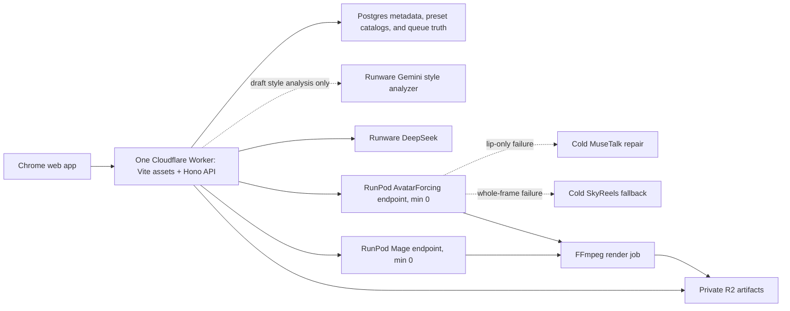

# VideoForge: start here

Status: see `CURRENT_STATE.yaml` (Phase 2 preserved; VF-3-01 green; bounded VF-3-02 active)
Context schema: `1.5`  
Last updated: `2026-08-11`

This folder is the durable project brain for new AI chats. It records what is approved, what is prohibited, what must still be benchmarked, and how to develop the product. Do not load every file blindly; use the read profiles in `MANIFEST.yaml`.

## One-sentence product

VideoForge is an invite-only web app for 5–10 teammates that accepts a title, final voiceover, reusable Avatar Profile selected from the Avatar Hub, and reusable Image Style, then automatically produces a 1920×1080 YouTube video using talking-avatar clips, highly relevant style-matched AI images with slow zooms, and a clean 50/50 avatar-left/image-right layout.

## Current handoff

Phase 0A contracts/tooling, the accepted Phase 0B fixture shell, the accepted provider-free Phase 0C
local ASR → scheduler → FFmpeg → Chrome/download slice, the full Phase 1 durable control plane, and
Phase 2 durable timing/timeline convergence are complete. VF-2-01 through VF-2-04 preserve exact
timing lineage, owned local transcription, canonical deterministic timeline persistence, selected
Avatar span ownership, metadata restore, and fail-closed Chrome inspection. VF-2-05 implementation
commit `907e0e4` completes exact padded-span WAV materialization plus canonical latest-attempt
runtime state and strict fresh-process restore. Evidence commit `d16c2a9` proves byte-equivalent
transcript/timeline/output/span hashes across independent runs, fresh-database metadata restore,
real installed-Chrome creation/playback/approval/download, and an uncached full gate: 131/131
control-plane, 39/39 pipeline, 163/163 web, 39/39 provider-sandbox, 56/56 worker, 38/38 fixture
Chrome plus 1/1 real-local Chrome, with zero skips, no provider call, and `$0` spend.
No remote, cloud/account, credential, deployment, provider, or paid mutation occurred through the
Phase 2 evidence checkpoint.

`VF-1-01` remains the preserved relational baseline. The provider-free corrective task `VF-1-01A`
is complete at implementation commit `36bf1ae`, with additive migration, constraint, migration
executor, repository-contract, and adversarial regression hardening recorded under
`evidence/acceptance/VF-1-01A/2026-08-10-relational-audit-hardening`. The user-approved accelerated
provider-free authority through `VF-2-05` is complete and exhausted. `VF-3-00` refreshed official
facts on 2026-08-10. The user then authorized autonomous provider/account, Git/hosted CI, and
isolated staging work while preserving the existing non-transferable provider caps and keeping
production deferred. The user explicitly made the GitHub repository public; hosted CI is green on
`c23ab438` with full verification, 38 installed-Chrome journeys, Gitleaks, and dependency audit.
Runware balance was verified at `$20.05` on 2026-08-11. `VF-3-01` then closed `GATE_LLM_001`:
live provider search resolved canonical AIR `deepseek:v4@flash` to `DeepSeek-V4-Flash-0731`, and
the accepted 40-scene/five-style strict-schema run passed all identity, relevance, safety, and cost
criteria. Cumulative DeepSeek qualification spend was `$0.00243598`; application mode remains
fixture. `CURRENT_STATE.yaml` now selects exact bounded brief `VF-3-02` for owned/synthetic Gemini
style analysis only; no adjacent brief or high-level roadmap item is authority.

The refresh found a hard AvatarForcing licensing contradiction: the official repository README
claims Apache-2.0, its committed `LICENSE.txt` is academic-only/non-commercial and prohibits
production use, and the public weights repository declares no license. `GATE_AVATAR_003` therefore
blocks weight download, paid qualification, and commercial use until authoritative clarification;
the AvatarForcing `$8` sub-cap remains untouched.
`CURRENT_STATE.yaml` remains the one replace-in-place handoff and ownership source. Do not redo the
accepted UI, renderer, local slice, or architecture.

## Approved MVP

Allowed output compositions are only:

1. Full-screen avatar.
2. Full-screen Mage-Flow image with a slow, smooth zoom-in.
3. 50/50 AvatarForcing avatar on the left and Mage-Flow image on the right.

AI B-roll video is explicitly deferred. The architecture keeps an adapter boundary for it, but no AI-video worker, UI, model, cost, or pipeline stage belongs in the MVP.

The normal user supplies:

- Video title.
- Final voiceover audio.
- A ready named Avatar Profile selected by image and name from the Avatar Hub. Avatar upload happens once in that Hub, never inside an ordinary project.
- A published Image Style, preselected to the built-in `documentary_stock_v1` realistic stock-footage look.
- Optional extra image-prompt keywords plus an explicit apply toggle; the toggle defaults off.

The first-shell Create Project UI does not expose an exact-script field. Local ASR text is canonical on that path. The versioned API may continue accepting nullable `optional_script` for backward compatibility, but the web shell sends `null`.

The Image Styles Hub creates reusable styles from reference images. Runware Gemini 3.5 Flash runs only when a new draft style version is explicitly analyzed; ordinary projects reuse the pinned text profile and never make a per-video/per-image vision call.

The Avatar Hub creates reusable private presenter presets from one centered source image. A project pins the exact ready profile version and canonical source checksum; reusing it adds no LLM or onboarding call to the video pipeline.

## Absolute rules

- Never output motion graphics.
- Never output captions, titles, lower-thirds, animated words, logos, infographics, arrows, borders, watermarks, chapter cards, or decorative overlays.
- Never output dissolves, wipes, glitches, light leaks, or decorative transitions. Use hard cuts.
- Slow image zoom-in is required and is allowed.
- This includes the image on the right of every split; no AI image is static.
- Do not use an LLM to choose avatar/full/split/image timing.
- Pin an immutable published Image Style version to every project revision.
- Require an exact ready Avatar Profile version; never accept an inline per-project avatar upload or resolve mutable `latest` state inside a worker.
- Do not run reference-image analysis during ordinary video generation.
- Do not send the full voiceover to the avatar model. Send only scheduled avatar spans plus small worker-side context padding.
- Generate one avatar clip and derive both full-screen and split layouts from deterministic crops. Never generate a second layout-specific avatar clip.
- Relatability to the exact narration phrase and faithful selected-style rendering are the primary image quality measures; the built-in default specifically requires believable documentary realism.
- All RunPod work is automated through APIs. The user is never required to operate the RunPod console.
- GPU workers scale to zero when their shared lane drains. Never stop a worker while queued or active work exists.
- No Supabase Pro, Redis, Kubernetes, Temporal, Remotion, HyperFrames, paid Whisper API, or always-on control server is required for the MVP.
- Subjective avatar whole-frame failures are user/reviewer-classified in MVP; do not invent an automatic visual-QA stage.

## Locked models and providers

| Task | Approved choice | Exact production role |
|---|---|---|
| Image-prompt writing | Runware DeepSeek V4 Flash 0731 | Batched strict JSON; thinking off; image prompts only |
| Reference-style analysis | Runware Gemini 3.5 Flash | One multimodal strict-JSON call only when a new draft style version is explicitly analyzed; provisional pending style gate |
| Image generation | `microsoft/Mage-Flow-Turbo` | 4-step Turbo; narration-relevant stills compiled for the pinned style |
| Primary avatar | AvatarForcing | Revision-pinned canonical Avatar Profile runtime source + selected span audio; provisional pending exact-avatar benchmark |
| Lip-only repair | MuseTalk 1.5 | Only an otherwise-good failed AvatarForcing clip |
| Whole-frame avatar fallback | SkyReels V3 Talking Avatar | Same pinned runtime source + selected span audio, never a failed derivative; cold quality fallback |
| Word timing | Local `whisper.cpp base.en` | Free ASR; local ASR is canonical in the web shell, with legacy optional-script alignment retained only at the versioned API boundary |
| Composition/render | FFmpeg | EDL, crops, zoom, hard cuts, loudness, encode |

The avatar router and crop geometry are user-approved. AvatarForcing remains provisional only because its paper does not disclose the hardware behind the reported speed; the one-time RunPod acceptance suite must pass before production lock.

## Reference-derived edit grammar

Two audited Ranga references both use about 22% avatar footage, divided almost equally between full-screen and 50/50. The combined average avatar appearance is about 3.74 seconds, typical clips are 2–6 seconds, the median image-only gap is about 11.2 seconds, and hard cuts dominate.

VideoForge turns this into a reproducible code rule:

- Cold-open with full-screen avatar.
- Target one short avatar appearance every 14–20 seconds.
- Alternate full-screen and 50/50 avatar layouts as the application rule.
- Snap every boundary to a phrase or sentence.
- Converge toward 21–22% total avatar, about half full and half split.
- Fill all other time with 3–7 second narration-relevant images.

For 30 minutes this is approximately 396 seconds of avatar, about 105 short avatar appearances, and around 220–320 generated images including images used on the right side of split shots. The exact count follows speech boundaries.

## Simple architecture

Recommended zero-required-subscription control plane: one Cloudflare Vite Worker serving the React app and same-origin Hono API, Cloudflare Workflows for durable waits, Neon Free Postgres, Google OAuth/admin allowlist, private R2, and scale-to-zero RunPod endpoints. This is $0 required only while current free allowances suffice. Vercel can be used for previews or with Pro, but its $0 Hobby plan is officially personal/non-commercial and is not the production cost assumption.

## Cost and speed target

For a 30-minute, no-whole-frame-fallback project:

- Selecting a ready Avatar Profile adds no onboarding/model call. Optional profile testing is a separate explicit one-time cost, never charged to the video's cap.
- A ready Image Style adds no vision call; creating a new 3–8-reference style is a separate one-time planning cost of roughly $0.03–$0.07.
- Runware prompts: roughly $0.005–$0.015.
- Mage images: $0.12–$0.25 sensitivity; target at or below $0.20 after measured batching/caching.
- Local ASR: $0 API cost and negligible incremental GPU cost.
- AvatarForcing: planning range $0.20–$0.51 on the Serverless Flex sensitivity path, benchmark-gated.
- Render/technical QA: roughly $0.06–$0.15 on the current GPU baseline.
- Derived fast/no-major-fallback total: approximately $0.40–$0.98; planning with modest fallback: about $0.50–$1.30.
- Default project hard cap before approval: $1.50; UI may expose a user-selected cap up to $2.

The cold no-fallback isolated-service p50 goal is at or below 30 minutes for a 30-minute final video; queue wait is reported separately. These are targets, not measured promises. Image and avatar lanes run concurrently; never add their times when calculating the critical path.

## First implementation rule

Follow `21_IMPLEMENTATION_EXECUTION_PLAN.md`, `12_DEVELOPMENT_PLAN.md`, and `19_IMPLEMENTATION_PLAYBOOK.md`: preserve every completed Phase 0–2 commit, the accepted fixture shell, and the user-accepted local render. `VF-3-00` is complete. Execute only the exact task selected by `CURRENT_STATE.yaml`; its provider/model/cap is not transferable to another lane. Private Git/CI and isolated staging are authorized but remain dependency-ordered. Production is deferred.

## Context navigation

- Product and scope: `01_PRODUCT_REQUIREMENTS.md`
- Current implementation/handoff snapshot: `CURRENT_STATE.yaml`
- Normative naming: `GLOSSARY.md`
- Final video specification: `02_OUTPUT_VIDEO_SPEC.md`
- Ranga measurements and frames: `03_REFERENCE_VIDEO_FORENSICS.md` and `references/ranga/`
- Image prompting and visual identity: `04_VISUAL_IDENTITY_AND_PROMPTS.md`
- Image Styles Hub and reference analysis: `18_IMAGE_STYLES_HUB.md`
- Avatar Hub and reusable presenter sources: `20_AVATAR_HUB.md`
- UI/UX: `05_UI_UX_SPEC.md`
- Services and data flow: `06_SYSTEM_ARCHITECTURE.md`
- Timeline algorithm and pipeline: `07_PIPELINE_AND_SCHEDULER.md`
- Models and exact modes: `08_MODELS_AND_PROVIDERS.md`
- RunPod, queue, lifecycle: `09_RUNPOD_AND_QUEUE_OPERATIONS.md`
- Contracts/state: `10_DATA_AND_API_CONTRACTS.md`
- Cost/speed math: `11_COST_SPEED_BUDGET.md`
- Development sequence: `12_DEVELOPMENT_PLAN.md`
- Engineering practices: `13_ENGINEERING_BEST_PRACTICES.md`
- Acceptance: `14_TESTING_AND_ACCEPTANCE.md`
- Approved decisions/open gates: `15_DECISIONS_AND_OPEN_GATES.md`
- Keeping this pack current: `16_CONTEXT_MAINTENANCE.md`
- Official and local evidence: `17_SOURCE_INDEX.md`
- Live-development protocol: `19_IMPLEMENTATION_PLAYBOOK.md`
- Exact remaining task order and safe parallelism: `21_IMPLEMENTATION_EXECUTION_PLAN.md`
- Exact implementation task briefs: `tasks/README.md`; the current file is selected by `CURRENT_STATE.yaml`
- Gate status/evidence paths: `GATES.yaml`
- Reproducible context/schema validation: `scripts/validate-context.sh` and `scripts/validate-schemas.sh`
