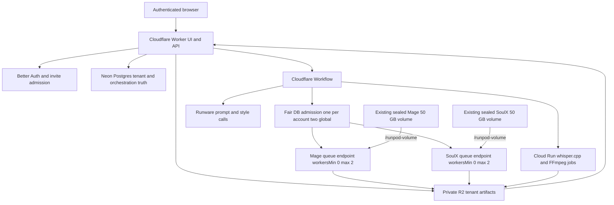

# System architecture

Status: approved Serverless v2 target; provider deployment not yet proven
Read when: implementing services, deployment, security, storage, tenancy, or orchestration.

## Architecture principle

Use a small scale-to-zero control plane, database-owned tenant admission/fairness, private durable
artifacts, and two isolated queue-based RunPod Serverless model lanes. Users never manage Pods or
workers. Postgres is editorial/operational truth; private R2 is artifact truth; RunPod job state is
provider observation, not the sole recovery record.

Each admitted account has one default workspace. All user-created data belongs to that
account/workspace. Only explicit built-ins are global. The server derives ownership from the
authenticated session and database relationships on every read/write; client-supplied ownership,
R2 keys, provider job IDs, or callbacks cannot grant access.

## Recommended stack

| Layer | Choice | Responsibility |
|---|---|---|
| Web UI | React + TypeScript + Vite | Existing compact UI, responsive private product flows |
| UI data | TanStack Query + Router | Typed server state and routes |
| Styling | Tailwind + Radix/shadcn + existing custom tokens | Accessible existing visual system |
| Web + API | Cloudflare Worker, Hono `/api/*` | Same-origin UI/API, auth checks, signed transfers |
| Durable orchestration | Cloudflare Workflows plus transactional Postgres outbox | State machine, waits, retries, reconciliation |
| Database | Neon Postgres | Identity, tenant data, fairness/admission, attempts, costs, audit |
| Auth | Better Auth email/password + Google OAuth + atomic invite admission | Closed access and one default workspace |
| Artifacts | Private Cloudflare R2 | Tenant-prefixed immutable inputs/outputs/receipts/manifests |
| Image prompt/style | Runware DeepSeek V4 Flash 0731; Gemini 3.5 Flash only for new style analysis | Existing pinned provider choices |
| GPU | Two RunPod queue-based Serverless endpoints in `EU-RO-1` | Mage images; SoulX avatar spans |
| Model storage | Two existing isolated sealed 50 GB RunPod network volumes | Read-only-by-app offline model loading |
| ASR/render | Scale-to-zero Cloud Run Jobs | Pinned whisper.cpp and FFmpeg/FFprobe |
| Contracts | Zod TypeScript + Pydantic Python | Validate every trust boundary |
| Repository | Public pnpm/Turborepo source; digest-pinned worker images; no private bytes or model weights in Git | Shared contracts and reproducible builds |

PGlite remains local/CI evidence only. Hosted production must use actual PostgreSQL constraint and
transaction behavior. Provider allowances/prices are time-sensitive and rechecked before any paid
or deployment mutation.

## Logical topology

There is no model-volume sharing, cross-mount, runtime model download, global user-artifact prefix,
direct browser-to-provider credential path, or manual Pod lifecycle in the active topology.

## Tenant and storage boundaries

- Admission creates exactly one default workspace transactionally with the user record.
- Every account-owned table carries account/workspace ownership through composite foreign keys or an
  equally strong database-enforced relationship. Repositories scope all operations to the
  authenticated account/workspace.
- Built-ins use explicit global ownership and are read-only; a nullable owner alone is insufficient
  without a constrained type/discriminator and tests.
- R2 keys are server-issued and include account/workspace/project/revision/attempt identity. Signed
  upload/download URLs are short-lived and restricted to an exact object, size/type contract, and
  method. Completion rechecks hash, media shape, and ownership.
- Provider payloads receive only bounded short-lived object access. Provider URLs and callback fields
  are untrusted input.
- Job scratch is local, unique to exact job/attempt, quota-bounded, and removed in `finally`. No user
  input, output, cache, log, or temporary artifact is written to `/runpod-volume`.
- Logs and metrics use opaque IDs and never contain credentials, signed URLs, raw invite codes,
  voiceover text, or private media.

## Product admission and fair queue

The product scheduler, not RunPod, admits work:

1. Generate freezes an immutable tenant-owned video revision, or an explicit Hub action freezes one
   preset-preview request; either creates an account-local waiting row.
2. A serializable transaction selects eligible work only when that account has no active provider
   workload and fewer than two different accounts hold global workload leases.
3. Eligible video account heads always precede previews. Fair account rotation chooses the
   least-recently-admitted eligible account; FIFO applies within that account unless its owner changed
   its own waiting order. Preview rotation is separate and never mutates the video cursor.
4. The transaction creates a `provider_workload_lease` plus exact stage attempts. No hosted or
   provider work may start before this commit.
5. Terminal reconciliation releases the lease, advances only the applicable fairness cursor, and
   promotes another eligible account.

Unique/partial constraints and locked selection must enforce one active provider workload per
account and two workloads globally from different accounts under races, restarts, and duplicate
requests. This also preserves one active video/account and two active videos globally. A user may
inspect/reorder/cancel only their own waiting work. UI position is privacy-safe and cannot expose
another account's identity/project.
The RunPod endpoint queue is only transport backlog after product admission; it must never become
the fairness mechanism. `/purge-queue` is forbidden in ordinary operation.

An explicit Mage or SoulX `preset_preview` is a separate tenant-owned request, not a hidden video.
It uses the same two global capacity slots and the same one-active-provider-workload/account lock,
but is eligible only when no video queue head is eligible. It cannot coexist with another active
workload from its account, outrank a waiting video, or create provider work before its locked
admission transaction. This preserves the one-video/account and two-video/global upper bounds while
keeping optional Hub tests safe and lower priority.

## Serverless model lanes

Both queue endpoints are restricted to `EU-RO-1` and configured independently:

| Setting | Mage | SoulX |
|---|---:|---:|
| `workersMin` | 0 | 0 |
| `workersMax` | 2 | 2 |
| scaling | `REQUEST_COUNT` | `REQUEST_COUNT` |
| scaler value | 1 | 1 |
| handler concurrency | 1 | 1 |
| GPU/worker | 1 | 1 |
| initial GPU type | RTX 4090 only | RTX 4090 only |
| network volume mount | Mage-only at `/runpod-volume` | SoulX-only at `/runpod-volume` |

`workersMin=0` means no always-on Active worker; autoscaled jobs use Flex workers.
`workersMax` counts Active plus Flex workers. RTX 5090 is not configured as a fallback until the
exact endpoint lane passes compatibility, output, VRAM, cold/warm, concurrent-reader, recovery, and
cost qualification. If multiple types are listed, RunPod may select any of them.

Each worker image is immutable and lane-specific. Startup:

1. Validate image/handler identity and required non-secret configuration.
2. Set every framework cache/temp path to job-local/container scratch, never the volume.
3. Verify exact volume identity, sealed completion marker, full file path/size/SHA-256 manifest, and
   model/runtime configuration with network model registries unavailable.
4. Load only the exact pinned model and run a real GPU warm-up.
5. Report `model_ready` with image digest, manifest digest, actual GPU/VRAM, worker identity, and
   measured timestamps. A process health response is not model readiness.

Each admitted video starts with one bounded whole-video batch attempt per required lane. The Mage
attempt processes its image work manifest; the SoulX attempt processes only scheduler-selected short
audio spans, never a full voiceover. At most one current attempt exists per video/lane. After a prior
attempt is terminal or uniquely reconciled, a bounded classified replacement may use a new
attempt/token containing all unresolved lane items as one batch; accepted items are never regenerated
and the controller never fragments work into parallel per-scene requests. Sequential work inside one
handler reuses the resident model. Handler concurrency remains one. With two admitted workloads,
RunPod may create two workers on each endpoint, bounded by `workersMax=2`. Two readers of the same
sealed volume must pass an exact concurrency/hash/inference qualification before production.

RunPod does not document a read-only mount flag. Application policy, filesystem permissions where
available, redirected caches, pre/post manifest verification, and zero-write tests enforce
immutability. Any manifest drift stops the job and endpoint dispatch; no repair or re-preparation is
performed during ordinary generation.

## Dispatch authority and RunPod limitations

Every external job uses a two-phase authority record:

1. **Predispatch:** transactionally reserve budget, persist endpoint/image/model/volume/input/output
   identities, unique dispatch token, request hash, attempt ordinal, expiration policy, and outbox
   intent before a provider POST.
2. **Post-assignment:** bind the exact returned or uniquely reconciled provider job ID to the token
   and attempt before accepting status/output. Record later worker/GPU/model-ready/timing/output facts
   in the separate VideoForge-signed provenance receipt. Accept an output only when its assignment,
   predispatch tuple, and expected private R2 receipt/checksum all match.

RunPod `/run` returns a job ID but does not document client idempotency, exactly-once execution, or
exactly-once billing. On an ambiguous POST, do not blindly resubmit. Reconcile durable outbox/provider
state and make any deliberate retry a new, cost-reserved attempt while accepting at most one result.
Record possible duplicate compute/cost instead of claiming it is impossible.

Poll `/status` as the authoritative provider observation. A webhook has limited retries and no
documented signature guarantee, so treat it as a hint and validate it against the bound job plus a
VideoForge-signed durable R2 receipt. RunPod async result retention is 30 minutes; never depend on
retrieving it later. Store accepted artifacts and receipts in R2 immediately.

TTL begins at submission, includes queue time, and may remove a running job. Execution timeout and
initialization timeout must be set above measured worst cases with finite bounds. The measured SoulX
Pod start-to-ready result of 672.035 seconds exceeds RunPod's documented seven-minute unhealthy
cold-start threshold, so `RUNPOD_INIT_TIMEOUT` and image/startup optimization require explicit
Serverless qualification. Provider defaults are not silently accepted.

Cancellation prevents new dispatch, calls exact job cancellation where valid, continues status/R2
reconciliation, records incurred cost, and reaches terminal state only when no accepted callback can
revive the attempt. Endpoint queue purge cannot be used because it affects unrelated tenants/jobs.

## CPU/media and artifact flow

Production voiceover timing and rendering run as authenticated scale-to-zero Cloud Run Jobs. They
consume immutable tenant-scoped R2 manifests and write only exact expected tenant-scoped results.
They have no RunPod credentials or volume access. The same pinned entrypoints run locally for
provider-free development parity, which is not hosted evidence.

The original voiceover is durably uploaded and checksum-bound before the revision can freeze or enter
the queue. After admission, normalization/transcription/scheduling/prompt compilation produce exact
lane manifests and input barriers; GPU dispatch cannot begin earlier. Once both exact lane requests
are dispatchable, their worker initialization/inference may overlap. Compilation requires every
planned asset to be accepted and checksum-bound. Final download is short-lived, verified, and
tenant-authorized.

## Preserved components and superseded components

Preserve and extend:

- the current React product surfaces and accessibility/Chrome acceptance baseline;
- additive Postgres migrations, immutable revision/version patterns, actor audit, and fail-closed
  repository style;
- CP-03 transcript/word timing and R2 media ports;
- CP-04 deterministic scheduler and immutable generation/render manifests;
- CP-05 provider-free orchestration/recovery patterns after adapting them to tenant/fair Serverless
  semantics;
- exact prepared Mage and SoulX models/volumes and their Pod qualification evidence.

Supersede in active code/contracts/UI:

- singleton global generation session and global equal-rights catalogs;
- one global manually ordered queue and cross-user mutation;
- user-facing GPU selectors, selected GPU pairs, manual Pod create/recreate/delete, warm-for-waiter,
  and session-unlock behavior;
- Pod HTTP entrypoints, `/workspace` model paths, global R2 prefixes, and global GPU-pair widgets;
- schemas/repos named around `global-generation-session/v2` or `pod-worker-job-envelope/v2` at the
  production boundary. Preserve migration history; replace behavior additively with tenant,
  admission, endpoint-job, and receipt contracts.

Pod qualification proves model/runtime correctness on that Pod image and volume. It does not prove
Serverless template compatibility, handler lifecycle, timeout, queue behavior, scale-to-zero,
concurrent reads, worker cleanup, or Serverless cost.

## Security, recovery, and operations

- Secrets remain server-only and are separated by minimum provider scope. Rotate without changing
  model/artifact identity.
- Verify MIME/magic bytes, size, duration, decode, path containment, hashes, and object ownership.
  Never give FFmpeg arbitrary URLs or arguments.
- Postgres plus signed R2 receipts/manifests recover every workflow after process loss. Provider
  callbacks are replay-safe and cannot change tenant/attempt identity.
- Budget reservation precedes dispatch; actual provider billing is reconciled separately. A cap can
  block future work but cannot undo incurred or duplicate provider work.
- Monitor queue age, fairness lag, cold/model-ready time, inference throughput, errors/retries,
  duplicate-risk events, R2 failures, worker count, endpoint configuration drift, cost, and zero-idle
  state without logging private content.
- Production handoff proves no Active workers (`workersMin=0`), zero Flex workers/jobs after drain,
  and exactly the two intended retained model volumes. Endpoint existence is not ongoing GPU spend.
