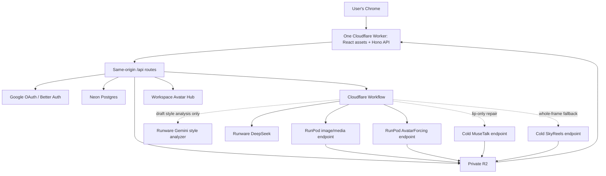

# System architecture

Status: recommended MVP architecture  
Read when: creating the repository, services, deployment, security, storage, or orchestration.

## Architecture principle

Use one small serverless control plane and isolated scale-to-zero media lanes. Postgres is the editorial and operational source of truth; external provider queues are execution transports. Keep expensive models off the web tier and never keep a GPU alive merely to wait for another stage.

## Recommended stack

| Layer | Choice | Reason |
|---|---|---|
| Web UI | React + TypeScript + Vite | Fast HMR, snappy client app, easy fixture-first Chrome development |
| UI data | TanStack Query + Router | Explicit server state, cache/retry control, typed routes |
| Styling | Tailwind + Radix/shadcn primitives + custom tokens | Accessible base without surrendering the custom visual identity |
| Web + API deployment | One Cloudflare Worker: Vite/React static assets + same-origin Hono `/api/*` | One deployable/origin, fast HMR, no CORS/config drift, direct bindings |
| Durable orchestration | Cloudflare Workflows | Durable waits/retries without an always-on server |
| Database | Neon Free Postgres | Durable relational truth, scale-to-zero, enough for 5–10 users' metadata |
| Database migrations/tests | Committed additive PostgreSQL SQL + query-library-neutral repository contracts; PGlite for local/CI tests only | Real Postgres constraint behavior without Docker, a live database, secrets, or premature runtime-driver coupling |
| Auth | Better Auth + Google OAuth + admin email allowlist/membership table | Google sign-in without public signup or a paid email provider |
| Artifact storage | Private Cloudflare R2 | Signed transfers, 10 GB-month free, low storage price, free direct egress |
| Production prompt LLM | Runware DeepSeek V4 Flash 0731 | Locked user decision; strict JSON and very low token cost |
| Reference-style analyzer | Runware Gemini 3.5 Flash | One multimodal strict-JSON call only when a new draft style version is explicitly analyzed; same Runware account/key |
| GPU compute | RunPod Serverless endpoints with `workersMin=0` | Automatic queueing and scale-to-zero through API |
| Media compiler | FFmpeg | Direct, deterministic, and sufficient for three simple layouts |
| Contracts | Zod in TypeScript; Pydantic in Python | Validate every boundary from the same JSON schemas |
| Repository | Private pnpm/Turborepo monorepo | Shared contracts and narrow deployable units; private research/assets stay unpublished |
| Container registry | Private GHCR candidate, benchmark-gated | RunPod registry auth; measure pull/cache/storage cost before lock |

Current free-tier facts and prices must be rechecked at deployment. As of 2026-08-08, Cloudflare Workers Free allows 100,000 requests/day, Workflows allows 3,000 steps/day, R2 includes 10 GB-month, and Neon Free includes a small scale-to-zero database. Cloudflare has announced Workflows billing while retaining a free allowance; the promise is therefore **$0 required while measured usage remains inside current allowances**, not “free forever.” Use tens of Workflow steps per project—not one per frame/image—and alert before 70/90% of an allowance.

Vercel is not the zero-cost production assumption. Its Hobby plan is $0 but officially personal/non-commercial. It remains an optional preview host or production choice if the user later accepts Vercel Pro.

`DEC_DB_001` makes the migration boundary explicit: Phase 1 starts with committed additive SQL and
repository contracts, and `pnpm verify` applies them only to an ephemeral PGlite database. PGlite is
test/development infrastructure, not recovery truth or a production adapter. Neon connectivity,
the Cloudflare-compatible driver, and live migrations are added only in the later authorized
runtime/integration tasks; ordinary verification never reads `DATABASE_URL` or contacts Neon.

## Logical topology

## Compute lanes

### Image/media lane

Dedicated model volume and endpoint for:

- `whisper.cpp base.en` transcription job type.
- Mage-Flow-Turbo image-generation job type.
- FFmpeg render/technical-probe job type.

The handler loads Mage only for image jobs. Run local ASR on CPU without evicting a resident Mage model; schedule latency-critical ASR between bounded Mage chunks. Run FFmpeg only after the relevant image queue/barrier permits it. Reusing this endpoint avoids a separate render service in MVP; benchmark a scale-to-zero CPU media endpoint and split only if measured GPU billing/residency or multi-user render contention is worse.

### Primary avatar lane

Dedicated endpoint for AvatarForcing. It receives only selected audio spans and the exact runtime source pinned from the chosen Avatar Profile version. It never resolves a mutable parent/`latest` pointer. Chunk work so one model load serves many clips and application-level fairness can interleave projects.

### Lip repair lane

Cold MuseTalk endpoint. It receives only an otherwise-good AvatarForcing clip whose remaining failure is lip sync. It never runs automatically on passed clips.

### Quality fallback lane

Cold SkyReels V3 endpoint, provisioned after its viability gate. It starts from the exact pinned Avatar Profile runtime source plus selected audio, never a failed derivative. A budget reservation is required before dispatch.

### Avatar-profile preparation path

Avatar Hub creation has no mandatory GPU stage. The original submitted source is retained privately while the ready version remains active/referenced so its immutable provenance and later safe reprocessing remain possible. The browser also creates an orientation-correct, color-managed, bounded high-quality sRGB runtime candidate and private thumbnail while removing EXIF/GPS. All three upload directly to distinct signed workspace/version paths. The server uses a deterministic metadata parser to verify magic bytes, format, dimensions, byte/decompression limits, checksum, orientation normalization, and absence of prohibited metadata from the runtime/thumbnail; it never trusts browser claims. Models receive only the canonical runtime asset, never the raw original. The user then reviews source safe areas and rights/likeness consent before trusted code marks the immutable version ready.

Phase 0A must benchmark the chosen browser encoder/server parser against representative files. If server-side structural validation cannot prove the contract inside Worker limits, move this tiny preparation job to a measured scale-to-zero CPU media path and expose its cost; do not silently boot the Mage GPU or claim unverified stripping.

### Style-analysis path

This is a small control-plane workflow, not a RunPod lane and not part of a normal project DAG. The browser performs orientation-aware, bounded sRGB re-encoding that strips EXIF/GPS before direct signed upload. The server still verifies magic bytes, raster metadata, dimensions, byte/decompression limits, and checksum; it must not trust browser claims. This zero-fixed-cost path avoids assuming a free Cloudflare Worker can decode/re-encode twelve high-resolution images or requiring paid Cloudflare Images. The workflow calls Runware Gemini 3.5 Flash once, validates the structured profile, and waits for user review/publication. A published style is then ordinary versioned Postgres/R2 data.

Do not add a style GPU worker, keep a vision model warm, or analyze a ready style again for every project.

### Volume layout

Keep image and avatar families separate. A cost-efficient initial layout is:

- `weights-image`: Mage + local ASR files.
- `weights-avatar-fast`: immutable AvatarForcing and MuseTalk weights; separate endpoints may mount the same read-only content-addressed volume if RunPod supports it safely.
- `weights-avatar-quality`: SkyReels only, created after the fallback gate.

Never allow concurrent writes to model volumes. Workers upload every mutable job artifact to R2.

Style reference originals/derivatives and Avatar Profile source/runtime/thumbnail assets live under separate workspace-scoped R2 prefixes, outside project artifacts and model-weight volumes. Projects reference the pinned Avatar Profile asset rather than copying it into every revision.

## Control-plane responsibilities

- Authenticate and authorize.
- Validate uploads and create immutable project revisions.
- Manage Avatar Profile parents, version-scoped private source uploads, technical/user approval, immutable ready versions, optional compatibility tests, archive/retention, and exact project binding.
- Manage Image Style parents and version-scoped drafts, private references, immutable published versions, analysis idempotency, disclosure/rights/retention metadata, durable cover policy, and optional test previews.
- Generate signed R2 transfers so large files bypass the Worker body.
- Run the deterministic scheduler.
- Call Runware in validated batches.
- For ordinary projects, load the pinned style profile without making a new vision call.
- Reserve budget and dispatch RunPod jobs idempotently.
- Consume signed progress/completion callbacks.
- Reconcile missing callbacks and expired leases.
- Compile only when required artifacts are accepted.
- Expose truthful events/costs to the UI.

The control plane never performs model inference or a 30-minute FFmpeg render. Persist every Cloudflare Workflow instance ID in Postgres; short provider/workflow retention is not recovery truth.

## Cost-mode behavior

Serverless endpoints are the MVP default because scale-to-zero and queueing are simpler and safer. The UI exposes tested immutable execution profiles, not raw per-job GPU mutation. A profile pins endpoint/config revision, ordered provider GPU priorities, model/container digest, volume/DC, timeout/TTL, and maximum rate:

- **Lowest cost:** use the cheapest tested compatible endpoint/profile; no speculative warm-up.
- **Balanced:** use the preferred cost/performance profile and optional bounded overlap.
- **Faster:** use a separately tested faster endpoint/profile or documented priority list and measured concurrency.

RunPod Serverless GPU priorities belong to endpoint configuration; never mutate one shared endpoint for an individual project.

A future high-volume optimization can replace a serverless lane with an API-controlled hourly Pod. It must preserve the same task/callback contract and add authoritative create/lease/drain/stop reconciliation. Do not build that complexity before measured serverless spend justifies it.

## Why Remotion and HyperFrames are excluded

The canonical output needs hard cuts, crops, scales, a slow still-image zoom, and audio muxing. FFmpeg handles these directly and deterministically.

- Remotion adds a React/browser rendering layer without improving photographic realism or narrative relevance.
- HyperFrames focuses on HTML/CSS composition and its strongest features are motion graphics, charts, lower-thirds, and templated text—the exact output class prohibited here.
- HyperFrames cloud rendering would add per-output-minute cost; self-hosting adds Chrome runtime operations.

Keep a renderer interface so a future requirement can add another backend, but use direct FFmpeg now.

## Security boundaries

- RunPod, Runware, database service-role, R2, and OAuth secrets are server-only.
- Use short-lived signed object URLs and workspace-scoped object keys.
- Enforce workspace membership in API and Postgres policies/queries.
- Sign worker callbacks with timestamp, nonce, HMAC, and replay protection.
- Validate remote MIME, size, checksum, duration, and media decode; never hand an arbitrary user URL directly to FFmpeg.
- Do not log full secret-bearing requests or expose provider error payloads unchanged.
- Record every admin credential/status change in an audit event.
- Keep signup closed. MVP invitations are admin allowlist/membership mutations; do not add an email provider merely to send invites.
- Treat style references as private but do not market ordinary Runware processing as zero-data-retention or confidential; require disclosure consent, send only normalized derivatives through short-lived signed URLs, record rights attestation, and distinguish VideoForge/R2 deletion from Runware retention/deletion.
- Treat avatar sources/thumbnails as private likeness images: require image-use and likeness-animation attestations, strip EXIF/GPS from runtime derivatives, prevent cross-workspace hash probing/deduplication disclosure, and never send them to DeepSeek/Gemini/Runware.

## Scale boundary

This architecture is intentionally sized for 5–10 teammates and intermittent projects. Revisit it only when evidence shows a limit: free-tier exhaustion, more than two concurrent projects, render contention, storage retention growth, or provider throughput. Do not introduce Redis, Kubernetes, Temporal, or a microservice per stage preemptively.

## Recovery and portability

- Run a scheduled encrypted metadata backup/export to private object storage and complete a restore drill before production.
- Postgres plus R2 manifests/artifacts are recovery truth; provider queues and short-lived workflow logs are not.
- Pin container digests. Rebuild model volumes from pinned hashes/licenses rather than treating them as irreplaceable state.
- Private Ranga/UI research files are optional local planning evidence. Build/test must succeed with owned placeholders when those git-ignored files are absent.
