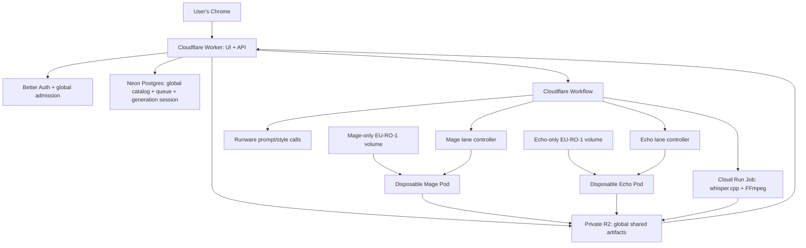

# System architecture

Status: recommended MVP architecture  
Read when: creating the repository, services, deployment, security, storage, or orchestration.

## Architecture principle

Use a small scale-to-zero control plane, one global shared app scope, and two isolated
API-controlled RunPod Pod lanes. Postgres is editorial and operational truth. Private R2 holds
production inputs and outputs. The two persistent model volumes are intentional fixed-cost
infrastructure. A waiting project may keep an already-running lane Pod warm, but cannot create or
recreate one. With no waiter when active lane work finishes, the Pod is deleted.

Mage owns one volume and its Pods. Echo owns a different volume and its Pods. A later Pod may
reattach only its own model's volume. Cross-model Pod, volume, preparation marker, manifest, cache,
lease, worker identity, or reconciliation adoption is forbidden.

## Recommended stack

| Layer | Choice | Reason |
|---|---|---|
| Web UI | React + TypeScript + Vite | Fast HMR and fixture-first Chrome development |
| UI data | TanStack Query + Router | Explicit server state and typed routes |
| Styling | Tailwind + Radix/shadcn primitives + custom tokens | Accessible base with custom visual identity |
| Web + API | One Cloudflare Worker: React assets + same-origin Hono `/api/*` | One deployable/origin and direct bindings |
| Orchestration | Cloudflare Workflows | Durable waits and reconciliation without an always-on app server |
| Database | Neon Postgres | Durable relational truth with scale-to-zero |
| Database tests | Additive PostgreSQL SQL and repository contracts; PGlite only for local/CI | Real constraint behavior without treating fixtures as production truth |
| Auth | Better Auth email/password + Google OAuth, followed by one-time invite-code admission at signup | Closed-team access without MVP roles or tenant administration |
| Artifacts | Private R2 plus verified local download | Durable job data outside model volumes |
| Prompt/style providers | Runware DeepSeek V4 Flash 0731; Gemini 3.5 Flash for new style analysis | Existing locked provider decisions |
| GPU compute | Two independent RunPod Pod lanes and two persistent `EU-RO-1` volumes | Fast offline loads and immediate per-lane shutdown |
| ASR/render | Cloud Run Jobs running pinned whisper.cpp/FFmpeg; same container/entrypoint on Mac for development | Scale to zero in production and never occupy a GPU lane |
| Contracts | Zod in TypeScript; Pydantic in Python | Validate every boundary |
| Repository/registry | Private pnpm/Turborepo monorepo; immutable private worker images | Shared contracts and pinned deployments |

Cloudflare and Neon allowances and current provider prices must be rechecked at deployment. The
promise is $0 control-plane cost only while measured use stays inside current allowances, not “free
forever.” The user explicitly accepts persistent-volume billing. Optimize disposable Pod runtime;
do not replace volumes with repeated model downloads. PGlite remains test infrastructure, never
production or recovery truth.

## Logical topology

There is no edge between a Pod and the other model's volume, and no Serverless endpoint queue in the
active GPU topology.

## Global access, queue, and generation session

MVP has one shared catalog, project list, queue, usage view, and result library for 5–10 admitted
users. Every admitted user has the same application rights. There are no workspace roles,
per-customer tenants, private per-user queues, or owner-only project actions in MVP. Actor identity
is still recorded for every mutation.

A new user signs up with email/password or Google, then completes one invite-code check in that same
signup flow. Each code is unique, single-use, and bound to one intended email. Email/password access
requires verified email; Google must return the same verified email. Successful admission and code
consumption are atomic and durably bound to the user; ordinary future sign-ins never ask for the
invite again. Codes are stored only as secure verifiers and never written raw to logs, analytics,
URLs, or audit payloads.

GPU selection is session-scoped, not user- or project-scoped. With no open generation session, the
first accepted Generate request shows fresh compatible Mage and Echo inventory, carries one exact
receipt-bound choice for each lane, and atomically opens the singleton global generation session.
While that session has an active project or any waiting entry, GPU selectors are locked/hidden for
everyone. Every later Generate only adds its revision to the shared queue and inherits the exact
session pair. No mid-session switching or substitution is allowed.

MVP runs one project at a time. Any admitted user may reorder or remove waiting entries using
optimistic versions; the server derives the actor and appends an audit event. An active entry cannot
be moved or deleted through queue controls; only the dedicated project-cancellation contract may
affect it. Advanced fairness, parallel project execution, per-user Pod pairs, and per-user priority
are deferred.

## Model lanes

### Mage image lane

Mage generates every original B-roll still through the exact ImageForge INT8 ConvRot contract:

- `Comfy-Org/Mage-Flow@d8c99241f6fa80fbd453014234af2bf337ea21e6` through pinned headless
  `Comfy-Org/ComfyUI@26d7f8556822d9d08c2d3e1878636ac3b4969af9`.
- Precision `int8-convrot`, four steps, CFG/guidance `1.0`, 1280×720, text-to-image only.
- Required files: `diffusion_models/mage_flow_turbo_int8_convrot.safetensors`,
  `text_encoders/qwen3vl_4b_bf16.safetensors`, and `vae/mage_flow_vae_bf16.safetensors`.

Its dedicated persistent `EU-RO-1` volume holds only the pinned cache, prepared runtime, and
verification evidence. A generation session creates or reuses at most one Mage Pod using the
immutable Mage worker image and the session's exact Mage GPU choice. It processes bounded image
chunks and uploads outputs only for the active project. A waiter may retain the already-running Pod
warm. With no waiter at active-lane completion, delete it independently; the volume remains.

### Echo avatar lane

EchoMimicV3-Flash is the sole active avatar generator. The profile pins
`antgroup/echomimic_v3@7e89489ca51c0d008fc1963ec6c03fc5bd0b9397`, Flash weights
`BadToBest/EchoMimicV3@311e176905a8c4c24b240b530488fe636ce4d249`, its Wan base/audio encoder,
and the VideoForge-prepared FP8 artifact. Compatible transformer linears use
`float8_e4m3fn` dynamic activation-and-weight quantization; other tensors stay BF16. Echo receives
only short scheduler-selected voiceover spans and the exact Avatar Profile runtime image.

Echo has a different persistent `EU-RO-1` volume and worker image. A generation session creates or
reuses at most one Echo Pod using the session's exact Echo GPU choice. It uploads clips only for the
active project. A waiter may retain the already-running Pod warm. With no waiter at active-lane
completion, delete it independently; the Echo volume remains. It never mounts the Mage volume.

Initially, each lane permits at most one Pod, so total GPU concurrency is at most two while only one
project executes. The first accepted Generate may start both required Pods concurrently while the
CPU transcription/timeline path advances. Inference waits for `model_ready` and its immutable lane
work plan. A lane deletes its Pod immediately when active lane work finishes with no waiting entry,
without waiting for the other lane or final render. A later waiter is inert and never recreates the
missing Pod. Only after the current video is terminal and that waiter is atomically promoted may the
controller revalidate and recreate the missing Pod on the same exact session GPU; unavailable means
blocked, never substituted. A waiter may keep an already-running Pod warm. The session closes and
GPU selection unlocks only after no active/waiting entry remains and both Pods are proven absent.

## Preparation, boot, and artifacts

Each model volume is prepared once in a separately authorized setup operation. Preparation downloads
only pinned sources, derives the approved runtime, records every path/size/hash/configuration and
toolchain identity, independently verifies the mounted result, and writes the completion marker
last. A partial preparation never becomes ready and one lane cannot prepare the other lane's volume.

Ordinary project boots download no model bytes and resolve no model repository. A Pod mounts its
already-prepared volume and reports these truthful phases:

1. `container_ready`: the expected container and health API run.
2. `volume_ready`: exact lane volume, complete marker, and manifest verify.
3. `model_loading`: verified bytes load to the selected GPU; inference is rejected.
4. `model_ready`: exact identities and a real GPU warm-up pass.

The model-loading path must work with model registries unavailable. Missing, changed, incomplete, or
cross-mounted content fails closed. Authenticated R2/control-plane access remains available for job
data and events.

Voiceover, avatar inputs, prompts, outputs, previews, logs, and renders live in the single private
R2 app namespace, never model volumes. Accepted outputs require size, checksum, and media
validation. Final download uses a temporary file, resume where supported, verification, and atomic
promotion. Production whisper.cpp transcription and deterministic FFmpeg render/probe run as
REST-executed Cloud Run Jobs using R2 artifacts. The Mac runs the same pinned media path only for
development and provider-free parity. Cloud Run region, CPU, memory, timeout, and concurrency remain
benchmark-gated; the CPU runner never boots or occupies either GPU lane.

## Reusable assets and style analysis

Avatar Hub retains a private original plus deterministic, metadata-stripped runtime/thumbnail
derivatives and binds projects to an immutable ready version. Browser claims never replace
server-side magic-byte, dimension, size, checksum, metadata, consent, and safe-area validation. Any
needed production media preparation uses the Cloud Run CPU boundary, not a GPU model lane; Mac
execution is development parity only.

New draft Image Style analysis is a control-plane Runware Gemini workflow, not a Pod lane or normal
project step. It verifies normalized private derivatives, validates the structured profile, and waits
for publication. A ready style is immutable Postgres/R2 data and incurs no per-project analysis.

## Control-plane responsibilities

- Authenticate, perform one-time global admission, validate uploads, and create immutable revisions.
- Manage versioned Avatar Profiles and Image Styles and their exact project pins.
- Run signed R2 transfers, Cloud Run Job ASR/render integration, scheduling, and Runware batches.
- Atomically create the singleton generation session from the first idle Generate and its two fresh,
  exact GPU choices; make later projects inherit that pair.
- Serialize one active project, version the global queue, and audit every waiting-entry move/delete.
- Reserve budget and record lane-scoped create/delete intents before provider mutation.
- Verify exact Pod, volume, image, model, GPU, worker, and attempt identity.
- Reconcile missing events and ambiguous provider responses without speculative create/delete.
- Let a waiter retain only an already-running Pod. Otherwise delete after active-lane completion and
  prove absence independently. Never let a waiter recreate a missing Pod; retain both volumes.
- Compile only after the accepted-artifact barrier and expose truthful progress/cost.

The control plane never performs model inference or a long render. Postgres stores admission,
generation-session, queue, workflow, create/delete attempt, provider identity, actor-audit, and
result-manifest truth; provider state/logs are not recovery truth.

## GPU choice and cost

When no generation session is open, refresh live, `EU-RO-1` volume-compatible, qualified inventory
independently for each model. The first accepted Generate explicitly chooses one exact offering per
lane and locks both into the singleton session. Record selected and actual GPU, receipt/rate,
volume/DC, image digest, model manifest, and compatibility evidence. All queued work inherits the
pair. While the session is open there is no GPU switching, second pair, or silent fallback.

Generate is bounded authority to open or join the global session and create only its required Pods.
Active-lane completion plus the waiting-only warm hint controls retention, never an idle timer. A
waiter cannot create work or a missing Pod. Ambiguous create/delete outcomes reconcile against exact
provider identity and fail closed: no speculative duplicate Pod and no false “stopped” state.

## Historical paths

The former Serverless-first `/run`, endpoint queue, `workersMin`/`workersMax`, FlashBoot, shared
image/media endpoint, and endpoint-profile design is historical planning only. AvatarForcing,
MuseTalk, and SkyReels are historical/replay evidence only, not active lanes, fallbacks, repairs, or
volume-sharing precedent. Reintroduction requires a new decision, brief, compatibility gate, and
cost authorization.

## Renderer and output boundary

Direct FFmpeg provides the required hard cuts, crops, scales, slow still-image zoom, and audio mux.
Remotion adds an unnecessary browser layer; HyperFrames centers the prohibited motion-graphics/text
output class. Keep a renderer interface, but use FFmpeg now.

## Security, scale, and recovery

- Keep RunPod, Runware, database, R2, OAuth, invite-code pepper/verifiers, and Cloud Run credentials
  server-only. Use short-lived signed object URLs, admission checks, and signed replay-protected
  worker events.
- Validate MIME, size, checksum, duration, and media decode; never pass arbitrary URLs to FFmpeg or
  leak provider payloads/secrets. Treat avatar likenesses and style references as private.
- Size MVP for 5–10 equal admitted users in one global app scope. The hard initial limit is one
  active project and one Pod per lane; any increase needs a new measured decision. Do not add
  roles, tenant routing, fairness scheduling, per-user pairs, shared model volumes, Redis,
  Kubernetes, or Temporal preemptively.
- Postgres plus R2 artifacts/manifests are recovery truth. Pin images and preparation hashes, retain
  each volume between Pods, and keep it reproducible from pinned sources.
- Reconcile exact Pod IDs before adoption, cancellation, or deletion. Lost create cannot authorize a
  second create; lost delete cannot be reported stopped until absence is proven.
