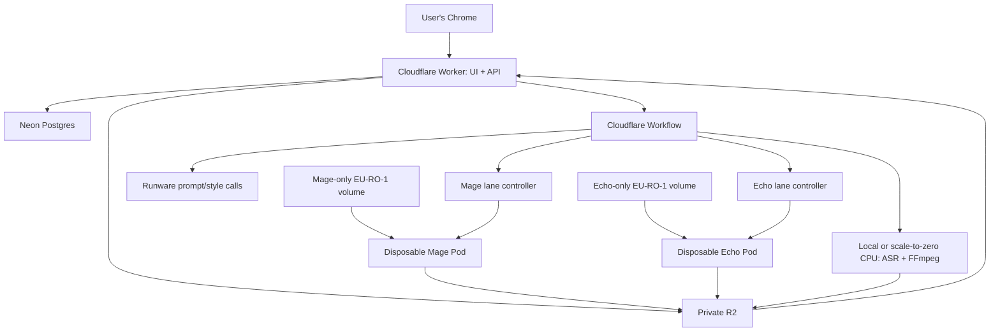

# System architecture

Status: recommended MVP architecture  
Read when: creating the repository, services, deployment, security, storage, or orchestration.

## Architecture principle

Use a small scale-to-zero control plane and two isolated API-controlled RunPod Pod lanes. Postgres is
editorial and operational truth. R2 or a verified local destination holds mutable inputs and outputs.
The two persistent model volumes are intentional fixed-cost infrastructure; disposable GPU Pods are
deleted between runs so only useful boot/inference time continues to incur compute cost.

Mage owns one volume and its Pods. Echo owns a different volume and its Pods. A later Pod may
reattach only its own model's volume. Cross-model Pod, volume, preparation marker, manifest, cache,
lease, worker identity, or reconciliation adoption is forbidden.

## Recommended stack

| Layer | Choice | Reason |
|---|---|---|
| Web UI | React + TypeScript + Vite | Fast HMR and fixture-first Chrome development |
| UI data | TanStack Query + Router | Explicit server state and typed routes |
| Styling | Tailwind + Radix/shadcn primitives + custom tokens | Accessible base with custom visual identity |
| Web + API | One Cloudflare Worker: React assets + same-origin Hono `/api/*` | One deployable/origin and direct bindings |
| Orchestration | Cloudflare Workflows | Durable waits and reconciliation without an always-on app server |
| Database | Neon Postgres | Durable relational truth with scale-to-zero |
| Database tests | Additive PostgreSQL SQL and repository contracts; PGlite only for local/CI | Real constraint behavior without treating fixtures as production truth |
| Auth | Better Auth + Google OAuth + membership allowlist | Closed-team sign-in |
| Artifacts | Private R2 plus verified local download | Durable job data outside model volumes |
| Prompt/style providers | Runware DeepSeek V4 Flash 0731; Gemini 3.5 Flash for new style analysis | Existing locked provider decisions |
| GPU compute | Two independent RunPod Pod lanes and two persistent `EU-RO-1` volumes | Fast offline loads and immediate per-lane shutdown |
| ASR/render | Local or measured scale-to-zero CPU whisper.cpp/FFmpeg | Never occupy the Mage GPU |
| Contracts | Zod in TypeScript; Pydantic in Python | Validate every boundary |
| Repository/registry | Private pnpm/Turborepo monorepo; immutable private worker images | Shared contracts and pinned deployments |

Cloudflare and Neon allowances and current provider prices must be rechecked at deployment. The
promise is $0 control-plane cost only while measured use stays inside current allowances, not “free
forever.” The user explicitly accepts persistent-volume billing. Optimize disposable Pod runtime;
do not replace volumes with repeated model downloads. PGlite remains test infrastructure, never
production or recovery truth.

## Logical topology

There is no edge between a Pod and the other model's volume, and no Serverless endpoint queue in the
active GPU topology.

## Model lanes

### Mage image lane

Mage generates every original B-roll still through the exact ImageForge INT8 ConvRot contract:

- `Comfy-Org/Mage-Flow@d8c99241f6fa80fbd453014234af2bf337ea21e6` through pinned headless
  `Comfy-Org/ComfyUI@26d7f8556822d9d08c2d3e1878636ac3b4969af9`.
- Precision `int8-convrot`, four steps, CFG/guidance `1.0`, 1280×720, text-to-image only.
- Required files: `diffusion_models/mage_flow_turbo_int8_convrot.safetensors`,
  `text_encoders/qwen3vl_4b_bf16.safetensors`, and `vae/mage_flow_vae_bf16.safetensors`.

Its dedicated persistent `EU-RO-1` volume holds only the pinned cache, prepared runtime, and
verification evidence. Each run creates one Mage Pod using the immutable Mage worker image and the
user's current Mage GPU choice. It processes bounded image chunks, uploads outputs, and is deleted;
the volume remains for the next Mage Pod.

### Echo avatar lane

EchoMimicV3-Flash is the sole active avatar generator. The profile pins
`antgroup/echomimic_v3@7e89489ca51c0d008fc1963ec6c03fc5bd0b9397`, Flash weights
`BadToBest/EchoMimicV3@311e176905a8c4c24b240b530488fe636ce4d249`, its Wan base/audio encoder,
and the VideoForge-prepared FP8 artifact. Compatible transformer linears use
`float8_e4m3fn` dynamic activation-and-weight quantization; other tensors stay BF16. Echo receives
only short scheduler-selected voiceover spans and the exact Avatar Profile runtime image.

Echo has a different persistent `EU-RO-1` volume and worker image. Each run creates one Echo Pod
using the user's independent Echo GPU choice. It uploads its clips and is deleted; the Echo volume
remains for the next Echo Pod. It never mounts the Mage volume.

Initially, each lane permits at most one Pod, so total GPU concurrency is at most two. One explicit
Generate action may start both required Pods concurrently while local/CPU transcription and timeline
preparation proceed. Inference waits for both `model_ready` and its immutable lane work plan. Each
lane completes and deletes independently.

## Preparation, boot, and artifacts

Each model volume is prepared once in a separately authorized setup operation. Preparation downloads
only pinned sources, derives the approved runtime, records every path/size/hash/configuration and
toolchain identity, independently verifies the mounted result, and writes the completion marker
last. A partial preparation never becomes ready and one lane cannot prepare the other lane's volume.

Ordinary project boots download no model bytes and resolve no model repository. A Pod mounts its
already-prepared volume and reports these truthful phases:

1. `container_ready`: the expected container and health API run.
2. `volume_ready`: exact lane volume, complete marker, and manifest verify.
3. `model_loading`: verified bytes load to the selected GPU; inference is rejected.
4. `model_ready`: exact identities and a real GPU warm-up pass.

The model-loading path must work with model registries unavailable. Missing, changed, incomplete, or
cross-mounted content fails closed. Authenticated R2/control-plane access remains available for job
data and events.

Voiceover, avatar inputs, prompts, outputs, previews, logs, and renders live in workspace-scoped R2
or verified local paths, never model volumes. Accepted outputs require size, checksum, and media
validation. Final local download uses a temporary file, resume where supported, verification, and
atomic promotion. whisper.cpp and FFmpeg run locally or on separate CPU compute; neither boots or
occupies Mage.

## Reusable assets and style analysis

Avatar Hub retains a private original plus deterministic, metadata-stripped runtime/thumbnail
derivatives and binds projects to an immutable ready version. Browser claims never replace
server-side magic-byte, dimension, size, checksum, metadata, consent, and safe-area validation. Any
needed server media preparation uses local/CPU execution, not a GPU model lane.

New draft Image Style analysis is a control-plane Runware Gemini workflow, not a Pod lane or normal
project step. It verifies normalized private derivatives, validates the structured profile, and waits
for publication. A ready style is immutable Postgres/R2 data and incurs no per-project analysis.

## Control-plane responsibilities

- Authenticate, authorize, validate uploads, and create immutable revisions.
- Manage versioned Avatar Profiles and Image Styles and their exact project pins.
- Run signed R2 transfers, local/CPU ASR integration, scheduling, and Runware batches.
- Query fresh compatible GPU inventory separately for Mage and Echo and persist each explicit choice.
- Reserve budget and record lane-scoped create/delete intents before provider mutation.
- Verify exact Pod, volume, image, model, GPU, worker, and attempt identity.
- Reconcile missing events and ambiguous provider responses without speculative create/delete.
- Delete each Pod after that lane is terminal and outputs are durable; retain both volumes.
- Compile only after the accepted-artifact barrier and expose truthful progress/cost.

The control plane never performs model inference or a long render. Postgres stores workflow IDs,
create/delete attempts, provider identities, and result manifests; provider state/logs are not
recovery truth.

## GPU choice and cost

Refresh live, `EU-RO-1` volume-compatible, qualified inventory independently for each model. The user
explicitly chooses one currently available GPU per required lane. Record selected and actual GPU,
rate snapshot, volume/DC, image digest, model manifest, and compatibility evidence. If availability
changes, require refresh/reselection; never silently fall back to another GPU or price.

Generate is bounded authority to create the required Pod or Pods. Delete each immediately after its
durable lane completion. Ambiguous create/delete outcomes reconcile against exact provider identity
and fail closed: no speculative duplicate Pod and no false “stopped” state.

## Historical paths

The former Serverless-first `/run`, endpoint queue, `workersMin`/`workersMax`, FlashBoot, shared
image/media endpoint, and endpoint-profile design is historical planning only. AvatarForcing,
MuseTalk, and SkyReels are historical/replay evidence only, not active lanes, fallbacks, repairs, or
volume-sharing precedent. Reintroduction requires a new decision, brief, compatibility gate, and
cost authorization.

## Renderer and output boundary

Direct FFmpeg provides the required hard cuts, crops, scales, slow still-image zoom, and audio mux.
Remotion adds an unnecessary browser layer; HyperFrames centers the prohibited motion-graphics/text
output class. Keep a renderer interface, but use FFmpeg now.

## Security, scale, and recovery

- Keep RunPod, Runware, database, R2, and OAuth secrets server-only. Use short-lived signed object
  URLs, workspace keys, authorization checks, and signed replay-protected worker events.
- Validate MIME, size, checksum, duration, and media decode; never pass arbitrary URLs to FFmpeg or
  leak provider payloads/secrets. Treat avatar likenesses and style references as private.
- Size MVP for 5–10 teammates. The hard initial limit is one Pod per lane; any increase needs a new
  measured decision. Do not add shared volumes, Redis, Kubernetes, or Temporal preemptively.
- Postgres plus R2 artifacts/manifests are recovery truth. Pin images and preparation hashes, retain
  each volume between Pods, and keep it reproducible from pinned sources.
- Reconcile exact Pod IDs before adoption, cancellation, or deletion. Lost create cannot authorize a
  second create; lost delete cannot be reported stopped until absence is proven.
