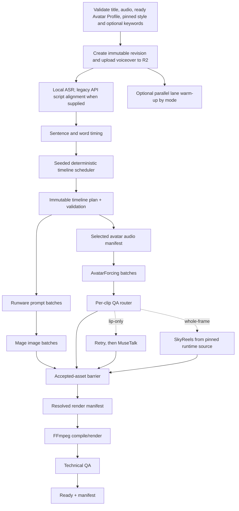

# Pipeline and deterministic scheduler

Status: approved production flow and initial scheduling algorithm  
Read when: implementing transcript alignment, EDL compilation, prompt dispatch, parallel work, or final assembly.

## Critical-path flow



Critical-path time is:

```text
upload + ASR + scheduler
+ max(prompting + image cold start + image generation,
      avatar cold start + avatar generation + clip QA/fallback)
+ final render + technical QA
```

Never report image time plus avatar time as if the lanes were sequential.

Image Style reference analysis is deliberately outside this critical path. A project may start only with a published pinned style version; it reads the stored profile and makes no Gemini vision call.

## Stage details

### 1. Ingest

- Enforce the MVP input envelope: English voiceover, 10 seconds–60 minutes, at most 1 GB; title 1–240 characters; supported decodable audio; exact accessible `READY` Avatar Profile version; and published Image Style version.
- Probe the audio with FFprobe.
- Normalize a temporary analysis copy to 16 kHz mono PCM; preserve the original for final output.
- Resolve the selected Avatar Profile version, verify it is `READY`, available, workspace-accessible, and belongs to an `ACTIVE` parent, then pin its canonical profile hash plus runtime source asset/checksum. A previously selected v1 remains valid after v2 becomes active; do not re-upload or silently upgrade/replace it during project ingest.
- Validate that the selected Image Style version is published and accessible in the workspace; snapshot its RFC-8785-canonical profile hash.
- Normalize/cap optional extra image keywords and persist both text and apply toggle. A false toggle means no provider/generator receives the text.
- Hash every input and create an immutable revision.

### 2. Free local word timing

Use `whisper.cpp base.en`, not Groq/Deepgram:

- Local M4 development: Metal + FlashAttention, greedy decode, one segment per word using the proven QuickCut approach.
- Production: CUDA build in the image/media worker; benchmark against faster-whisper once and lock the faster equivalent only if outputs remain compatible.
- Normalize audio once.
- Persist millisecond word starts/ends and true FFprobe duration.

The first-shell web client does not expose an exact-script field and submits `optional_script: null`, so ASR wording is canonical on that path. For backward-compatible versioned API clients that supply a non-null exact script, normalize its tokens and sequence-align ASR words to the script with deterministic dynamic programming. Keep matched times, interpolate unmatched script tokens, and retain the supplied wording as canonical. Do not add WhisperX unless evaluation shows visible boundary error above roughly 250 ms.

### 3. Sentence/phrase boundaries

Create candidate boundaries from punctuation, pauses, conjunctions, and maximum duration. Every candidate carries:

- Start/end milliseconds.
- Exact phrase.
- Word count.
- Sentence ID.
- Pause before/after.
- Adjacent context.

### 4. Timeline composition scheduler

Use a versioned seeded PRNG derived from `project_revision_id + scheduler_version + user_seed`. The same input/version/seed must produce the same timeline plan.

Initial algorithm:

1. Begin with `AVATAR_FULL` at 00:00, selecting a natural 2–6 second phrase; allow 4–7 seconds for a strong cold open when a complete sentence needs it.
2. Choose the next target avatar start 14–20 seconds after the prior start.
3. Snap to the best nearby phrase boundary without creating an avatar clip outside 2–6 seconds except the bounded opener.
4. Alternate `AVATAR_FULL` and `AVATAR_SPLIT_IMAGE`.
5. Maintain running coverage and bias later choices toward 21–22% total avatar and near-equal full/split time.
6. Avoid cutting inside a word, on a sharp breath, or across a meaningful pause.
7. Fill uncovered regions with 3–7 second `IMAGE_FULL` scenes at clause/sentence boundaries.
8. Merge residual image scenes below 2.5 seconds; split those above 8 seconds where semantics permit.
9. Create one dedicated relevant right-panel image task for every split segment unless a clearly matching adjacent accepted image is explicitly reused.
10. Assign every image slot one `in_image_shot_role` from the versioned seeded rotation, with deterministic lexical overrides when narration clearly asks for hands/action, an object, a wide setting, macro evidence, or a result.
11. Convert boundaries to canonical 30 fps integer `start_frame` and exclusive `end_frame_exclusive`; retain source-audio milliseconds/samples separately.
12. Emit and validate `timeline-plan/v1`: composition-specific required slots/task keys, no generated asset IDs, exact coverage/order/percentages/duration bounds/layout alternation.

No LLM is called during this algorithm.

Expected 30-minute envelope:

- Total avatar: about 396 seconds.
- Full avatar: about 198 seconds.
- Split avatar: about 198 seconds.
- Avatar appearances: roughly 100–110.
- Full-image assets plus split companions: roughly 220–320, often near 300.

These are targets, not hard-coded counts. Speech boundaries win over hitting an exact count.

### 5. Prompt batches

- Build batches of 25–50 image scenes.
- Give Runware the sanitized project title once per batch; give each item its exact phrase, assigned `in_image_shot_role`, and concise adjacent context.
- Give DeepSeek the pinned style's compact planner guidance once per batch.
- Carry the compact accepted continuity state from one batch into the next; do not add a separate continuity LLM call.
- Keep the full selected style suffix, optional enabled extra keywords, and permanent guardrails in code. Never send project extra keywords to DeepSeek.
- Validate strict JSON and scene IDs.
- Retry only missing/invalid items once; then show a blocker or deterministic fallback prompt.
- Dispatch each valid batch to Mage immediately instead of waiting for all prompts.

### 6. Image generation

- Use Mage-Flow-Turbo, 4 steps, CFG 1, pinned revision/hash.
- Compile every prompt from scene core + crop guidance + pinned style suffix + enabled extra keywords + permanent guardrails. Store writer/compiler versions, components, exact final positive/negative UTF-8 strings, and hashes of the exact submitted bytes.
- Keep a model resident while processing the project's batches.
- Generate full images in 16:9 and split companions in 8:9 where supported.
- Upload each result immediately with checksum and metadata.
- Record prompt, seed, latency, GPU, peak VRAM, and actual cost.
- Do not run a mandatory upscaler or multimodal QA stage. Use inexpensive deterministic checks and human review for obvious failures.

### Separate Image Style creation workflow

Style creation/update is not a numbered video-production stage:

1. Browser-normalize private reference derivatives, upload them, independently verify them server-side, and record disclosure/rights/retention.
2. Run one version-scoped idempotent Runware Gemini 3.5 Flash multi-image analysis.
3. Validate untrusted `image-style-analyzer-output/v1`, apply the deterministic hard-rule validator, and assemble trusted `image-style-profile/v1`; surface per-trait support, outliers, and uncertainty.
4. User reviews/edits and may explicitly request a small Mage test.
5. Atomically publish the immutable version and move the parent active-version pointer.

Only step 5 makes that version selectable. Published v1 remains selectable while v2 is drafted/analyzed; updates never mutate a queued/running/ready project's pinned version.

### 7. Avatar generation and QA authority

- Slice only scheduled spans, adding small context padding for coarticulation.
- Preserve exact EDL trim points so padding never changes timeline length.
- Send the pinned Avatar Profile runtime source + span audio + restrained prompt to AvatarForcing.
- Generate one clip per span and reuse it for both layouts.
- Process multiple spans per resident worker/chunk.

MVP acceptance authority:

- Deterministic decode, duration, frame-rate, crop, checksum, and A/V checks may auto-pass.
- After the global AvatarForcing model/container/GPU suite has been accepted, a technically valid primary result becomes the selected draft clip so production does not require 100+ mandatory clicks. Optional per-profile compatibility evidence is separate.
- The user can inspect/flag any clip. Subjective identity/body/background/motion/detail failure is never silently inferred by a general visual-QA model in MVP.
- A future local lip metric may be added only after its own documented gate; until then, `LIP_ONLY` versus `WHOLE_FRAME` is an explicit user/reviewer classification.

Defect-specific router after a failure is classified:

1. Pass → accept, no MuseTalk.
2. Lip sync only → one AvatarForcing retry.
3. Still lip-only → MuseTalk on the otherwise-good AvatarForcing source.
4. MuseTalk fails → discard repair; SkyReels from the same pinned Avatar Profile source/audio.
5. Identity, body, background, motion, or full-screen-detail failure → skip MuseTalk; SkyReels from the same pinned Avatar Profile source/audio.
6. One clip failure never changes the global default.

### 8. Asset barrier and compilation

The timeline becomes renderable only when every required slot points to one selected technically valid asset, an explicitly user-accepted replacement, or an explicit user-approved placeholder. Bind those assets/checksums, the original voiceover checksum, revision/timeline hashes, fixed output profile, and total frames into immutable `resolved-render-manifest/v1`; do not mutate the pre-generation timeline plan. Validate both manifests and artifact hashes before dispatch.

FFmpeg:

- Apply fixed avatar crops.
- Apply the accepted asset's renderer source profile: AvatarForcing 832×480/25 fps and SkyReels
  960×960/25 fps use separate fixed center crops and direct 25→30 conversion. Never force a fallback
  through the primary crop; no optical-flow/interpolation model.
- Apply eased centered image zoom.
- Build exact-duration 1080p30 segments.
- Join with hard cuts.
- Mux the original voiceover.
- Perform two-pass loudness normalization only if needed.
- Encode one Chrome-compatible MP4.

### 9. Technical QA and delivery

Use FFprobe and deterministic assertions for format, duration, stream count, coverage, geometry, A/V start/end, and decode. Store the final checksum and expose a short-lived signed preview at the automatic `READY_FOR_REVIEW` terminal without pretending technical QA detected generated-pixel anatomy, pseudo-text, relevance, or style defects. Explicit user review records `APPROVED`; only then create immutable `production-manifest/v2` binding the approval plus revision, timeline, resolved-render manifest, prompt manifest, attempt index, QA manifest, cost-ledger snapshot, selected avatar/style/model profiles, and final output, and issue the approved download bundle.

## Parallelization rules

- Start ASR immediately after upload.
- Balanced/Faster may start compatible image/avatar workers or preprocessing during ASR; Lowest cost waits until work is ready.
- Prompt generation and avatar dispatch begin together after EDL creation.
- Mage starts each validated prompt batch immediately.
- Avatar clip QA occurs as clips arrive; fallbacks do not wait for the whole avatar lane.
- Prepare resolved-manifest inputs and filtergraph incrementally, but do not keep a GPU billed while waiting for the other lane.
- Trigger a fresh lightweight render job when the barrier closes.
- Fetch/validate the selected style during preflight; do not insert analysis into the project critical path.

## Simplifications intentionally retained

- No AI layout planner.
- No AI B-roll video.
- No separate forced-alignment model.
- No per-image vision QA API.
- No automatic subjective whole-frame avatar classifier; user/reviewer classification activates the fallback router.
- No per-video reference-style vision call; a ready published style is reused as data.
- No automatic Style LoRA training or reference-conditioned image stage.
- No enhancement/upscale stage unless the bakeoff proves it changes visible full-screen quality enough to justify cost.
- No second avatar generation for split layout.
- No browser compositor.
- Retry only the failed unit.
