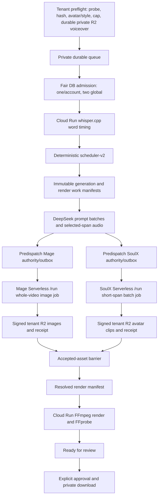

# Pipeline and deterministic scheduler

Status: CP-03/CP-04 planning foundations accepted; tenant-fair Serverless integration pending
Read when: implementing transcript alignment, scheduling, generation, dispatch, or final assembly.

## Critical path

A durable database scheduler admits at most one active video per account and two globally. Waiting
projects are private to their account and perform no hosted CPU or GPU work. The RunPod endpoint
queues receive only already-admitted exact jobs; they do not decide fairness.



After admission, derivative preparation/transcription/scheduling/prompt/span preparation may overlap
Serverless worker initialization when exact dependencies allow. Critical-path time is measured, not
assumed:

```text
queue wait
+ durable input/preparation
+ max(Mage worker initialization + remaining Mage inference,
       SoulX worker initialization + remaining SoulX inference and clip QA)
+ final render/probe
```

Do not add image and avatar lane times as if sequential. A healthy handler is not `model_ready`.
Every stage transition requires the exact durable predecessor receipts and tenant-bound identities.

## 1. Ingest and admission

- Validate title 1–240 characters and English voiceover 10 seconds–60 minutes, at most 1 GB, using
  server-side MIME/magic-byte/decode/duration/channel/sample-rate checks.
- Derive the account/default-workspace from the authenticated session. Resolve only an account-owned
  `READY` Avatar Profile version and published Image Style version, or an explicit global built-in.
  Foreign, archived-for-new-use, or mismatched IDs fail without revealing existence.
- Locally probe/hash audio, reserve its exact private R2 object, durably upload the validated original,
  and verify the object receipt/hash. Preserve those original bytes for final audio.
- Freeze an immutable revision containing the verified voiceover asset/receipt/hash, selected
  versions/hashes, `scheduler-v2`, compiler versions, seed, output contract, and spend cap.
- Generate is idempotent at the VideoForge command boundary: duplicate browser submission returns the
  existing private queue item. It does not imply provider exactly-once behavior.
- Enqueue privately. A serializable fair-admission transaction activates it only when the account has
  no active provider workload and fewer than two different accounts hold global workload leases.
- Before admission, do no ASR, prompt generation, span slicing, Serverless dispatch, or render work.
- Only after admission may the pipeline make the 16 kHz mono PCM analysis derivative.

## 2. Word timing

Use pinned `whisper.cpp ggml-base.en`, not Groq, Deepgram, WhisperX, or an LLM. Production invokes an
authenticated scale-to-zero Cloud Run Job with an immutable tenant R2 input/output manifest; the Mac
runs the same entrypoint only for development/provider-free parity.

- Greedy decoding, English, `--max-len 1 --split-on-word`, best-of 1, beam size 1.
- Persist exact executable/model/config hashes, original/normalized audio hashes, millisecond word
  starts/ends, FFprobe duration, and chunk receipt lineage.
- For long audio, preserve CP-03 deterministic overlap/reconciliation and replay rules. Monotonic,
  complete word coverage is mandatory.
- The normal web client sends `optional_script: null`, so ASR wording is canonical. If a versioned API
  client supplies a script, deterministic dynamic programming aligns it to ASR timing; no AI timing
  decision is added.

## 3. Natural candidate boundaries

Create candidate boundaries from transcript punctuation, measured pauses, conjunctions, sentence
structure, and bounded duration. Each candidate contains start/end milliseconds, exact word range,
phrase, sentence ID, word count, pause before/after, and adjacent context.

Duration never selects an arbitrary cut. Prefer a full stop and the next good comma/full-stop/pause
that remains within the legal window. If no short sentence exists, use the best clause/pause boundary;
only then use the nearest legal word boundary with a deterministic penalty. Never cut inside a word,
breath, or meaningful phrase. This is deterministic code and needs no LLM.

## 4. Timeline scheduler

Preserve accepted `scheduler-v2`. A versioned PRNG derives only from
`project_revision_id + scheduler_version + user_seed`. Same inputs/version/seed produce identical
frame boundaries, compositions, asset slots, and shot roles.

Algorithm:

1. Start frame 0 with `AVATAR_FULL` on a natural 2–6-second phrase. A strong complete opening sentence
   may use 4–7 seconds.
2. Target the next avatar start 14–20 seconds later, then rank legal word/clause boundaries by pause,
   syntax, coverage pace, and distance. Time is a bounded target, not the cut authority.
3. Alternate `AVATAR_FULL` and `AVATAR_SPLIT_IMAGE` strictly.
4. Maintain 21–22% total avatar coverage and near-equal full/split cumulative frames.
5. Fill uncovered narration with 3–7-second `IMAGE_FULL` scenes at natural clause/sentence boundaries.
   Merge residual image scenes below 2.5 seconds; split scenes above 8 seconds where semantics permit.
6. Make one literal right-panel image task for every split unless an exact matching accepted adjacent
   image is intentionally reused.
7. Assign one deterministic `in_image_shot_role` per image slot from the accepted varied rotation,
   with lexical overrides for people/actions, object evidence, wide setting, macro detail, or result.
8. Convert to canonical 30 fps integer `start_frame` and exclusive `end_frame_exclusive`; retain
   source audio milliseconds/samples separately.
9. Emit and validate `timeline-plan/v1`: exact composition slots/task keys, no generated asset IDs,
   total duration, coverage/order, alternation, bounds, and percentages.
10. Fail closed unless avatar frames are 21–22%, full/split cumulative difference is at most seven
    seconds, every word/source/frame interval is covered once, and all image scenes are legal.

No LLM chooses timing, composition, crop, or boundaries.

### Ranga-close acceptance

Pinned two-video evidence defines the target band:

- frame 0 full avatar; first literal evidence 3–6 seconds; first split by 18 seconds;
- full and split strict alternation (reference 148/149 transitions, 99.33%);
- total avatar 21–22%; mean avatar span 3.5–4.0 seconds; typical 2–6 seconds;
- 3.3–3.7 avatar appearances/minute and median non-avatar gap 10–13 seconds;
- mean visual change 4.0–4.8 seconds and median 3.6–4.7 seconds;
- literal narration evidence and meaningful varied shot roles.

CP-04's 30-minute fixture remains the regression anchor: 54,000 frames, 394 segments, 21.05%
avatar, 103 appearances (3.433/minute), 3.679-second mean avatar span, 4.569-second mean segment, 81
frames full/split difference, 342 image slots, and six shot roles with complete word/source/frame
coverage. Do not rebuild or loosen this scheduler for the architecture transition.

For human relevance review, score each image 2=directly depicts the narrated claim, 1=contextually
supports it, 0=generic/unrelated. Production-length sample target is mean at least 1.8, with no 0 in
the opening minute or a critical claim. Reject visible pseudo-text/logo/anatomy/style defects.

## 5. Generation work manifests

Before provider dispatch, compile immutable JCS documents:

- `generation-work-manifest/v1` binds tenant/workspace/project/revision/transcript/timeline/config
  hashes; 25–50-scene prompt batches; every image slot/planned artifact; every short SoulX task and
  its 16 kHz mono padded WAV/trim lineage; exact cost cardinalities; and
  `full_voiceover_dispatched=false`.
- `render-work-manifest/v1` binds every exclusive frame interval to planned image/avatar assets,
  locks `HARD_CUTS_ONLY`, requires `SLOW_SMOOTH_CENTERED_ZOOM` for image-containing segments, and
  requires an accepted avatar source/crop profile before resolution.

Missing/duplicate/cross-tenant/cross-revision/full-voiceover/transition/slot/count/hash drift is a
hard failure. Planning manifests authorize no provider work by themselves.

## 6. Image prompt compilation

- Batch 25–50 image scenes. DeepSeek receives the sanitized title once, each exact phrase/shot role
  and concise context, plus the pinned style planner guidance once.
- Preserve compact accepted continuity state between batches; no extra continuity LLM call.
- Validate strict JSON and exact scene IDs. Retry only missing/invalid items once, then block or use an
  explicitly defined deterministic prompt fallback.
- Trusted code compiles scene core + crop guidance + immutable style suffix + enabled extra keywords
  + permanent guardrails. Store components and exact submitted UTF-8/hash.
- Never send disabled extra keywords, private style references, Ranga research frames, or another
  account's data.

## 7. Mage image generation

Use only the exact Mage profile:

- `Comfy-Org/Mage-Flow@d8c99241f6fa80fbd453014234af2bf337ea21e6`;
- pinned `Comfy-Org/ComfyUI@26d7f8556822d9d08c2d3e1878636ac3b4969af9`;
- INT8 ConvRot, four steps, guidance 1.0, 1280x720, text-to-image.

For one admitted video, persist a predispatch authority/outbox record then submit one bounded
whole-video image job to the Mage queue endpoint. The handler mounts only the existing sealed
Mage-only volume at `/runpod-volume`, redirects cache/temp/output to job-local scratch, verifies the
manifest, loads offline, warms up, and processes the exact image work manifest sequentially while
resident. It uploads every result immediately to its exact private R2 object and writes a signed
completion receipt containing hashes, size/shape, prompt/seed, GPU, VRAM, timings, attempt, and cost
observations. Verify the model manifest again before successful exit.

No runtime download, model resolution, upscaler, reference conditioning, LoRA, BF16 substitute,
other volume, or auto-repair is permitted. Two simultaneously admitted videos may occupy two Mage
Flex workers only after concurrent-read qualification; handler concurrency stays one.

## 8. SoulX avatar generation

Use only exact SoulX-FlashHead Pro:

- source `Soul-AILab/SoulX-FlashHead@9bc03de06bb0de82cd6bc477804512ae06144bf2`;
- weights `Soul-AILab/SoulX-FlashHead-1_3B@59119b6c681230c3eeee157e224ae1941746711e#Model_Pro`;
- BF16, 512x512, 25 fps, four distilled steps, shift 5, color correction 1.0, seed 42, streaming audio,
  Torch compile, no face crop/repair/enhancement/fallback/substitute.

Materialize only scheduled span WAVs. Add deterministic coarticulation padding, retain exact trim
sample/frame lineage, and ensure padding never changes the timeline. Never send the full voiceover.
One generated native clip serves both full and split compositions.

Persist a predispatch authority/outbox record then submit one bounded whole-video span-batch job to
the SoulX endpoint. Its handler mounts only the sealed SoulX volume at `/runpod-volume`, redirects all
writes to job-local scratch, verifies/loads/warms offline, processes spans sequentially, validates
each clip's decode/frame-rate/duration/A-V relationship, uploads to exact tenant R2 keys, and writes a
signed receipt. Verify the sealed manifest again before exit.

EchoMimicV3-Flash, Long Video CFG, repair, enhancement, face crop, alternate model/precision, and
cross-mount are forbidden. Two simultaneous SoulX workers require explicit concurrent-read and
quality qualification.

Deterministic media checks establish `READY_FOR_USER_REVIEW`, not subjective quality. Users may flag
lip sync or whole-frame identity/motion/background/detail. Any retry is a new costed authorized
attempt; there is no silent fallback.

## 9. Provider dispatch and recovery

Before each `/run`, transactionally store endpoint/image/model/volume/input/output identities,
dispatch token, request hash, attempt, budget reservation, TTL, execution/init timeout, and outbox
state. After `/run`, bind the exact provider job ID and later actual worker/GPU evidence.

RunPod does not promise client idempotency or exactly-once billing. An ambiguous POST is reconciled,
not blindly repeated. A deliberate repeat creates a new attempt/reservation; accept at most one exact
result and expose duplicate-compute/cost risk.

Poll `/status`. Treat webhooks only as hints and require the bound job plus a VideoForge-signed R2
receipt. Copy/verify durable outputs immediately because async result retrieval expires after 30
minutes. TTL includes queue time and can remove running jobs; set TTL, execution timeout, and
`RUNPOD_INIT_TIMEOUT` from measured bounded evidence. Never purge the endpoint queue.

Cancellation stops undispatched stages, sends cancellation only for exact bound jobs, and continues
reconciliation until no callback can revive the attempt. Failure/cancel still records cost and
cleans local scratch. Scale-to-zero is provider autoscaling; the product does not create/delete Pods.

## 10. Asset barrier and render

The timeline becomes renderable only when every required slot points to one selected technically
valid checksum-bound artifact, an explicitly accepted replacement, or an explicitly approved
placeholder. Create immutable `resolved-render-manifest/v1` binding tenant/revision/timeline,
original voiceover, exact assets, avatar source/crop profile, output profile, and total frames.

An authenticated scale-to-zero Cloud Run Job runs pinned FFmpeg/FFprobe against exact private R2
objects. It:

- applies the exact source-aware SoulX full/split crop profile only after that Avatar Profile's
  visual approval; the latest sample outputs do not yet establish production crop acceptance;
- uses the same native avatar clip for either layout;
- applies eased centered zoom to each image-containing segment;
- builds exact 1080p30 segments and joins them with hard cuts;
- muxes the original voiceover and uses loudness normalization only if needed;
- encodes one Chrome-compatible H.264/AAC MP4 and verifies streams, frames, geometry, decode, A/V
  start/end, duration, and coverage.

The renderer adds no caption/title/text/graphic/border/watermark/transition. A slow image zoom is the
only permitted motion treatment.

## 11. Review and delivery

A valid final output becomes `READY_FOR_REVIEW`. Technical checks cannot approve relevance,
anatomy, pseudo-text, identity, lip sync, or style. Explicit user approval creates immutable
`production-manifest/v3` binding approval actor/time, tenant/revision/timeline, generation/render
manifests, accepted Serverless provenance receipts, exact provider attempts/cost snapshot,
avatar/style/model profiles, QA, and final SHA-256. Historical v2 manifests remain replay-only.
Preview/download URLs are short-lived and tenant-authorized.

Terminal workflow releases the account/global admission lease only after lane attempts, callbacks,
artifacts, and cost records reconcile. New fair work may then be admitted. Workers scale to zero
automatically; operations independently verifies zero queued/running jobs and zero Active/Flex
workers when drained while retaining only the two sealed model volumes.

## Style workflow outside the video critical path

New Image Style analysis is version-scoped and account-private:

1. Browser-normalize authorized references; server-verify and store tenant-private derivatives.
2. Record rights and plain Runware retention/non-ZDR disclosure consent.
3. Run one idempotent Gemini 3.5 Flash analysis and validate untrusted structured output.
4. User reviews/edits and may explicitly request a separately estimated Mage test.
5. Publish one immutable version; keep prior versions usable for pinned work.

Ordinary project generation reads the stored style profile and performs no reference vision call.
