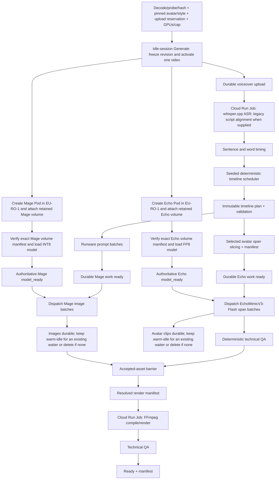

# Pipeline and deterministic scheduler

Status: approved production flow and initial scheduling algorithm  
Read when: implementing transcript alignment, EDL compilation, prompt dispatch, parallel work, or final assembly.

## Critical-path flow

There is one global generation session and exactly one active video. When no session is open, the
first accepted Generate selects one fresh exact GPU offering for each model, opens the session, and
activates that video. While a video is active, every later Generate only appends an immutable
waiting entry which inherits the session's GPU pair. A waiting project performs no transcription,
scheduling, prompt/span preparation, Pod creation, or inference until the current video reaches a
terminal state and that waiting entry is atomically activated.

After the last active video becomes terminal and no waiting entry remains, drain/cancel both lanes
as needed, delete every remaining Pod independently, prove both absent, close the session, and only
then expose fresh GPU selection again. The two model volumes remain.

The queue is global and shared. Every admitted user may append a project and may move or delete any
waiting entry using optimistic queue versions; the authenticated actor and before/after state are
audited. Creator identity gives no ownership priority. The active entry cannot be moved or removed
through waiting-queue controls; its dedicated cancellation contract is separate.



For the one active video, Pod attachment/model loading and hosted CPU preparation may overlap.
Critical-path time is:

```text
Generate preflight
+ max(durable upload + Cloud Run ASR + scheduler + prompt/span preparation,
      Mage Pod create + volume verify + model load,
      Echo Pod create + volume verify + model load)
+ max(remaining Mage generation,
      remaining Echo generation + clip QA)
+ final render + technical QA
```

Never report image time plus avatar time as if the lanes were sequential. Container health, an open HTTP port, or a mounted volume is not model readiness. A lane may dispatch generation only after the exact Pod reports authoritative `model_ready` for its pinned container, model manifest, volume, and selected GPU.

Image Style reference analysis is deliberately outside this critical path. A project may start only with a published pinned style version; it reads the stored profile and makes no Gemini vision call.

## Stage details

### 1. Ingest

- Enforce the MVP input envelope: English voiceover, 10 seconds–60 minutes, at most 1 GB; title
  1–240 characters; supported decodable audio; exact globally available `READY` Avatar Profile
  version; and published Image Style version.
- Before the single Generate mutation, locally decode/probe/hash the voiceover and freeze its
  checksum/metadata plus a resumable R2 upload reservation, immutable creative revision, exact ready
  avatar/style bindings, model-volume preparation evidence, and budget reservation. If the global
  generation session is idle, Generate also carries independent fresh Mage/Echo GPU choices,
  atomically opens the session, activates this revision, and may start both disposable Pods
  concurrently. Mage and Echo attach different retained model volumes.
- If a session is already open, Generate omits GPU fields and only appends the revision as a
  waiting entry inheriting the immutable session pair. Storage admission may finish, but no ASR,
  timeline, prompt/span preparation, Pod action, or inference for that project starts before it is
  the sole active entry.
- For the active entry, continue durable voiceover upload, Cloud Run ASR, timeline, prompts, and
  span slicing while required Pods boot. The immutable checksum/upload identity exists before
  provider mutation; no inference task may dispatch until its exact R2 input assets pass their
  durable barrier.
- Probe the audio with FFprobe.
- Normalize a temporary analysis copy to 16 kHz mono PCM; preserve the original for final output.
- Resolve the selected Avatar Profile version, verify it is `READY`, available in the global
  shared catalog, and belongs to an `ACTIVE` parent, then pin its canonical profile hash plus
  runtime source asset/checksum. A previously selected v1 remains valid after v2 becomes active;
  do not re-upload or silently upgrade/replace it during project ingest.
- Validate that the selected Image Style version is published and available in the global shared
  catalog; snapshot its RFC-8785-canonical profile hash.
- Normalize/cap optional extra image keywords and persist both text and apply toggle. A false toggle means no provider/generator receives the text.
- Hash every input and create an immutable revision.

### 2. Hosted word timing with Mac development parity

Use pinned `whisper.cpp base.en`, not Groq/Deepgram. Production invokes an authenticated,
scale-to-zero Cloud Run Job against immutable R2 input/output manifests. It never requires or
keeps either model Pod alive. The local Mac runs the same pinned contract only for development and
provider-free parity; local success is not production execution evidence.

- Local M4 development parity: Metal + FlashAttention, greedy decode, one segment per word using
  the proven QuickCut approach.
- Production: pinned CPU/memory/timeout/concurrency remain benchmark-gated, and accepted word JSON
  returns to the canonical private R2 prefix with checksum/shape validation and attempt lineage.
- Normalize audio once.
- Persist millisecond word starts/ends and true FFprobe duration.

The first-shell web client does not expose an exact-script field and submits `optional_script: null`, so ASR wording is canonical on that path. For backward-compatible versioned API clients that supply a non-null exact script, normalize its tokens and sequence-align ASR words to the script with deterministic dynamic programming. Keep matched times, interpolate unmatched script tokens, and retain the supplied wording as canonical. Do not add WhisperX unless evaluation shows visible boundary error above roughly 250 ms.

### 3. Sentence/phrase boundaries

Create candidate boundaries from punctuation, pauses, conjunctions, and maximum duration. Every candidate carries:

- Start/end milliseconds.
- Exact phrase.
- Word count.
- Sentence ID.
- Pause before/after.
- Adjacent context.

### 4. Timeline composition scheduler

Use a versioned seeded PRNG derived from `project_revision_id + scheduler_version + user_seed`. The same input/version/seed must produce the same timeline plan.

Active `scheduler-v2` algorithm:

1. Begin with `AVATAR_FULL` at 00:00, selecting a natural 2–6 second phrase; allow 4–7 seconds for a strong cold open when a complete sentence needs it.
2. Choose the next target avatar start 14–20 seconds after the prior start.
3. Rank exact word boundaries near phrase/clause boundaries. A bounded coverage-pace term prevents
   sparse or silence-heavy transcripts from drifting below the locked target; deterministic opener
   alternatives avoid greedy boundary dead ends.
4. Alternate `AVATAR_FULL` and `AVATAR_SPLIT_IMAGE`.
5. Maintain running coverage and bias later choices toward 21–22% total avatar and near-equal full/split time.
6. Avoid cutting inside a word, on a sharp breath, or across a meaningful pause.
7. Fill uncovered regions with 3–7 second `IMAGE_FULL` scenes at clause/sentence boundaries.
8. Merge residual image scenes below 2.5 seconds; split those above 8 seconds where semantics permit.
9. Create one dedicated relevant right-panel image task for every split segment unless a clearly matching adjacent accepted image is explicitly reused.
10. Assign every image slot one `in_image_shot_role` from the versioned seeded rotation, with deterministic lexical overrides when narration clearly asks for hands/action, an object, a wide setting, macro evidence, or a result.
11. Convert boundaries to canonical 30 fps integer `start_frame` and exclusive `end_frame_exclusive`; retain source-audio milliseconds/samples separately.
12. Emit and validate `timeline-plan/v1`: composition-specific required slots/task keys, no generated asset IDs, exact coverage/order/percentages/duration bounds/layout alternation.
13. Fail closed unless avatar frames are within 21–22%, full/split cumulative frame difference is
    at most seven seconds, every word/source/frame interval is covered once, and every remaining
    image range partitions into legal 3–7-second scenes.

No LLM is called during this algorithm.

After selected-span audio is materialized, deterministic code compiles two additional immutable
JCS documents before any generation can be dispatched:

- `generation-work-manifest/v1` binds the timeline/transcript/config hashes, 25–50-scene prompt
  batches, every image slot and planned artifact ID, every short Echo task and its 16 kHz mono
  padded WAV/trim lineage, plus exact cost cardinalities. `full_voiceover_dispatched` must be false.
- `render-work-manifest/v1` binds every exclusive 30 fps interval to planned image/avatar assets,
  locks `HARD_CUTS_ONLY`, requires `SLOW_SMOOTH_CENTERED_ZOOM` for every image-containing segment,
  and requires accepted Echo crop authority before later resolution.

Missing, duplicate, cross-revision, full-voiceover, transition, zoom, slot, count, or hash drift is a
hard validation failure. These planning manifests do not authorize provider work.

Normal avatar appearances have a hard 2–6-second envelope. Only the opening sentence may use the bounded 4–7-second exception. This edit rule follows measured reference cadence and creates bounded independent Echo work units; it is not evidence that VRAM scales linearly with audio duration.

Expected 30-minute envelope:

- Total avatar: about 396 seconds.
- Full avatar: about 198 seconds.
- Split avatar: about 198 seconds.
- Avatar appearances: roughly 100–110.
- Full-image assets plus split companions: roughly 220–320, often near 300.

These are targets, not hard-coded counts. Speech boundaries win over hitting an exact count.

### 5. Prompt batches

- Build batches of 25–50 image scenes.
- Give Runware the sanitized project title once per batch; give each item its exact phrase, assigned `in_image_shot_role`, and concise adjacent context.
- Give DeepSeek the pinned style's compact planner guidance once per batch.
- Carry the compact accepted continuity state from one batch into the next; do not add a separate continuity LLM call.
- Keep the full selected style suffix, optional enabled extra keywords, and permanent guardrails in code. Never send project extra keywords to DeepSeek.
- Validate strict JSON and scene IDs.
- Retry only missing/invalid items once; then show a blocker or deterministic fallback prompt.
- Persist each valid batch immediately instead of waiting for all prompts. Dispatch it as soon as the Mage Pod has also produced authoritative `model_ready` evidence.

### 6. Image generation

- Use the exact ImageForge-compatible active contract: `Comfy-Org/Mage-Flow@d8c99241f6fa80fbd453014234af2bf337ea21e6`, pinned ComfyUI, `int8-convrot`, four steps, guidance `1.0`, and 1280×720 output.
- Mount the dedicated retained Mage model volume on the selected disposable `EU-RO-1` Mage Pod.
  Treat verified model files as immutable/read-only in the worker, write scratch/results elsewhere,
  verify the content-addressed manifest before and after the ordinary job, load the model, and emit
  authoritative `model_ready` before accepting a generation dispatch. Do not assume RunPod provides
  a read-only mount flag.
- Compile every prompt from scene core + crop guidance + pinned style suffix + enabled extra keywords + permanent guardrails. Store writer/compiler versions, components, exact final positive/negative UTF-8 strings, and hashes of the exact submitted bytes.
- Keep a model resident while processing the project's batches.
- Generate every Mage asset at 1280×720. For split companions, prompt for the pinned 8:9 safe area and record the renderer's deterministic crop from the same locked output profile.
- Upload each result immediately with checksum and metadata.
- Record prompt, seed, latency, GPU, peak VRAM, and actual cost.
- Do not run a mandatory upscaler or multimodal QA stage. Use inexpensive deterministic checks and human review for obvious failures.
- After every required Mage output for the active video is durable, inspect only the global waiting
  queue. If at least one waiting entry exists, keep an already-running Mage Pod `model_ready` but
  idle; it may not claim or prepare waiting-project work. If there is no waiting entry, drain and
  delete the Mage Pod immediately and retain its model volume, without waiting for Echo or final
  render. If Mage was deleted and a project is appended later while the current video is still
  active, do not recreate it early; recreate on that project's activation only, after revalidating
  the same session-locked Mage offering, with no substitution.

### Separate Image Style creation workflow

Style creation/update is not a numbered video-production stage:

1. Browser-normalize private reference derivatives, upload them, independently verify them server-side, and record disclosure/rights/retention.
2. Run one version-scoped idempotent Runware Gemini 3.5 Flash multi-image analysis.
3. Validate untrusted `image-style-analyzer-output/v1`, apply the deterministic hard-rule validator, and assemble trusted `image-style-profile/v1`; surface per-trait support, outliers, and uncertainty.
4. User reviews/edits and may explicitly request a small Mage test.
5. Atomically publish the immutable version and move the parent active-version pointer.

Only step 5 makes that version selectable. Published v1 remains selectable while v2 is drafted/analyzed; updates never mutate a queued/running/ready project's pinned version.

### 7. Avatar generation and QA authority

- Slice only scheduled spans, adding small context padding for coarticulation.
- Preserve exact EDL trim points so padding never changes timeline length.
- Use the pinned EchoMimicV3-Flash Turbo FP8 runtime on its own disposable `EU-RO-1` Pod and retained Echo
  model volume. The worker treats verified model files as immutable/read-only application data and
  writes scratch/results elsewhere; provider-enforced read-only mounting is not assumed.
- Verify the exact Echo volume manifest, load the FP8 runtime, and emit authoritative `model_ready` before sending any avatar task.
- Send the pinned Avatar Profile runtime source + span audio + restrained prompt to EchoMimicV3-Flash only after both the durable span manifest and Echo `model_ready` evidence exist.
- Generate one clip per span and reuse it for both layouts.
- Process multiple spans per resident worker/chunk.
- After every required Echo clip for the active video is durable, keep an already-running Echo Pod
  `model_ready` but idle only when at least one global waiting entry exists. It may not claim or
  prepare waiting-project work. With no waiting entry, drain and delete it immediately, retain its
  model volume, and do not wait for Mage or final render. If Echo was deleted and a project is
  appended later while the current video is still active, recreate only after that project becomes
  active, revalidating the exact session-locked Echo offering and never substituting it.

MVP acceptance authority:

- Deterministic decode, duration, frame-rate, crop, checksum, and A/V checks may auto-pass.
- After the global EchoMimicV3-Flash model/container/GPU suite has been accepted, a technically valid primary result becomes the selected draft clip so production does not require 100+ mandatory clicks. Optional per-profile compatibility evidence is separate.
- The user can inspect/flag any clip. Subjective identity/body/background/motion/detail failure is never silently inferred by a general visual-QA model in MVP.
- A future local lip metric may be added only after its own documented gate; until then, `LIP_ONLY` versus `WHOLE_FRAME` is an explicit user/reviewer classification.

Active sample-first rule:

1. Deterministic checks establish only technical validity.
2. Native output becomes `READY_FOR_USER_REVIEW`; only the user decides subjective quality.
3. Poor output stops. No retry, repair, fallback, tuning, or substitution without new authority.

### 8. Asset barrier and compilation

The timeline becomes renderable only when every required slot points to one selected technically valid asset, an explicitly user-accepted replacement, or an explicit user-approved placeholder. Bind those assets/checksums, the original voiceover checksum, revision/timeline hashes, fixed output profile, and total frames into immutable `resolved-render-manifest/v1`; do not mutate the pre-generation timeline plan. Validate both manifests and artifact hashes before dispatch.

The production renderer is an authenticated scale-to-zero Cloud Run Job running pinned FFmpeg and
FFprobe against immutable private R2 manifests. The Mac uses the same entrypoint only for
development/provider-free parity. The production job:

- Apply fixed avatar crops.
- Apply the accepted asset's measured EchoMimicV3-Flash source profile only after user sample
  approval. No Echo dimensions, frame rate, or crop are pre-seeded from a historical model; any
  valid native geometry blocks profile creation until measured crop rules are user-approved. No
  optical flow.
- Apply eased centered image zoom.
- Build exact-duration 1080p30 segments.
- Join with hard cuts.
- Mux the original voiceover.
- Perform two-pass loudness normalization only if needed.
- Encode one Chrome-compatible MP4.

### 9. Technical QA and delivery

Use FFprobe and deterministic assertions for format, duration, stream count, coverage, geometry, A/V start/end, and decode. Store the final checksum and expose a short-lived signed preview at the automatic `READY_FOR_REVIEW` terminal without pretending technical QA detected generated-pixel anatomy, pseudo-text, relevance, or style defects. Explicit user review records `APPROVED`; only then create immutable `production-manifest/v2` binding the approval plus revision, timeline, resolved-render manifest, prompt manifest, attempt index, QA manifest, cost-ledger snapshot, selected avatar/style/model profiles, and final output, and issue the approved download bundle.

## Parallelization rules

- Only the first accepted idle-session Generate may select GPUs and start the disposable Mage and
  Echo Pods concurrently in `EU-RO-1`; this is not an optional Faster-mode warm-up. A Generate
  during the open session appends a waiting project only and inherits the pair.
- Exactly one video owns pipeline execution. Waiting entries perform no ASR, scheduling,
  prompt/span preparation, Pod create/recreate, or inference until atomic activation after the
  prior video is terminal.
- Mage and Echo always mount separate retained model volumes. Neither Pod may write mutable project inputs/results to a model volume.
- For the active video, start the Cloud Run ASR Job after its durable voiceover barrier. Continue
  timeline, prompt-batch, selected-span slicing, and manifest preparation while required Pods
  attach volumes, verify caches, and load models.
- Prompt generation and avatar dispatch begin together after EDL creation.
- A prepared task waits at a durable barrier until its own lane reports authoritative `model_ready`; readiness in one lane never authorizes dispatch to the other.
- Mage starts each validated prompt batch immediately after its two prerequisites—durable batch and Mage `model_ready`—exist.
- Avatar clip QA occurs as clips arrive. No repair or fallback model is active; a failed Echo clip stops for user direction.
- Prepare resolved-manifest inputs and filtergraph incrementally. When a lane's active-video assets
  are durable, keep its existing Pod warm but idle only if a waiting entry already exists;
  otherwise drain/delete it and prove absence independently without waiting for the other lane or
  final render.
- Pod deletion never deletes the retained Mage/Echo volume. A later active video recreates only a
  missing required Pod; that Pod verifies and loads the already-present pinned model bytes instead
  of downloading them again.
- A Pod deleted before a waiter appears is not recreated during the current video. When the next
  video activates, recreate it only on the same session GPU after fresh exact-offering
  revalidation; unavailable blocks and never substitutes. After a fully drained/closed session, a
  future first project selects a new pair.
- When the active video is terminal and there is no waiter, reconcile both lanes to proven Pod
  absence before closing the session and unlocking GPU selection; terminal failure or cancellation
  does not leave paid compute running.
- Trigger a fresh Cloud Run FFmpeg render/probe Job when the active video's barrier closes.
- Fetch/validate the selected style during preflight; do not insert analysis into the project critical path.

## Simplifications intentionally retained

- No AI layout planner.
- No AI B-roll video.
- No separate forced-alignment model.
- No per-image vision QA API.
- No automatic subjective whole-frame avatar classifier; user/reviewer rejection stops the affected work and does not activate a hidden repair, retry, or fallback route.
- No per-video reference-style vision call; a ready published style is reused as data.
- No automatic Style LoRA training or reference-conditioned image stage.
- No enhancement/upscale stage unless the bakeoff proves it changes visible full-screen quality enough to justify cost.
- No second avatar generation for split layout.
- No browser compositor.
- Retry only the failed unit.
