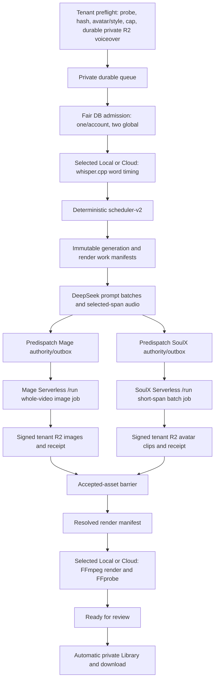

# Pipeline and deterministic scheduler

Fresh ordinary generation uses the same fair DB admission, transcript, scheduler, prompt writer,
selected-span audio, and revision-selected Local/Cloud render. After those stages, migration 0188 materializes
Kie image and Fal audio-to-video jobs; the API Workflow claims each before submission, verifies
private outputs, and hands accepted media to the existing render path. The RunPod diagram and
queue details below describe historical attempts only.

The API coordinator keeps at most eight image and four avatar tasks outstanding. Fal starts
within those slots concurrently; Kie starts use 1050ms slots. Every submitted result is visited
on each observation pass, with serial media acceptance and 250ms minimum observation slots.
Slots include their final interval to preserve pacing across passes and the two admitted accounts.
Accepted work advances immediately; a pending-only pass sleeps two seconds. A submission error
stops queued paid calls while already claimed calls finish recording their exact identities.

Hosted prompt batches check the configured Runware balance before claiming a new request. Insufficient
credits pause the existing run without changing its saved prefix or reservation. Recovery verifies
the original task archive, including exact request/task/model identity; a confirmed admission refusal
uses the existing bounded replacement gate. A polling `processing` response alone never authorizes
replay. Credit pauses can resume through the normal continuation or Check again action; RunPod credits
do not fund Runware inference. See `evidence/acceptance/VF-10-09/2026-10-01-prompt-credit-recovery.json`.

Status: transcript and deterministic-scheduler foundations accepted; tenant-fair Serverless integration pending
Read when: implementing transcript alignment, scheduling, generation, dispatch, or final assembly.

## Critical path

A durable database scheduler admits at most one active video per account and two globally. Waiting
projects are private to their account and perform no hosted CPU or GPU work. The RunPod endpoint
queues receive only already-admitted exact jobs; they do not decide fairness.


```mermaid
flowchart TD
    P["Tenant preflight: probe, hash, avatar/style, cap, durable private R2 voiceover"] --> Q["Private durable queue"]
    Q --> A["Fair DB admission: one/account, two global"]
    A --> T["Selected Local or Cloud: whisper.cpp word timing"]
    T --> S["Deterministic scheduler-v2"]
    S --> WM["Immutable generation and render work manifests"]
    WM --> D["DeepSeek prompt batches and selected-span audio"]
    D --> MI["Predispatch Mage authority/outbox"]
    D --> SI["Predispatch SoulX authority/outbox"]
    MI --> ME["Mage Serverless /run whole-video image job"]
    SI --> SE["SoulX Serverless /run short-span batch job"]
    ME --> MR["Signed tenant R2 images and receipt"]
    SE --> SR["Signed tenant R2 avatar clips and receipt"]
    MR --> B["Accepted-asset barrier"]
    SR --> B
    B --> RM["Resolved render manifest"]
    RM --> F["Selected Local or Cloud: FFmpeg render and FFprobe"]
    F --> R["Ready for review"]
    R --> AP["Automatic private Library and download"]
```

After admission, derivative preparation/transcription/scheduling/prompt/span preparation may overlap
Serverless worker initialization when exact dependencies allow. Critical-path time is measured, not
assumed:

```text
queue wait
+ durable input/preparation
+ max(Mage worker initialization + remaining Mage inference,
       SoulX worker initialization + remaining SoulX inference and clip QA)
+ final render/probe
```

Do not add image and avatar lane times as if sequential. A healthy handler is not `model_ready`.
Every stage transition requires the exact durable predecessor receipts and tenant-bound identities.

## 1. Ingest and admission

- Validate title 1–240 characters and English voiceover 10 seconds–60 minutes, at most 1 GB, using
  server-side MIME/magic-byte/decode/duration/channel/sample-rate checks.
- Derive the account/default-workspace from the authenticated session. Resolve only an account-owned
  `READY` Avatar Profile version and published Image Style version, or an explicit global built-in.
  Foreign, archived-for-new-use, or mismatched IDs fail without revealing existence.
- Locally probe/hash audio, reserve its exact private R2 object, durably upload the validated original,
  and verify the object receipt/hash. Preserve those original bytes for final audio.
- Freeze an immutable revision containing the verified voiceover asset/receipt/hash, selected
  versions/hashes, `scheduler-v2`, compiler versions, seed, output contract, and the `NULL`
  unlimited-project cost-limit fact.
- Generate is idempotent at the VideoForge command boundary: duplicate browser submission returns the
  existing private queue item. It does not imply provider exactly-once behavior.
- Enqueue privately. A serializable fair-admission transaction activates it only when the account has
  no active provider workload and fewer than two different accounts hold global workload leases.
- Before admission, do no ASR, prompt generation, span slicing, Serverless dispatch, or render work.
- Only after admission may the pipeline make the 16 kHz mono PCM analysis derivative.

## 2. Word timing

Use pinned `whisper.cpp ggml-base.en`, not Groq, Deepgram, WhisperX, or an LLM. Production grants an
exact time-bounded lease to an authenticated worker paired with the same account/workspace. The
worker obtains fresh immutable tenant R2 input ports only at claim time and has no reusable R2 or
provider credential. Windows and macOS run the same execution contract.

- Greedy decoding, English, `--max-len 1 --split-on-word`, best-of 1, beam size 1.
- Persist exact executable/model/config hashes, original/normalized audio hashes, millisecond word
  starts/ends, FFprobe duration, and chunk receipt lineage.
- For long audio, preserve deterministic overlap/reconciliation and recovery rules. Monotonic,
  complete word coverage is mandatory.
- A word longer than the seven-second maximum scene cannot be scheduled. Before publishing a new
  chunk receipt, re-decode only the affected chunk once with balanced overlapping windows capped at
  90 seconds (15 seconds for an original chunk at most 90 seconds), the same pinned model and options,
  and original normalized analysis bytes. Preserve healthy receipts, cancellation and exact source
  duration; reject recovery that remains invalid. Never fabricate word timing. Historical accepted
  results remain immutable and require a fresh attempt; planning rejects oversized words immediately.
- Hosted canonical timing replay preserves every exact source, timeline, task and tenant identity.
  Only per-request `planning_started_at`/`planning_completed_at` display observations are excluded
  from append-payload replay equality; first accepted clock evidence remains immutable. Concurrent
  browser/continuation planning must accept the same canonical plan without new provider work.
- The normal web client sends `optional_script: null`, so ASR wording is canonical. If a versioned API
  client supplies a script, deterministic dynamic programming aligns it to ASR timing; no AI timing
  decision is added.

## 3. Natural candidate boundaries

Create candidate boundaries from transcript punctuation, measured pauses, conjunctions, sentence
structure, and bounded duration. Each candidate contains start/end milliseconds, exact word range,
phrase, sentence ID, word count, pause before/after, and adjacent context.

Duration never selects an arbitrary cut. Prefer a full stop and the next good comma/full-stop/pause
that remains within the legal window. If no short sentence exists, use the best clause/pause boundary;
only then use the nearest legal word boundary with a deterministic penalty. Never cut inside a word,
breath, or meaningful phrase. This is deterministic code and needs no LLM.

## 4. Timeline scheduler

Preserve accepted `scheduler-v2`. A versioned PRNG derives only from
`project_revision_id + selected_config_timing_seed_namespace + user_seed`; legacy versions use
their own version as that namespace. Same inputs/version/seed produce identical
frame boundaries, compositions, asset slots, and shot roles.

Historical image-quality revisions select `scheduler-v6` for long narration and `scheduler-v7` for
short narration. These use the V2/V5 parent's timing and segment-ID seed namespace respectively,
so the new behavior changes only eligible shot roles. Compute the old candidate first: preserve
every non-HANDS_ACTION role, and retain HANDS_ACTION only for supported physical contact. Abstract
cyclic hand shots and vague `work/working` alone are ineligible; a conservative English classifier
can leave uncommon real actions in another framing without deleting their narrated content.
V2–V5 behavior and saved revisions remain immutable. Golden hashes and timing/layout/ID parity
must pass before publication. Do not silently alter the legacy rotation or force every physical
action into a hands-only view.

Legacy precursor algorithm (On V10/V11 and historical V8/V9 apply their pinned opening mask afterward):

1. Start frame 0 with `AVATAR_FULL` on a natural 2–6-second phrase. A strong complete opening sentence
   may use 4–7 seconds.
2. Target the next avatar start 14–20 seconds later, then rank legal word/clause boundaries by pause,
   syntax, coverage pace, and distance. Time is a bounded target, not the cut authority.
3. Alternate `AVATAR_FULL` and `AVATAR_SPLIT_IMAGE` strictly.
4. Maintain 21–22% total avatar coverage and near-equal full/split cumulative frames.
5. Fill uncovered narration with 3–7-second `IMAGE_FULL` scenes at natural clause/sentence boundaries.
   Merge residual image scenes below 2.5 seconds; split scenes above 8 seconds where semantics permit.
6. Make one literal right-panel image task for every split unless an exact matching accepted adjacent
   image is intentionally reused.
7. Assign one deterministic `in_image_shot_role` per image slot from the accepted varied rotation,
   with lexical overrides for people/actions, object evidence, wide setting, macro detail, or result.
8. Convert to canonical 30 fps integer `start_frame` and exclusive `end_frame_exclusive`; retain
   source audio milliseconds/samples separately.
9. Emit and validate `timeline-plan/v1`: exact composition slots/task keys, no generated asset IDs,
   total duration, coverage/order, alternation, bounds, and percentages.
10. Fail closed unless avatar frames are 21–22%, full/split cumulative difference is at most seven
    seconds, every word/source/frame interval is covered once, and all image scenes are legal.

No LLM chooses timing, composition, crop, or boundaries.

### Opening composition correction and optional avatar — 2026-10-05

Fresh requests preserve avatars during video openings.
Replace opening photo slots with whole generated videos, including the right side of avatar
splits. Keep normal avatar timings, frequencies, full-screen appearances and layouts exactly.
Avatar toggle defaults On; Off converts avatar scenes to full-screen visual scenes, requires
no avatar selection and creates no avatar/span work or corresponding progress stages. Opening
and avatar are independent immutable choices. Remaining-timeline percentage and optional
whole-scene spreading/fill remain; saved older policies/manifests keep their original semantics.
Implementation and release proof are tracked in AVATAR_COMPOSITION_PLAN.md and CURRENT_STATE.yaml.

### Historical configurable AI video opening — 2026-10-05

Saved create/v4, preflight/v3 and script-project/v2 requests pin independent opening seconds
(default180;6–3600 in six-second increments). Off retains scheduler-v6/v7 and WHOLE_SCENE_V2.
On retains scheduler-v10/v11 and OPENING_CONFIG_V4: precursor scenes starting before the threshold
become IMAGE_FULL, preserving words/frames/later compositions. Required whole clips cannot fall
back to stills. Crossing suffix consumes remaining-duration coverage before optional spread/fill.
These saved full-screen-only semantics and v3 wire stay immutable; fresh requests follow the
avatar-preserving correction above. Fixed v8/v9 and OPENING_180_V3 also remain historical.

### Mandatory AI video opening — 2026-10-04

DEC_VIDEO_OPENING_001 supersedes the legacy cold open for fresh revisions. Narration longer than
30 seconds pins `scheduler-v8`; shorter narration pins `scheduler-v9`. Each version preserves the
V2/V5 timing namespace and physical-hand eligibility. First construct and validate the unchanged
legacy precursor, including its avatar coverage and balance. Then convert every scene whose
source start is before 180,000 ms to `IMAGE_FULL` with its own full-screen image source task.
Retain exact words, phrase text, source times and frame boundaries. Later compositions and avatar
work remain at their precursor positions; do not redistribute the removed opening avatar share.
Converted opening scenes retain the precursor's 2–7-second bound; later full-image scenes remain
3–7 seconds and avatars retain their bounds and full/split alternation. All saved V2–V7 plans remain
immutable. A film ending within 180 seconds has no avatar spans; its versioned generation work
manifest permits zero avatar/span counts without weakening historical manifest checks.

Historical fixed-opening revisions pin `OPENING_180_V3`. Every scene starting before frame 5,400 requires a
successful accepted whole-scene video clip. No opening still, full avatar, split composition or
still fallback may reach rendering. A scene crossing 3:00 finishes in motion to preserve its
whole-word scene boundary. Require exact successful opening job/asset/receipt coverage at both
video readiness and render materialization. Definite optional failures after the opening retain
the existing whole-scene still fallback; unknown submissions retain exact paid identity and never
replay. Old `LEGACY_PREFIX_V1` and `WHOLE_SCENE_V2` revisions retain their original selection rules.

For total frames T and selected integer percentage P, the remaining-duration budget is
`floor(max(0,T-5400)*P/100)`. Only a crossing scene's frames after 5,400 consume that budget;
opening frames before it never do. Deduct that suffix before applying the existing deterministic
whole-scene spread/fill algorithm to later eligible scenes. Underfill remains valid. The crossing
scene stays required even at P=0 or when its suffix exceeds the optional budget. Keep requested
remaining coverage distinct from mandatory opening duration and final overall footage share.
Create estimates are preliminary; exact provider cost uses padded selected request durations.
Release steps and remaining acceptance gates are in [AI_VIDEO_OPENING_PLAN.md](AI_VIDEO_OPENING_PLAN.md)
and CURRENT_STATE.yaml.

### Ranga-close acceptance

Pinned two-video evidence defines the target band:

- frame 0 full avatar; first literal evidence 3–6 seconds; first split by 18 seconds;
- full and split strict alternation (reference 148/149 transitions, 99.33%);
- total avatar 21–22%; mean avatar span 3.5–4.0 seconds; typical 2–6 seconds;
- 3.3–3.7 avatar appearances/minute and median non-avatar gap 10–13 seconds;
- mean visual change 4.0–4.8 seconds and median 3.6–4.7 seconds;
- literal narration evidence and meaningful varied shot roles.

The accepted 30-minute scheduler fixture remains the regression anchor: 54,000 frames, 394 segments, 21.05%
avatar, 103 appearances (3.433/minute), 3.679-second mean avatar span, 4.569-second mean segment, 81
frames full/split difference, 342 image slots, and six shot roles with complete word/source/frame
coverage. Do not rebuild or loosen this scheduler for the architecture transition.

For human relevance review, score each image 2=directly depicts the narrated claim, 1=contextually
supports it, 0=generic/unrelated. Production-length sample target is mean at least 1.8, with no 0 in
the opening minute or a critical claim. Reject visible pseudo-text/logo/anatomy/style defects.

## 5. Generation work manifests

Before provider dispatch, compile immutable JCS documents:

- `generation-work-manifest/v1` binds tenant/workspace/project/revision/transcript/timeline/config
  hashes; the complete Stage 4 image-scene list and its minimum contiguous adaptive prompt batches
  (no fixed scenes-per-batch rule or project scene cap); every image slot/planned artifact; every
  short SoulX task and its 16 kHz mono padded WAV/trim lineage; exact cost cardinalities; and
  `full_voiceover_dispatched=false`.
- `render-work-manifest/v1` binds every exclusive frame interval to planned image/avatar assets,
  locks `HARD_CUTS_ONLY`, requires `SLOW_SMOOTH_CENTERED_ZOOM` for image-containing segments, and
  requires an accepted avatar source/crop profile before resolution.

Missing/duplicate/cross-tenant/cross-revision/full-voiceover/transition/slot/count/hash drift is a
hard failure. Planning manifests authorize no provider work by themselves.

## 6. Image prompt compilation

- Stage 4 owns the deterministic voiceover split and exact ordered image-scene list. Stage 5 derives
  the minimum contiguous adaptive batch count from request/context/output budgets; there is no fixed
  scenes-per-batch rule and no project scene cap.
- DeepSeek receives the sanitized title, compact global story context, and pinned immutable-style
  treatment once per batch. Each scene item carries the exact phrase, containing sentence, bounded
  previous/next narration, and code-assigned shot role/layout.
- The provider returns structured literal subject, one visible action, environment, and lighting facts
  plus continuity tags and compatibility-only `prompt_core`. Subject/action/environment are grounded
  to exact/local/global source anchors; action morphology is allowed but ungrounded action chains are
  rejected. Trusted code compiles final literal content from validated structured facts, never from
  raw `prompt_core`.
- Validate strict JSON, exact scene IDs, source relevance, hard visual restrictions, and immutable style
  treatment. Persist each accepted batch and its receipt/cost evidence before the next request. Make
  exactly one provider request per persisted planned batch; any definite or ambiguous failure stops
  without retry, redispatch, or provider retrieval. The UI exposes durable accepted increments through
  its bounded scrollable prompt viewer.
- Never send disabled extra keywords, private style references, Ranga research frames, or another
  account's data.

## 7. Mage image generation

Use only the exact Mage profile:

- `Comfy-Org/Mage-Flow@d8c99241f6fa80fbd453014234af2bf337ea21e6`;
- pinned `Comfy-Org/ComfyUI@26d7f8556822d9d08c2d3e1878636ac3b4969af9`;
- INT8 ConvRot, four steps, guidance 1.0, 1280x720, text-to-image.

For one admitted video, persist a predispatch authority/outbox record then submit one bounded
whole-video image job to the Mage queue endpoint. The handler mounts only the existing sealed
Mage-only volume at `/runpod-volume`, redirects cache/temp/output to job-local scratch, verifies the
manifest, loads offline, warms up, and processes the exact image work manifest sequentially while
resident. It uploads every result immediately to its exact private R2 object and writes a signed
completion receipt containing hashes, size/shape, prompt/seed, GPU, VRAM, timings, attempt, and cost
observations. Verify the model manifest again before successful exit.

No runtime download, model resolution, upscaler, reference conditioning, LoRA, BF16 substitute,
other volume, or auto-repair is permitted. Two simultaneously admitted videos may occupy two Mage
Flex workers only after concurrent-read qualification; handler concurrency stays one.

## 8. SoulX avatar generation

Use only exact SoulX-FlashHead Pro:

- source `Soul-AILab/SoulX-FlashHead@9bc03de06bb0de82cd6bc477804512ae06144bf2`;
- weights `Soul-AILab/SoulX-FlashHead-1_3B@59119b6c681230c3eeee157e224ae1941746711e#Model_Pro`;
- BF16, 512x512, 25 fps, four distilled steps, shift 5, color correction 1.0, seed 42, streaming audio,
  Torch compile, no face crop/repair/enhancement/fallback/substitute.

Materialize only scheduled span WAVs. Add deterministic coarticulation padding, retain exact trim
sample/frame lineage, and ensure padding never changes the timeline. Never send the full voiceover.
One generated native clip serves both full and split compositions.

Persist a predispatch authority/outbox record then submit one bounded whole-video span-batch job to
the SoulX endpoint. Its handler mounts only the sealed SoulX volume at `/runpod-volume`, redirects all
writes to job-local scratch, verifies/loads/warms offline, processes spans sequentially, validates
each clip's decode/frame-rate/duration/A-V relationship, uploads to exact tenant R2 keys, and writes a
signed receipt. Verify the sealed manifest again before exit.

Alternate runtimes, long-form generation modes, repair, enhancement, face crop, alternate precision,
and cross-mount are forbidden. Two simultaneous SoulX workers require explicit concurrent-read and
quality qualification.

Deterministic media checks establish `READY_FOR_USER_REVIEW`, not subjective quality. Users may flag
lip sync or whole-frame identity/motion/background/detail. Any retry is a new costed authorized
attempt; there is no silent fallback.

## 9. Provider dispatch and recovery

Before each `/run`, transactionally store endpoint/image/model/volume/input/output identities,
dispatch token, request hash, attempt, budget reservation, TTL, execution/init timeout, and outbox
state. After `/run`, bind the exact provider job ID and later actual worker/GPU evidence.

RunPod does not promise client idempotency or exactly-once billing. An ambiguous POST is reconciled,
not blindly repeated. A deliberate repeat creates a new attempt/reservation; accept at most one exact
result and expose duplicate-compute/cost risk.

Poll `/status`. Treat webhooks only as hints and require the bound job plus a VideoForge-signed R2
receipt. Copy/verify durable outputs immediately because async result retrieval expires after 30
minutes. TTL includes queue time and can remove running jobs; set TTL, execution timeout, and
`RUNPOD_INIT_TIMEOUT` from measured bounded evidence. Never purge the endpoint queue.

Cancellation stops undispatched stages, sends cancellation only for exact bound jobs, and continues
reconciliation until no callback can revive the attempt. Failure/cancel still records cost and
cleans local scratch. Scale-to-zero is provider autoscaling; the product does not create/delete Pods.

## 10. Asset barrier and render

The timeline becomes renderable only when every required slot points to one selected technically
valid checksum-bound artifact, an explicitly accepted replacement, or an explicitly approved
placeholder. Create immutable `resolved-render-manifest/v1` binding tenant/revision/timeline,
original voiceover, exact assets, avatar source/crop profile, output profile, and total frames.

The exact authenticated tenant-owned selected-backend lease runs pinned FFmpeg/FFprobe against fresh
private R2 ports. It:

- applies the exact source-aware SoulX full/split crop profile only after that Avatar Profile's
  visual approval; the latest sample outputs do not yet establish production crop acceptance;
- uses the same native avatar clip for either layout;
- applies eased centered zoom to each image-containing segment;
- builds exact 1080p30 segments and joins them with hard cuts;
- muxes the original voiceover and uses loudness normalization only if needed;
- encodes one Chrome-compatible H.264/AAC MP4 and verifies streams, frames, geometry, decode, A/V
  start/end, duration, and coverage.

The renderer adds no caption/title/text/graphic/border/watermark/transition. A slow image zoom is the
only permitted motion treatment.

## 11. Review and delivery

Verified renders enter private Library automatically under `DEC_DELIVERY_003`, with immediate
playback/download/provenance. No human approval; completion does not prove visual quality.
Preserve tenant/revision, retention, successful output/result/checksum binding, render-only receipt
and private-object validation. Optional viewer keeps contact sheets/flags; genuine prior approvals
remain provenance. Never fabricate approval. Versioned manifests retain timeline/attempt/receipt,
profile/QA/SHA-256 identity. URLs remain short-lived and tenant-authorized.

Terminal workflow releases the account/global admission lease only after lane attempts, callbacks,
artifacts, and cost records reconcile. New fair work may then be admitted. Workers scale to zero
automatically; operations independently verifies zero queued/running jobs and zero Active/Flex
workers when drained while retaining only the two sealed model volumes.

## Style workflow outside the video critical path

New Image Style analysis is version-scoped and account-private:

1. Browser-normalize authorized references; server-verify and store tenant-private derivatives.
2. Record rights and plain Runware retention/non-ZDR disclosure consent.
3. Run one idempotent Gemini 3.5 Flash analysis and validate untrusted structured output.
4. User reviews/edits and may explicitly request a separately estimated Mage test.
5. Publish one immutable version; keep prior versions usable for pinned work.

Ordinary project generation reads the stored style profile and performs no reference vision call.

## Optional Cloud media boundary — 2026-09-28

Only admitted, input-ready ASR, selected-span batches and final render jobs may rent Cloud compute.
Cloud stops between expensive Kie/Fal provider-wait stages; continuation uses durable outbox/workflows
without browser or personal-worker polling. Backend selection and retry lineage are immutable. An
explicit render-only Cloud retry reuses accepted assets and the resolved manifest, with a fresh
fenced attempt; it does not regenerate prompts/images/avatars. Local remains the default.

User clarification2026-09-30: after committed upload Cloud must continue with the personal computer
off and no personal-worker disk preflight. Remote control/private storage and Kie/Fal stay hosted;
RunPod owns temporary media scratch. GPU-preferred, qualified Secure CPU fallback uses the same
pinned media runtime and quality gates under the existing admission, launch, cost and cleanup fences.
CPU fallback is locally implemented but remains disabled until live qualification. An OUTBOXED job
behind an earlier admitted project is queue waiting, not evidence of RunPod placement shortage.

## DEC_VIDEO_GENERATION_001 — 2026-10-02

Fresh scene video retains the pinned Seedance1.0ProFast provider model, native geometry, padded duration checks, source receipts, private cost attribution and no-replay identity. The mandatory opening policy and remaining-duration percentage are owned by DEC_VIDEO_OPENING_001 above; legacy plans keep their original render contract and selection identities. Publication and paid acceptance remain distinct in CURRENT_STATE.yaml.

## Historical whole scene coverage (2026-10-03; fresh opening supersedes this)

DEC_VIDEO_SCENE_001 and DEC_VIDEO_COVERAGE_001 are published in source 89cfe121: each accepted WHOLE_SCENE_V2 clip replaces a complete IMAGE_FULL scene within the user-selected finished-video coverage ceiling. Create accepts integers 0–100%, default 7%; zero skips scene footage, high values saturate at eligible scene capacity, and avatars retain their timing/layout. Whole-scene underfill is valid; no silent overshoot. Existing LEGACY_PREFIX_V1 plans retain their immutable 7% prefixes and outputs. Migration248, qualified Desktop0.1.47/Cloud readers and provider-free composition checks pass. Fresh paid whole-film/editorial acceptance remains separate. See [the combined implementation plan](tasks/SEEDANCE_VIDEO_PLAN.md#whole-scene-replacement-follow-up) and CURRENT_STATE.yaml.

## Optional script-to-voiceover preparation — 2026-10-04

DEC_VOICEOVER_001 makes J1TTS narration the first durable stage of script-created projects. One Create video action saves the script, voice and exact preset choices before any TTS submission. Queue intake remains accepted while capacity is busy; a revision is written only after real generated audio has a verified checksum and measured duration. A generated MP3 is the final canonical narration and follows the same voiceover validation/upload/timed-ASR stages. TTS shares the global admission lock and one/account, two/global provider-workload ceiling with existing videos/previews. Busy preparation performs no provider POST. Existing fair video admission waits around active TTS, preserving lease counters and reconciliation. Ambiguous TTS submissions retain their capacity and never automatically replay; known provider IDs permit retrieval-only recovery.

## Historical short voiceover precursor compatibility — 2026-10-04

The V5 precursor for 10–30 second voiceovers pins `scheduler-v5`; fresh V9 applies the mandatory opening after validating it. It first attempts V4's20–24% short coverage envelope; only if no legal complete word-boundary plan exists may it use20–26%. The18.019second production narration has boundaries at3.470s and4.440s and cannot fit the prior20–24% band. The V5 fallback preserves whole words,3–7second image scenes, bounded avatar scenes, complete source coverage and hard cuts. The long precursor retains V2's 21–22% target; fresh V8 masks its opening. Published V2/V3/V4 configuration hashes and existing revisions stay immutable; preserve the failed V4 qualification revision rather than rewriting its history. Regression fixtures cover both real19.087s and18.019s timing patterns.

## Shared API capacity — 2026-10-04

Under DEC_API_CAPACITY_001, provider task admission is durable across workflows and separate from per-account video admission. Fair waiting and shared cooldown precede paid submission; observation of accepted tasks continues during congestion. Only positively unaccepted throttles may be deferred for a fresh submission claim. Uncertain paid submissions retain their exact identity and are never released into retry by elapsed time. API_CAPACITY_PLAN.md and CURRENT_STATE.yaml record implementation and qualification boundaries.

The throughput follow-up to DEC_API_CAPACITY_001 is planning only:40 completed30–40minute Cloud videos/day, with independently selected preferred Kie/Fal accounts per video and immutable account ownership for each paid task. Additional accounts require verified capacity and unchanged effective prices/no extra fees. Unsent tasks may use spare eligible capacity; accepted/unknown tasks never switch credentials. Runware remains unchanged. API_CAPACITY_PLAN.md owns sizing, queue-order/deadline checks, qualification and release steps.
