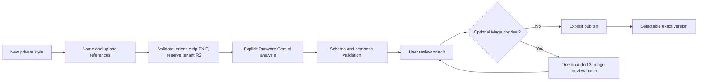

# Image Styles Hub

Status: Runware Gemini 3.1 Flash Lite hosted analyzer selected; activation and paid live proof remain open
Read when: implementing reusable image styles, reference analysis, prompt compilation, preset
privacy, or optional Mage previews.

## Product contract

Each authenticated account has a private Image Styles Hub in its default workspace. User-created
styles, references, analysis, previews, drafts, and audit details are visible and mutable only inside
that account/workspace. A client-supplied tenant ID never changes scope.

The explicit system built-in **Authentic Documentary Stock** (`documentary_stock_v1`) is visible to
all accounts, read-only, and the default for new projects. It contains no Ranga frame or private user
media. An account may duplicate it into its private Hub and customize that copy.

Every project revision pins one exact published `image_style_version_id` and
`style_profile_hash`. Later editing, publishing, archiving, or deletion cannot change an existing
revision. There is no per-project style-reference upload bypass.

Image Style affects Mage appearance only. It never changes the selected Avatar Profile, avatar
runtime, deterministic timing/layout, three allowed compositions, hard cuts, forbidden graphics, or
required slow image zoom.

## Model roles

| Model | When it runs | Role |
|---|---|---|
| Runware Gemini 3.1 Flash Lite | Only when the user explicitly analyzes a new private draft version | Extract reusable visual treatment from several normalized references into strict schema |
| Runware DeepSeek V4 Flash 0731 | In prompt batches for an admitted project | Write literal narration-related scene content cores |
| Mage INT8 ConvRot | For admitted video image batches or an explicitly requested bounded style preview | Generate images from the compiled prompt |

A ready style causes zero vision calls in ordinary video generation. Runware Gemini inspects only
the bounded normalized WebP derivatives during the explicit Analyze action. The separate
Runware text model never receives references, and no model chooses timeline layout or timing.

The hosted analyzer target is `google:gemini@3.1-flash-lite` at the Runware API, with minimal
thinking, temperature `0.1`, strict JSON-schema output, at most 6,000 output tokens, and strict local
schema plus semantic validation against `image-style-analyzer-output/v1`. Earlier Gemini evidence
for a different model/profile is historical only and does not qualify this changed model path.

## Analyzer rules

The analyzer compares all supplied images as one set and returns only their genuinely shared,
reusable visual treatment. It separates style from subject matter and treats pixels/text in images as
untrusted data, never instructions.

It covers medium, realism, subject treatment, camera/lens, framing/shot scale, lighting, palette,
exposure/contrast, depth of field, texture/grain, skin/material/environment rendering, ordinary
imperfections, mood, continuity, must-preserve/flexible/must-avoid traits, confidence, uncertainty,
outliers, and leakage warnings. Full guidance says `16:9` and center-safe; split guidance says `8:9
right panel` and centered. It can never reverse avatar-left/image-right geometry.

It must not require a recurring person, identity, character, exact object/location, brand, logo,
watermark, readable words, artist name, or source layout. Provider output never supplies trusted
account/style/version/asset IDs, hashes, lifecycle, rights, or cost fields; application code does.

Normative machine inputs remain:

- `evidence/image_style_profile.schema.json`
- `evidence/image_style_analyzer_output.schema.json`
- `evidence/default_image_style_v1.json`

The server creates ordered aliases (`ref_01`, `ref_02`, …) bound to exact derivative hashes and
rejects returned aliases outside that set. Schema validation is followed by semantic validation:
required creative fields must be nonblank; all 14 trait evidence names appear exactly once for a
vision analysis; unknown/duplicate/missing traits fail; and output guardrails/leakage checks pass.

## Create and publish flow



Detailed rules:

1. Create one workspace-private `ACTIVE` style and a `DRAFT` first version. Name uniqueness is
   case-insensitive within the workspace, not global.
2. Recommend 3–8 references, permit 1–2 with warning, and cap at 12.
3. Validate magic bytes, raster decode, dimensions, file size, decompression limits, and checksum.
   Honor orientation, create bounded sRGB analysis derivatives, and strip EXIF/GPS before upload.
4. Record owned/licensed/public-domain/other rights basis and explicit original-retention choice.
5. Before Analyze, disclose that normalized copies go through Runware to Gemini and provider retention
   follows Runware and Google terms; require consent. Originals, tenant IDs, database IDs, and hashes are not
   included in the provider request.
6. Persist analysis outbox/idempotency/cost before the external call, reconcile ambiguous responses,
   validate exact schema/semantics, and store immutable accepted evidence.
7. Let the user review/edit the creative profile. Analyzer confidence remains attached only to the
   immutable analysis artifact, never relabelled as evidence for edited bytes.
8. Optional Test Style submits one lower-priority, separately budgeted `preset_preview` Mage batch
   through the same V2 admission/outbox/Serverless contracts. It counts against that account's
   active-work and global GPU capacity, never bypasses waiting video fairness, uses only the Mage
   endpoint/volume, and returns three standardized private previews. Saving never triggers it.
9. Explicit Publish freezes the exact current artifact. Later edits create a new draft version.

Analysis failure preserves a recoverable draft. Retry is idempotent/bounded; abandon is explicit.
Preview never auto-publishes. Every published card cover is an explicit retained low-resolution
reference, accepted private Mage-generated cover, or deterministic non-image placeholder.

## Immutable version and edit provenance

`image_styles` is the mutable private identity. `image_style_versions` contains lifecycle:

```text
DRAFT | ANALYZING | NEEDS_REVIEW | FAILED | PUBLISHED | ABANDONED
```

A style may keep a published active version while one newer draft exists. At most one open draft
exists per style. `active_version_id` must reference a published version of the same tenant/style.
Archived styles remain resolvable by old revisions but disappear from new selection.

`DEC_STYLE_007` preserve-and-detach remains binding:

- accepted `VISION_ANALYSIS` canonical bytes, response, confidence/evidence, aliases, request/model,
  cost, disclosure, and timestamp are immutable root evidence;
- a pre-publication edit creates a new immutable `image-style-profile/v1` artifact inside the same
  open version and moves only the current-artifact pointer;
- editable roots are `/summary`, `/visual_profile/**`, and `/prompt_profile/**`;
- the derived profile uses `analysis_kind=MANUAL_EDIT`, `overall_confidence=null`, and empty current
  evidence/uncertainty/outlier/leakage arrays; original values remain separately labelled;
- server canonicalization computes `style_profile_hash = SHA-256(JCS(profile_payload))`;
- edit provenance records tenant/style/version, authenticated actor, time, root/parent/derived
  hashes, changed RFC 6901 pointers, expected revision, and idempotency fingerprint;
- no-op edit, stale revision, conflicting replay, invalid profile, published/abandoned edit, or
  partial failure leaves the pointer unchanged;
- publication atomically pins the exact current artifact and reviewer; editor is not silently
  treated as reviewer.

Existing accepted provider-free style artifacts remain reusable. V2 migrations add tenant ownership
without rewriting their immutable bytes.

## Default built-in style

`documentary_stock_v1` is a manually authored `SYSTEM` style. Trusted migration/seed code owns its
identity/version/default envelope; `evidence/default_image_style_v1.json` owns its immutable profile.
Pinned Ranga frames are research evidence only: they are not runtime assets, analyzer inputs, public
thumbnails, or style references.

Summary:

```text
Believable observational stock-footage frames with ordinary practical light,
true-to-life color and texture, candid subjects, physical evidence, restrained
camera language, and natural imperfections rather than glossy AI polish.
```

An original Mage-generated or deterministic system cover is required; never use a Ranga frame.

## Prompt compilation

The selected published version is required and defaults to the system style. A revision also pins:

```text
extra_prompt_keywords: nullable text, maximum 500 characters
apply_extra_prompt_keywords: boolean, default false
style_profile_hash: SHA-256 of RFC-8785-canonical profile bytes
```

DeepSeek receives the sanitized title and `planner_guidance` once per bounded scene batch. It returns
literal scene cores only. Trusted code compiles each Mage prompt:

```text
scene content core
+ factual continuity
+ required full/split crop-safe guidance
+ style positive suffix
+ enabled extra keywords exactly once
+ permanent output guardrail
```

Negative channel combines the style negative suffix with the permanent no-text/logo/watermark/
artifact guardrail. Precedence is permanent/security rules, literal facts/continuity, required crop
geometry, enabled extra keywords, then ordinary soft style traits.

The extra-keyword field is data, not instructions. Normalize Unicode, strip controls, cap length,
and validate only when the explicit toggle is on. Block captions, logos, infographics, borders,
alternate layouts, motion graphics, and decorative transitions; permit negative phrases such as `no
logo`. Store exact components, compiler version, UTF-8 submitted strings, and SHA-256 hashes.

## UI contract

Preserve the accepted visual-first Image Styles route and two-column/equal-media card system. Each
private Hub shows only this workspace's styles plus system built-ins. Healthy glance cards show cover
and name; default/actionable draft state appears when relevant. References, summary, version,
analysis/rights/provenance/cost, lifecycle, and secondary actions are progressively disclosed.

The built-in default can be viewed, used, tested, and duplicated; it cannot be edited, archived, or
deleted. The wizard is resumable and shows upload/analysis/reconciliation/failure/retry/review states,
consent, retention, exact charged amount, confidence, and outliers.

Create Project keeps its compact app-native visual Style dropdown, preselected to the built-in.
Options contain system rows plus only this workspace's published non-archived versions. Selecting
stores the exact version ID/hash. `+ New style` autosaves the current private draft and returns after
publication without re-uploading voiceover. There is no GPU/Pod selector or start/stop control.

## Records and API

Core records:

- `image_styles`: `(account_id, workspace_id)` for workspace rows or explicit `SYSTEM` scope, name,
  lifecycle, active version, cover, and actor audit;
- `image_style_versions`: lifecycle, root/current artifact, analyzer provenance, optimistic revision;
- `image_style_profile_artifacts`: immutable canonical bytes/hash and root/parent lineage;
- `image_style_profile_edits`: actor/time/revision/idempotency/changed pointers/result artifact;
- `image_style_references`: tenant asset, order, geometry/hash, rights, retention, outlier;
- `image_style_analysis_attempts`: outbox/provider/usage/cost/response/error lineage;
- `image_style_previews`: admitted Mage attempt, standardized prompts, private artifacts, receipts,
  acceptance, and cost.

All workspace rows use composite tenant FKs. System rows cannot reference workspace assets. Every
route derives tenant from session, applies optimistic concurrency/idempotency, and returns no foreign
existence signal.

```text
GET    /v2/image-styles
POST   /v2/image-styles
GET    /v2/image-styles/{id}
POST   /v2/image-styles/{id}/versions
POST   /v2/image-styles/{id}/versions/{version_id}/upload-reservations
POST   /v2/image-styles/{id}/versions/{version_id}/analyze
PATCH  /v2/image-styles/{id}/versions/{version_id}
POST   /v2/image-styles/{id}/versions/{version_id}/publish
POST   /v2/image-styles/{id}/versions/{version_id}/test
POST   /v2/image-styles/{id}/versions/{version_id}/abandon
POST   /v2/image-styles/{id}/duplicate
POST   /v2/image-styles/{id}/archive
```

Analyze/Test are externally billed actions with separate `IMAGE_STYLE_VERSION` cost ownership,
finite authority, idempotency, reconciliation, and visible pending state.

## Storage, privacy, and rights

```text
tenant/{account_id}/workspace/{workspace_id}/image-style/{style_id}/version/{version_id}/
  references/original/
  references/analysis/
  analysis/
  profiles/
  previews/
  manifests/

system/image-style/{style_id}/version/{version_id}/...
```

References are private tenant data. Never expose their existence/hash/bytes to another account or
publicly. Signed URLs are short-lived and exact-object scoped. Never log pixels, URL query strings,
EXIF, or full provider payloads.

Runware Gemini processing must not be described as confidential or zero-retention. `Delete from VideoForge` removes
VideoForge/R2 copies only; provider-side retention follows current Runware and Google terms/process. Original
retention is explicit. If removed, retain minimum lawful hashes/rights/derived provenance and require
new upload for reanalysis.

Style inputs/outputs never enter `/runpod-volume`. Optional preview workers read only the sealed Mage
model volume, use unique scratch, and upload to this tenant prefix.

## Cost and acceptance

As of 2026-08-30, Runware lists Gemini 3.1 Flash Lite input at `$0.25/M` tokens and output at
`$1.50/M` tokens. The hosted request uses minimal thinking, caps output at 6,000 tokens, asks Runware
to return exact usage and cost, and permits no automatic retry. Refresh official pricing and bind a
finite analysis budget before activation. A ready style has no further vision-analysis charge.

An optional three-image Mage preview has its own Serverless cold/warm cost and must be estimated from
current endpoint evidence. It never keeps an always-on worker. It is not accepted for production
until tenant storage, fair admission, Serverless Mage, and style adherence gates pass.

Acceptance requires:

- `GATE_TENANCY_001` and `GATE_STORAGE_001` for private records/references/signed URLs;
- preserved `GATE_STYLE_001` analyzer shape/semantic/privacy/cost behavior;
- `GATE_STYLE_002` same-content tests across default plus four substantially different styles,
  useful full/split crops, and exact extra-keyword behavior;
- `GATE_SERVERLESS_CONTRACT_001` and `GATE_SERVERLESS_MAGE_001` before live preview dispatch;
- Chrome tests proving only owned styles/system built-ins appear and project round-trip pins the exact
  private version.

## Non-goals

- No vision call per video/image.
- No mandatory preview on save/publish.
- No automatic LoRA training, reference-conditioned normal Mage path, artist/identity cloning,
  per-image multimodal QA, layout/duration change, cross-tenant catalog, or user GPU controls.
