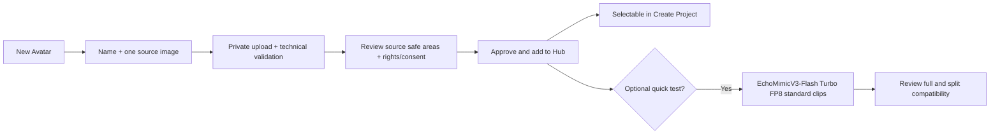

# Avatar Hub

Status: VF-5-01/VF-5-02 durable fixture acceptance complete; EchoMimicV3-Flash Turbo FP8 is sole active avatar path
Read when: implementing reusable avatars, avatar source upload/validation, project avatar selection, or avatar-source provenance.

## Product contract

VideoForge has one global shared **Avatar Hub**. Every admitted user sees the same catalog and has
equal authority to create, edit, validate, test, approve, version, duplicate, archive, restore, and
select an avatar. The server derives the actor from authentication and audits every mutation;
creator identity is provenance, not ownership or a permission tier. MVP has no Hub roles, tenant
selector, or multi-workspace tenancy. Legacy records/contracts may retain `workspace_id`, but active
writes use one canonical global sentinel and expose no workspace choice. A named avatar is created
once, its private source is approved, and it is reused from the shared searchable selector for
later videos. Optional standard test clips can add confidence but are not required to save or
select it. Ordinary Create Project never asks for a fresh avatar upload.

Primary floating navigation uses the explicit labels **Avatar Hub** and **Image Styles**. These are sibling preset libraries, but they solve different problems:

- an Avatar Profile stores one presenter identity/source and model-compatibility evidence;
- an Image Style stores reusable visual-treatment guidance for generated images.

They never influence each other. Selecting an avatar does not change image prompts, and selecting an Image Style does not change the avatar.

## Invariants

Provider-free `VF-5-01` worker boundary exists at `fcb8f31`. `VF-5-02` is complete at `e0bec7e`:
migration `0012` and production PGlite acceptance persist one native clip, both exact layout
bindings, technical QA, explicit `UNREVIEWED` subjective state, and full pinned Avatar/span/
execution/callback/cost lineage. These tasks close no Avatar/model/GPU gate.

- Create Project requires one exact `READY` Avatar Profile version selected from the global shared hub.
- There is no ordinary per-project avatar-image upload or unversioned `latest avatar` lookup.
- The project revision pins the parent profile, exact version, canonical profile hash, runtime source asset/checksum, preparation/validation profiles, exact compatibility state at preflight, and matching immutable terminal evidence when one exists.
- Replacing a source image creates a new version. It never mutates an existing ready version or any queued/running/reviewed/approved project.
- Renaming or archiving the parent does not change a version hash. Archived profiles remain resolvable for historical projects but disappear from new-project selection.
- One generated avatar clip serves both output layouts after the active EchoMimicV3-Flash Turbo FP8 full/split crop pair is measured and approved. Historical AvatarForcing/SkyReels crops do not authorize an Echo crop; that active crop remains a gate.
- Only scheduled voiceover spans are sent to avatar workers. The Hub never causes the full voiceover to be sent.
- Creating or selecting an avatar uses no LLM. A ready avatar adds no per-video model call beyond the avatar clips the timeline already requires.

## Parent and version model

`avatar_profiles` is the mutable global shared identity:

- canonical global sentinel, creator/last-mutating actor audit, name, `ACTIVE | ARCHIVED`; active
  names are case-insensitively unique across the one catalog, and actor fields grant no exclusive
  authority;
- active ready version ID;
- a mutable pointer to the active version's immutable private thumbnail—never a second independent image authority;
- created/updated timestamps.

`avatar_profile_versions` owns one immutable source definition after it becomes `READY`:

```text
DRAFT → VALIDATING → NEEDS_REVIEW → READY
             ↘ FAILED ↗
any open state → ABANDONED
```

- `FAILED` is retryable with the same source or editable while the version is not ready.
- Replacing the source in an open version invalidates all earlier validation/test evidence.
- `ABANDONED` is terminal and frees the one-open-draft invariant.
- `READY` is immutable. A later source, crop-confirmation, or source-preparation change creates v2.
- A ready v1 stays selectable while v2 is being prepared.

Only one nonterminal, non-ready draft may exist per parent. `active_version_id` must reference a `READY` version of the same profile.

The authoritative immutable payload is `evidence/avatar_profile_version.schema.json`. Its 512-pixel schema floor is a transport sanity check, not a final quality promise; `GATE_AVATAR_001` must lock a stronger crop-aware recommendation if the full-screen bakeoff requires it. Its canonical hash is:

```text
avatar_profile_hash = SHA-256(RFC 8785 JCS(profile_payload))
```

Lifecycle, name, archive state, compatibility runs, and timestamps outside the payload do not change that hash.

## New-avatar flow



Detailed behavior:

1. Create an `ACTIVE` parent and `DRAFT` v1; its name is a case-insensitively unique user-facing
   label in the global shared catalog, while the immutable ID remains authoritative. Record the
   authenticated actor for audit, not exclusive ownership.
2. Upload one JPEG/PNG/WebP source at most 20 MB through a short-lived path-scoped signed URL in the
   canonical private global prefix. Large bytes bypass the Worker body.
3. Check magic bytes, raster metadata, dimensions, decompression bounds, checksum, and supported color/orientation metadata. A browser thumbnail is only a preview; it is never trusted as proof that the original is safe.
4. The browser creates an orientation-correct, color-managed, bounded high-quality sRGB runtime candidate and thumbnail while stripping EXIF/GPS. The server independently verifies magic bytes, metadata absence, dimensions, byte/decompression bounds, and checksum before either becomes authoritative. Show source centering/safe-area guides; these are derived UI aids, not claims about later model output and not independent canonical sources. The MVP does not apply an unrecorded crop: an unsuitable source must be replaced.
5. The user confirms one primary presenter, horizontal centering, direct-to-camera suitability, image-use rights, the right/consent to animate the depicted likeness, and consent to talking-avatar processing. Do not claim this manual confirmation is biometric or identity verification.
6. `Approve and add to Avatar Hub` atomically makes the version immutable `READY`, points the parent to it, and makes it selectable. Nothing is made public; `publish` is only the internal state transition name.
7. Offer—not require—an explicit short compatibility test. Show its exact one-time estimate before
   starting. No GPU starts merely because the profile was saved or selected. The actor-audited test
   serializes behind the global video session and cannot start while a video is active or waiting.
8. If requested after global qualification, EchoMimicV3-Flash Turbo FP8 generates three short standard
   clips covering ordinary speech, visible labials/teeth, and pauses/subtle head motion using owned
   test-audio fixtures. It uses one exact live Echo GPU under a bounded profile-test lease, cleans
   up that Pod independently, and never changes a video session GPU pair or starts Mage. Any
   admitted user records the compatibility verdict after viewing each clip in both final crops;
   this step cannot claim crop compatibility until the active Echo crop gate has closed.

The optional three-clip quick test is a per-profile compatibility check, not the global model/GPU qualification suite in `14_TESTING_AND_ACCEPTANCE.md`. The global gate tests representative avatars and infrastructure once; the quick test gives extra confidence for this particular source. If the primary model/checkpoint/container/crop profile materially changes, the prior result becomes `STALE` without mutating the avatar payload. A ready untested/stale version remains selectable with a clear warning until benchmark evidence or a later explicit user decision makes a quick-test pass mandatory.

No repair or fallback model is active. All new Echo bindings keep repair/quality profile fields `null`.

## UI contract

### Avatar Hub

Each card shows:

- private thumbnail;
- avatar name;
- `Details`;
- an exceptional actionable lifecycle or compatibility badge only when the normal ready/passed state is not true.

Active version, full compatibility mapping (`UNTESTED` → `Not tested`, `RUNNING` → `Testing`, `PASSED` → `Passed`, `FAILED` → `Failed`, `STALE` → `Retest recommended`, `CANCELLED` → `Test cancelled`), source dimensions, accepted-test date, model/profile label, rights, and permitted secondary actions live in the focused details sheet. Healthy `Ready`, `Passed`, `Active vN`, and last-used copy never repeat on the card. The Hub shares Image Styles' equal-height card primitive: exactly two columns above 680 px and one column on mobile; a single avatar remains half-width on desktop.

The empty state explains `Create an avatar once, then reuse it in every project` and makes **New
Avatar** the primary action. Draft/failed versions remain visible to every admitted user but cannot
be selected for a new production revision. There is no built-in or silent avatar default: the user
explicitly selects one, recent ready profiles sort first, and duplicated projects may retain the
prior pinned choice.

### New Avatar wizard

The wizard is resumable and has three required steps plus one optional action:

```text
Source → Framing and consent → Review and approve → Optional quick test
```

Mandatory states include upload/validation failure, unsupported or too-small image, source replacement required for bad centering, consent missing, failed/retryable, needs review, ready, optional-test estimate, GPU queued/cold/model loading, test generation/review, test cancelled/retryable, stale compatibility, version conflict, and archived.

### Create Project selector

Create Project contains a required compact app-native visual **Avatar** dropdown. Its closed trigger shows only the selected thumbnail and name; opening it expands the visual options inside the same bordered control and adds search only when catalog size warrants it. Version/compatibility stays behind details unless it becomes an actionable warning. Each option represents one globally available `ACTIVE` parent backed by that parent's current active `READY` version. Selecting an option immediately stores the exact version ID in the draft—never only a parent/latest pointer—and there is no silent default. Do not spread every avatar card across the normal form.

Approving v2 after a draft selected v1 does not silently upgrade the draft. Keep v1 selected with
`Newer version available`; new selections use v2. Archiving or source erasure before revision
creation blocks preflight and asks for re-selection, while an already-created revision remains
pinned. Under the proposed MVP optional-test policy, every compatibility state (`UNTESTED`,
`RUNNING`, `PASSED`, `FAILED`, `STALE`, or `CANCELLED`) remains selectable when the source version
is otherwise ready; `FAILED` gets the strongest warning while untested/stale/cancelled show
ordinary warnings. No status may block the ready source or trigger a hidden test charge.

The field includes `+ New avatar`; ordinary Avatar Hub navigation stays in the floating dock.
Opening the workflow from a project draft autosaves title, verified voiceover upload handle,
selected Image Style, prompt-keyword text/toggle, mode, cap, and seed. Saving or cancelling returns
to the same draft; a newly ready avatar is selected automatically without re-uploading the
voiceover or re-entering settings. GPU choices are session-scoped transient selection, never Avatar
Profile or project-avatar fields; the return path shows the current global session state and
revalidates any still-unsubmitted idle choice. The first-shell web UI has no exact-script field.

Do not add an `Upload avatar for this video` escape hatch to the normal form. A new source belongs in the Hub so reuse, consent, validation, compatibility, and provenance cannot be bypassed.

## Records and API

Core records:

- `avatar_profiles`: parent identity, canonical global sentinel, mutable name, lifecycle, active
  ready version, private cover/thumbnail, and creator/last-mutating actor audit with no ownership
  authorization.
- `avatar_profile_versions`: immutable ready profile payload/hash and open-draft state/revision before publication.
- `avatar_profile_assets`: original, canonical runtime source, thumbnail, crop previews, checksums, media metadata, retention.
- `avatar_compatibility_assessments`: version + model/checkpoint/container/execution/crop profile, standard fixtures, attempts, user verdict, cost, immutable evidence hash, and `RUNNING | PASSED | FAILED | STALE | CANCELLED`; absence means `UNTESTED`. `CANCELLED` preserves partial attempt/cost evidence and may be retried as a new attempt.
- `avatar_profile_test_attempts`: idempotent RunPod task/attempt/cost/asset lineage.

Duplicate/New version may reuse the same private source bytes inside the one global app scope, but
it never copies a human compatibility verdict or rights/likeness attestation. The new draft
requires fresh confirmation, and compatibility remains keyed to the exact source/model tuple.

Minimum routes:

```text
GET    /v1/avatar-profiles
POST   /v1/avatar-profiles
GET    /v1/avatar-profiles/{id}
PATCH  /v1/avatar-profiles/{id}
GET    /v1/avatar-profiles/{profile_id}/versions
POST   /v1/avatar-profiles/{profile_id}/versions
POST   /v1/avatar-profiles/{profile_id}/versions/{version_id}/uploads/sign
POST   /v1/avatar-profiles/{profile_id}/versions/{version_id}/validate
PATCH  /v1/avatar-profiles/{profile_id}/versions/{version_id}
POST   /v1/avatar-profiles/{profile_id}/versions/{version_id}/test
POST   /v1/avatar-profiles/{profile_id}/versions/{version_id}/tests/{assessment_id}/verdict
POST   /v1/avatar-profiles/{profile_id}/versions/{version_id}/publish
POST   /v1/avatar-profiles/{profile_id}/versions/{version_id}/abandon
DELETE /v1/avatar-profiles/{profile_id}/versions/{version_id}/source
POST   /v1/avatar-profiles/{id}/duplicate
POST   /v1/avatar-profiles/{id}/archive
POST   /v1/avatar-profiles/{id}/restore
```

Every version mutation uses optimistic concurrency/`If-Match`; externally billed Test uses a version-scoped `Idempotency-Key`, budget reservation, and ambiguous-dispatch reconciliation. Project creation submits only `avatar_profile_version_id`; trusted code resolves and pins the full binding. `UNTESTED`/`RUNNING` preflight states carry null immutable evidence; `PASSED`/`FAILED`/`STALE`/`CANCELLED` carry an evidence snapshot whose status exactly matches the pinned state.

All admitted users have the same route authority. Trusted code derives the actor and canonical
global sentinel from the authenticated session, applies optimistic concurrency/idempotency, and
appends an audit event. No client-supplied workspace, owner, member role, or tenant value may change
authorization or storage routing.

If v1 is abandoned before the parent has any ready version, trusted code removes the empty draft parent or archives a tombstone in the same transaction so no orphan card remains. Any admitted user may restore with actor audit, and restore succeeds only when an available ready version still exists.

## Storage, privacy, and deletion

```text
app/global/avatar-profile/{profile_id}/version/{version_id}/
  source/original/
  source/runtime/
  thumbnails/
  previews/
  compatibility/
  manifests/
```

- Avatar sources are private identity/personal images. Never place them in public builds, public
  buckets, logs, fixtures, analytics payloads, or research packs, and never reveal their existence,
  hashes, or bytes to an unauthenticated identity.
- Echo model weights live on the dedicated retained Echo network volume in `EU-RO-1`. Ordinary
  workers verify and treat model files as immutable/read-only application data and write
  scratch/results elsewhere; provider-enforced read-only mounting is not assumed. Avatar source
  images, voiceover spans, generated clips, and compatibility outputs remain in their private
  R2/job paths and never enter that model volume.
- Authorize every list/read/sign/mutate route by durable app admission. Every admitted user has the
  same application rights; audit the authenticated actor for mutations.
- Use short-lived path-scoped URLs; redact URLs and image bytes from logs and provider errors.
- Record the user's rights basis and explicit consent to animate the source.
- Reusable preprocessing may be cached only inside the canonical private global app namespace,
  keyed by source hash + exact model/preparation profile, and only when the model supports it
  without quality loss.
- Archive hides a profile from new selection but preserves pinned historical lineage.
- A source referenced by a queued/running/review candidate cannot be deleted. A later explicit erasure must warn that historical revisions become non-regenerable, retain only the minimum lawful audit metadata/checksum, and never pretend the pixels still exist.
- Source availability is derived as `AVAILABLE | ERASED`, separate from lifecycle/readiness. An erased version is never selectable; if a parent has no available ready version, it is hidden from normal selection/archived until a new version is approved.

There is no application role matrix in MVP. Any admitted user may view/use ready profiles and may
create, rename, version, validate, test, record verdicts, approve, duplicate, archive, restore, or
perform explicit source erasure. Sensitive/destructive mutations still require optimistic
concurrency, explicit confirmation where specified, and actor audit; they do not create a hidden
owner/admin tier.

## Cost and speed

- Creating the parent, uploading, validating metadata, and selecting a ready avatar requires no LLM and no recurring subscription.
- An optional three-clip compatibility test is a one-time, separately estimated RunPod charge owned by `AVATAR_PROFILE_VERSION`, not by a video project. Initial planning target is at or below $0.20; the exact value remains part of `GATE_AVATAR_001` evidence.
- A ready avatar adds only a small database/R2 lookup to ordinary project preflight. It does not increase the 30-minute per-video generation range.
- Reusing the same source avoids repeated uploads and can reuse safe source preprocessing. It does **not** eliminate EchoMimicV3-Flash Turbo FP8 inference required for each video's unique selected speech spans.
- When an idle-session Generate activates the first video, its Echo FP8 Pod may start concurrently
  with Mage, attach the already-populated Echo volume, verify the pinned manifest, and load while
  the active video's Cloud Run ASR/timeline/span preparation continues. A queued Generate starts no
  Pod or pipeline work. Avatar dispatch waits for authoritative Echo `model_ready`.
- After the active video's required clips are durable, keep an existing Echo Pod warm but idle only
  if a waiting video already exists; otherwise drain/delete it independently and retain the Echo
  volume. If a waiter appears after deletion, do not recreate early: on that project's activation,
  revalidate and recreate only the same session-locked Echo GPU, with no substitution. Profiles
  alone never keep a Pod warm.
- Normal generated spans remain 2–6 seconds, with a seven-second maximum only for the opening sentence. This reference-derived scheduling bound does not prove or imply linear VRAM growth with duration.

## Acceptance

- A user can create, leave, resume, test, review, approve, select, version, duplicate, and archive an avatar without a provider console or public sharing.
- The project selector shows image + name and blocks only unready, erased, archived-parent, or
  globally unavailable versions. Compatibility states only change warning strength under the
  proposed optional-test policy.
- v1 remains selectable while v2 is open; approving v2 never mutates a revision pinned to v1.
- The exact source/version/hash in the project revision reaches the pinned EchoMimicV3-Flash Turbo FP8 runtime only after authoritative model readiness; repair/quality bindings are `null`.
- A new-avatar round trip from Create Project preserves every other input and verified upload handle.
- One-time test spend is visible and separate; ready-avatar reuse causes zero onboarding/test calls.
- Admission boundary, equal-rights actor audit, canonical-global-sentinel, private signed-URL,
  consent, deletion-in-use, idempotency, and version-race tests pass.

## Non-goals

- No avatar marketplace, public sharing, face recognition, identity verification, voice cloning, or automatic avatar creation from the Image Style references.
- No per-project avatar upload bypass.
- No LLM or vision model to choose the avatar.
- No automatic avatar model training, LoRA, or performance-bank generation in MVP.
- No second avatar generation for the split layout.
- No per-user avatar catalog, owner-only mutation, workspace picker, or tenant-specific policy.
