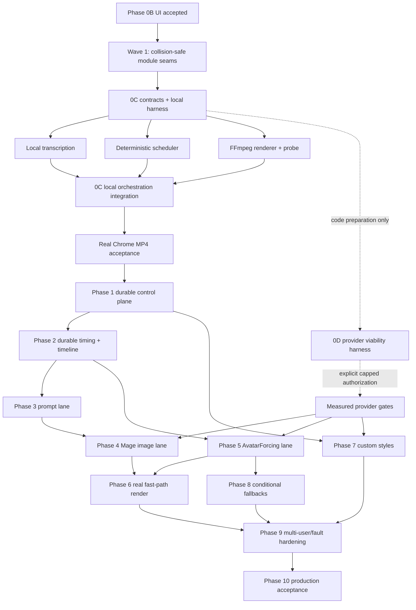

# Implementation execution plan

Status: approved execution sequence; Phase 0C implementation is integrated through VF-0C-07 and VF-0C-08 acceptance is active
Read when: starting a new implementation chat, selecting the next task, assigning parallel ownership, or integrating a completed task.

## Authority and purpose

This file owns implementation order, dependency edges, safe parallelism, and integration cadence. It does not redefine product behavior. If it conflicts with an approved decision, primary domain file, machine schema, or acceptance gate, follow the authority order in `16_CONTEXT_MAINTENANCE.md` and reconcile the conflict before coding.

`CURRENT_STATE.yaml` selects the one active wave or task. A fresh chat must not choose a later item merely because it appears independently implementable. The goal is fast completion through small vertical slices and disjoint ownership—not maximum simultaneous editing.

The user's future instruction “UI is good for now; implement the next tasks according to the plan” authorizes the exact `$0` fixture/local `recommended_next_task` in `CURRENT_STATE.yaml`. It does not authorize provider calls, paid resources, credential export, destructive infrastructure changes, or skipping an open gate.

## Frozen baseline

The following is already implemented and must be preserved:

- Phase 0A/0C contract foundation: sixteen canonical contracts, Ajv/Zod/Pydantic entry-point parity, generated structural TypeScript types, TypeScript RFC 8785 JCS, worker-job and orchestration-state boundaries, local media job/result boundaries, fixture profiles, CI, secret scan, and stable root commands.
- Phase 0B fixture shell: approved medium-scale UI, app-native in-flow controls, reusable Avatar/Image Style Hubs, access fixtures, semantic preflight, immutable pins, mutation concurrency, review approval binding, responsive layouts, and real-Chrome acceptance.
- Phase 0C through VF-0C-07: owned local narration, real whisper.cpp timing, deterministic scheduling, exact accepted-asset resolution, real FFmpeg render/probe, bounded local API lifecycle, and truthful playback/download UI.
- `GATE_UI_001` is closed. Do not redesign the visual system, change its medium scale, or alter dock resting geometry unless the user explicitly asks or a later feature exposes a verified regression.
- Fixture mode remains the default, makes no provider call, and authorizes `$0` external spend.
- The stable development URL remains `http://localhost:4173`; visible work must reuse it and retain the approved routes.

Known unfinished boundaries are not hidden:

- The real local MP4 exists and passes automated API/media checks, but Phase 0C remains open until the required real-Chrome play/seek/approve/download/replay checkpoint is recorded.
- Python intentionally does not derive RFC 8785 hashes. TypeScript is the sole JCS authority; Python validates schemas and exact input/media bytes and treats canonical document hashes as opaque.
- Local transcription and render workers exist. Provider-backed prompt, image, and avatar generation workers do not; all corresponding gates remain open.
- Fixture state is bounded in memory. Production authentication, Postgres, R2, Workflows, callbacks, and provider transports do not exist.
- No production GPU profile is selectable; all provider/model/cost gates remain open.

## Development principles

1. **Preserve a runnable vertical slice.** Every integration wave ends with a working fixture app; local and sandbox modes are additive.
2. **Lock contracts before adapters.** Schema, request/response, event, error, idempotency, and version semantics land before UI, worker, storage, or provider implementations depend on them.
3. **Use ports, not temporary bypasses.** Core services depend on repositories, artifact stores, worker transports, clocks, and ID generators through explicit interfaces. Fixture, local-filesystem, Postgres/R2, and RunPod implementations plug into the same ports.
4. **Keep mode boundaries explicit.** `fixture`, `local`, `sandbox`, and `production` use separate configuration and fail closed. `pnpm verify` is always provider-free.
5. **Separate mechanical refactors from behavior.** A move/rename/extraction commit cannot also change output, copy, API semantics, or visual styling.
6. **Prefer additive migrations.** Add nullable/new versioned fields, backfill, switch readers, then enforce constraints. Never combine destructive migration and feature rollout.
7. **One authority per shared file.** Contracts, migrations, lockfiles, root scripts, route composition, and context are serialized through the integration owner.
8. **Small green commits.** Each task has one outcome, targeted tests, a reversible commit, and an exact handoff. A wave receives a full `pnpm verify` and human Chrome checkpoint.
9. **No silent realism claims.** Fixture/local artifacts are labelled synthetic. Provider/model/GPU/cost claims require gate evidence.
10. **Keep the output grammar hard-coded.** Only full avatar, full image, and avatar-left/image-right split; hard cuts; slow zoom on every AI image; no text or decorative graphics.

## Dependency graph

Provider viability is deliberately off the main local-development critical path, but it starts early enough that measured failures can change a production adapter before that adapter is integrated.

## Ownership and parallelism model

Use at most three implementation lanes plus one integration/verification lane. More concurrent lanes increase merge and diagnosis time for this repository.

| Lane | Owns | Must not edit concurrently |
|---|---|---|
| Integration/shared | root scripts, `package.json`, `pnpm-lock.yaml`, canonical schemas, generated contract copies, migrations, route/app composition, `CURRENT_STATE.yaml`, context | No other lane edits these files |
| Web/control plane | Hono domain services, repositories/ports, API routes, auth/storage adapters | Canonical schemas or frontend presentation |
| Frontend | route screens, feature components, client schemas/query hooks, screen-scoped styles and Chrome tests | Server state machine, migrations, canonical schemas |
| Pipeline/worker | `packages/pipeline/**` and one explicitly assigned worker subdirectory | Web presentation, shared worker entrypoint, another worker lane's directory |
| Verification | new tests/evidence in an explicitly disjoint test file; read-only audits | Production files owned by an active implementation lane |

Parallel work is safe only when all of the following are true:

- Dependencies are already committed and immutable for the wave.
- Owned paths do not overlap.
- No two lanes run dependency installation or regenerate the lockfile.
- No two lanes change the same API/schema/state enum.
- Each lane can run its targeted tests without requiring another lane's uncommitted work.
- The integration owner chooses merge order and runs the only full shared-server Chrome matrix.

Serialize these changes even if parallel capacity is available:

- Canonical JSON Schema, generated copies, cross-language validators, JCS rules.
- Database migrations and durable state transitions.
- Root dependency/lockfile changes.
- Hono app/route composition and shared worker dispatch entrypoints.
- UI tokens, shell/navigation, shared CSS ordering, and context authority.
- Provider resource creation/deletion and the global authorized-spend ledger.

Integration order within a wave is: contracts/config → pure domain/core → worker/storage/provider adapters → API composition → frontend → tests/evidence/context. If a later layer reveals a contract problem, fix and recommit the contract first instead of adding a local exception.

## Wave 1 — reduce collision risk without changing behavior

Goal: establish stable feature boundaries before adding local and durable modes. This is a mechanical wave; the approved UI/API behavior is frozen.

Run these children in parallel after one integration owner records path ownership:

### `VF-W1-BE` — server seam extraction

- Own: `apps/web/src/server/**` and server-only tests.
- Keep `createApiApp` and every existing route/response/error unchanged.
- Extract thin route registration, project/preset domain services, fixture session store, mutation/idempotency helpers, and access middleware from the monolithic `app.ts`.
- Define ports for project state, artifact metadata, worker transport, clock, and ID generation without implementing production storage.
- Keep fixture state and its session-isolation behavior behind a fixture adapter.
- Acceptance: the 68 server tests and all API-facing Chrome journeys pass unchanged; no route, code, status, ETag, or response field changes.

### `VF-W1-FE` — frontend feature extraction

- Own: `apps/web/src/screens/**`, new `apps/web/src/features/**`, screen-scoped styles, and frontend-only tests.
- Move route screens and feature components out of `screens/index.tsx` without changing JSX semantics, copy, class names, DOM order, or query behavior.
- Split the stylesheet into an explicit import order: tokens/base → shell/components → feature screens → responsive/reduced-motion. Do not retune values.
- Preserve the approved dock, medium scale, dropdown containment, Hub geometry, focus, and responsive behavior exactly.
- Acceptance: component tests and all 26 Chrome journeys pass; computed root/control/dock metrics and real-Chrome screenshots show no intended visual difference.

### `VF-W1-PIPE` — pure pipeline package scaffold

- Own: new `packages/pipeline/**` only until integration.
- Add dependency-free pure interfaces for transcript input, scheduler input/output, accepted asset resolution, render planning, deterministic clock/ID injection, and domain errors.
- Import canonical types from `@videoforge/contracts`; do not copy schema definitions.
- Add pure unit-test scaffolding and no provider/storage/process calls.
- The integration owner alone adds workspace scripts or lockfile changes.

Wave integration is serial. Merge server extraction, pipeline scaffold, then frontend extraction; run targeted suites after each and `pnpm verify` plus a real-Chrome baseline at the end. If a mechanical extraction changes visible behavior, revert that task rather than “fixing” the approved design inside the refactor.

## Phase 0C — local short-video walking slice

The first functional goal is one owned 30–120 second narration producing a real 1920×1080, 30 fps MP4 through the same versioned boundaries future providers use.

### `VF-0C-01` — local machine-contract and tooling lock

Sequential shared task after Wave 1.

- Audited the original ten schemas and added exactly six versioned documents required by the local job: transcript timing, ASR input/result, render input/result, and technical probe.
- Run every new valid/invalid fixture through Ajv, Zod, JSON Schema, and Pydantic entry points.
- Keep canonicalization solely in the TypeScript control plane. Python workers validate parsed documents and exact byte hashes but treat canonical JSON hashes as opaque; they never reserialize JSON for JCS. This is the recorded `DEC_CONTRACT_001` choice, not mixed behavior.
- Use the repository-wide Python 3.12 workspace with exactly `uv 0.8.13` and the committed `uv.lock`; all contracts/workers share it and tests run locked/no-sync. Do not mix installers between workers.
- Add provider-free commands such as `pnpm local:doctor` and `pnpm test:local-slice`; keep them separate from the fast default until stable, then include their deterministic subset in `pnpm verify`.
- Lock the local artifact root, content-addressed filenames, cleanup policy, and fixture/local mode separation.

### `VF-0C-02` — owned local acceptance fixture

Sequential immediately after the contract lock.

- Add a reproducible generator and compact manifest for 30–120 seconds of owned/synthetic English narration, fixture images, and a synthetic avatar source/clip.
- Commit only source instructions, small owned assets, hashes, and provenance. Keep generated audio/video in the ignored artifact root when too large for Git.
- Include phrases that exercise full avatar, full image, and split segments; never include prohibited text/graphic output.
- Prove a fresh local run can reproduce or clearly request the missing local-only input without downloading a model during ordinary verification.

After `VF-0C-01/02`, run the next three tasks in parallel with disjoint subdirectories. The image-media worker entrypoint and `pyproject.toml` remain integration-owned until all three land.

### `VF-0C-03` — deterministic scheduler core

- Own: `packages/pipeline/src/scheduler/**` and its tests.
- Consume immutable revision config plus canonical word/sentence timing.
- Produce `timeline-plan/v1` with 30 fps end-exclusive frames, phrase-bound boundaries, cold-open avatar, seeded bounded variation, approximately 22% avatar, alternating full/split avatar appearances, 3–7 second image segments, and no gaps/overlaps.
- No LLM, provider, filesystem, wall clock, or random global state.
- Golden tests prove byte-equivalent output for identical input/seed and different valid output for an explicit seed change.

### `VF-0C-04` — local transcription job

- Own: `workers/image-media/src/videoforge_image_media/jobs/transcribe/**` and tests.
- Validate the claim-bound job/input manifest before invoking a process.
- Run pinned local `whisper.cpp base.en`; return canonical words/timestamps/model hash and precise decode/tool/model errors.
- Never download the model during tests or silently fall back to a paid API. A fixture adapter may exercise error/success shapes; the acceptance run uses the real cached local binary/model.
- Verify duration tolerance, monotonic timing, source checksum, cancellation, and no full secret-bearing command log.

### `VF-0C-05` — resolved manifest, FFmpeg render, and technical probe

- Own: `packages/pipeline/src/render/**`, `workers/image-media/src/videoforge_image_media/jobs/render/**`, and their tests.
- Resolve accepted fixture slots into `resolved-render-manifest/v1`; reject missing/mismatched split assets and renderer profile/crop mismatches.
- Compile direct FFmpeg: original narration, hard cuts, exact crop geometry, slow smooth zoom on every full/split image, H.264/AAC, 1920×1080, 30 fps.
- Use argument arrays, never arbitrary shell strings. Validate every local path under the allocated artifact root.
- Run FFprobe and return duration, streams, dimensions, frame rate/count, loudness result, bytes, and SHA-256. Fail rather than publish an invalid artifact.

### `VF-0C-06` — local orchestration and API integration

Sequential convergence task after `VF-0C-03/04/05`.

- Implement a local-filesystem artifact adapter and local worker transport through the ports from Wave 1.
- Drive the bounded local slice through the same browser project/revision, idempotency, cancellation, event, job input/result, and accepted-result contracts. The direct local bridge must validate and content-bind every job/result, but it does not claim durable outbox/envelope dispatch or restart recovery.
- Keep browser APIs under `/api/v1`; do not add a one-off “render now” bypass.
- Materialize submitted title, exact preset pins, transcript, timeline, events, manifest, preview, cost `$0`, and download state.
- Make restart/reconciliation behavior explicit even if local state is initially bounded; never report durable recovery that is not implemented.

Phase 0C scope decision: `orchestration-state/v1` and `worker-job-envelope/v1` remain the
normative durable production vocabulary, but their persisted task/attempt/outbox transport is not
simulated inside the bounded local process. `VF-1-01`, `VF-1-05`, and `VF-1-06` own that durable
implementation and recovery proof. This prevents the local checkpoint from creating a second
temporary orchestration system or overstating restart guarantees.

### `VF-0C-07` — local playback and download UI

May begin in parallel with `VF-0C-06` only after its response schema is committed; build first against a matching fixture adapter.

- Reuse the approved Progress/Review/Library surfaces; add no redesign.
- Show truthful local transcription, scheduling, rendering, probe, failure, retry, cancellation, ready-for-review, approval, and download states.
- Use a real `<video>` preview for the MP4; verify play, pause, seek, duration, and download filename/checksum.
- Keep technical manifests behind disclosure and preserve the minimal glance layer.

### `VF-0C-08` — local-slice acceptance

Serial checkpoint:

1. Start from the stable URL in `local` mode without external network calls.
2. Create a project from the owned audio and existing exact avatar/style fixture versions.
3. Observe real transcription → deterministic timeline → fixture asset resolution → FFmpeg render → FFprobe → review.
4. In the user's real Chrome, play and seek the 1080p30 MP4, approve it, download it, and replay the downloaded file.
5. Verify every image—including split-right images—zooms; compositions are legal; cuts are hard; voiceover is original; frames cover the duration exactly.
6. Record command, commit, tool/model versions, input/output hashes, console/network result, and evidence path.

Phase 0C closes only after that human playback checkpoint. Automated tests alone do not close it.

## Phase 0D — early capped viability track

Provider code preparation can start after `VF-0C-01` locks job/result contracts, in parallel with later local/durable work. Real calls remain blocked until one grouped authorization envelope records exact providers/models, account/region, total and per-lane USD caps, maximum resource count, expiry, cleanup/scale-to-zero, and evidence paths.

### Serial provider control tasks

- `VF-0D-00`: securely acquire/store credentials without printing or committing them; validate only redacted metadata.
- `VF-0D-01`: implement the sandbox task/attempt/evidence harness, cost ledger, exact endpoint/profile snapshots, timeout, cancellation, and cleanup verifier.
- A single provider coordinator owns resource creation/deletion and the total spend ledger. Provider mutations are serialized even when analysis/code lanes are parallel.

### Parallel bounded experiments

- `VF-0D-02`: Runware DeepSeek identity, strict schema, batching, latency, and cost.
- `VF-0D-03`: Mage checkpoint/license, resolution/batching/GPU fit, 300-image envelope, quality, recovery, and scale-to-zero.
- `VF-0D-04`: AvatarForcing exact-avatar suite, crop/cadence, cold/warm speed, cost, and optional compatibility workflow.
- `VF-0D-05`: Gemini style analyzer schema/content separation/privacy/cost plus same-content style adherence inputs.

Code/test preparation may use three lanes. Run at most two paid compute experiments simultaneously, only on separate resources and within the grouped cap. A failed first cold run pauses that lane's remaining spend but does not stop unrelated `$0` development.

`VF-0D-06` integrates evidence and updates gates/profiles. A benchmark failure is a result, not permission to swap models or architecture silently.

## Phase 1 — durable control-plane walking slice

Begin after Phase 0C acceptance. Local/test implementations stay available; production adapters replace ports rather than domain logic.

### Serial foundation

- `VF-1-01`: lock relational schema and additive migrations for users/workspaces/memberships, presets, projects/revisions, tasks/attempts, assets, events, cost reservations, workflow instances, and outbox. Add repository contract tests before an ORM/query implementation.
- `VF-1-02`: make the Hono app runtime-neutral, then add Cloudflare Vite/Worker bindings and local emulator configuration. Provisioning/deployment remains a separately authorized external mutation.

### Parallel adapters after migrations commit

- `VF-1-03` Auth: Better Auth Google OAuth, admin allowlist/membership, workspace authorization, session-derived reviewer identity.
- `VF-1-04` Artifact storage: private R2 signed multipart upload/download, checksums, workspace prefixes, expiry, retention, and local test adapter.
- `VF-1-05` Orchestration: Postgres repositories, transactional outbox/cost reservation, Cloudflare Workflow adapter, signed callbacks, execution claims, reconciliation, and cancellation.

These lanes share only committed repository interfaces/migrations. The integration owner composes bindings and root configuration.

### Serial convergence

- `VF-1-06`: one mock job proves dispatch-ack ambiguity, restart/reconciliation, duplicate suppression, one accepted result, exact cost state, and cancel.
- `VF-1-07`: two invited accounts prove workspace isolation; large audio bypasses Worker bodies; one stored avatar is selected without project upload.
- `VF-1-08`: scheduled metadata export and restore smoke before any real worker is treated as production-capable.

## Phase 2 and production lane fan-out

### Phase 2 — durable timing/timeline

- Persist real transcription and word/sentence/phrase records from the local worker contract.
- Reuse the proven pure scheduler; add only durable task wiring, selected span-audio materialization, invalidation, and Chrome coverage.
- Exit on byte-equivalent plan generation, no gap/overlap, and real-audio timeline inspection.

After Phase 2, use three disjoint lanes:

### Lane A — prompt then image (`VF-3-*` → `VF-4-*`)

1. Implement the deterministic prompt compiler and fixture Runware adapter.
2. After `GATE_LLM_001`, integrate strict batched DeepSeek with partial retry and cost lineage.
3. After image/GPU/RunPod gates, integrate Mage chunks, per-item checkpointing, fair dispatch, selected drafts, regeneration, and scale-to-zero.

### Lane B — primary avatar (`VF-5-*`)

1. Implement fixture worker inputs from the exact revision-pinned avatar source and selected padded audio spans.
2. After avatar/GPU/RunPod gates, integrate AvatarForcing resident-model chunking, execution claim, technical checks, one clip/two crops, deterministic 25→30 cadence, review classification, and cost lineage.

### Lane C — custom styles (`VF-7-*`)

After Phase 1 and the relevant style gates, implement durable draft/reference/analyze/review/test/publish/version/archive lifecycle. This lane must prove ordinary project generation makes zero analyzer calls. It must not block the built-in-style fast path.

Phase 6 real fast-path rendering waits for accepted Mage and AvatarForcing assets, not for the full custom-style lifecycle. Reuse the Phase 0C compiler; replace fixture assets with accepted content-addressed assets and create the immutable production manifest only after review approval.

Phase 8 conditional fallbacks may proceed in parallel with Phase 6/custom-style work after the primary avatar lane and fallback gates are ready. MuseTalk is lip-only; SkyReels starts from the same pinned canonical source and selected audio, preserves its own crop/rate profile, and requires budget approval.

## Phase 9 and 10 convergence

Phase 9 serializes cross-cutting fault/multi-user work after the real fast path, styles, and fallback boundaries are stable:

- Fair queue and workspace/project concurrency caps.
- Config drift, no capacity, ambiguous dispatch, expired URLs, OOM, partial upload, duplicate/out-of-order callback, balance exhaustion, cancel, and restart fixtures.
- Free-tier alarms, retention, security review, callback replay tests, backup/restore drill, and duplicate-cost visibility.
- Full 30-minute cold/warm measurements separated into queue wait and isolated service time.

Phase 10 is a controlled release/acceptance sequence: fresh-account setup, exact migrations/secrets, pinned container/model/profile evidence, live Chrome project creation through downloaded playback, scale-to-zero, restore proof, cost/SLO review, and final user sign-off.

## Gate and authorization matrix

| Work | May code in fixture/local mode | Real calls or production lock require |
|---|---|---|
| Phase 0C local slice | Yes, `$0` | No provider gate; real-Chrome playback required |
| Runware prompt integration | Fixture adapter yes | Exact cap + `GATE_LLM_001` |
| Mage worker/integration | Fixture/local harness yes | Exact cap; `GATE_IMAGE_001`, `GATE_GPU_001`, `GATE_RUNPOD_001`; `GATE_IMAGE_002` before commercial launch |
| AvatarForcing worker/integration | Fixture/local harness yes | Exact cap; `GATE_AVATAR_001`, `GATE_GPU_001`, `GATE_RUNPOD_001` |
| Custom style analyzer | Fixture lifecycle yes | Exact cap + `GATE_STYLE_001`; adherence claim needs `GATE_STYLE_002` |
| SkyReels fallback | Fixture routing yes | Exact cap + `GATE_FALLBACK_001` and budget approval |
| Production cost/SLO claim | Planning UI yes | `GATE_COST_001` |
| Cloud deployment/account mutation | Local emulator/config yes | Explicit deployment/account authorization and secret plan |

Do not fetch a RunPod/Runware key merely because provider work appears later in this plan. Credential retrieval begins only inside an authorized provider task.

## Verification cadence

During a task, run the smallest relevant tests first:

- Contracts: package sync/typecheck and cross-language fixture tests.
- Pipeline: pure package tests with golden determinism/frame coverage.
- Web API: focused server tests and client response-schema tests.
- Frontend: component tests plus the exact fixture journey.
- Worker: isolated Python tests with no model download, then the explicitly named local/sandbox acceptance command.

At every integration wave:

1. `pnpm format:check`
2. `pnpm lint`
3. `pnpm typecheck`
4. `pnpm test`
5. `pnpm contracts:check`
6. `pnpm context:validate` when contracts/context changed
7. `pnpm secret:scan`
8. `pnpm build`
9. `pnpm test:chrome`
10. `pnpm audit:dependencies`

`pnpm verify` remains the canonical aggregate and must stay network/provider-free. Local-real-media and sandbox-provider commands remain explicit separate commands so an ordinary verification run can never spend money or download models.

Only the integration lane runs the full Chrome matrix against the shared stable port. Parallel lanes use unit tests or an explicitly allocated isolated test process; they do not fight over `4173` or the user's browser.

## Checkpoints that may interrupt the user

To minimize interruptions, implementation proceeds autonomously inside approved decisions. Stop for user input only when:

- A normative context conflict would change product behavior.
- A provider/deployment task lacks an exact authorization envelope or would exceed it.
- A benchmark fails and changing a locked model/profile/architecture is proposed.
- A destructive external mutation or unrecoverable data operation is necessary.
- A user-owned/private asset or legal rights attestation is missing.

Planned user checkpoints are grouped:

1. Phase 0C real local MP4 playback/download.
2. One grouped provider authorization, then one consolidated viability/gate review.
3. First real fast-path output quality/cost checkpoint.
4. Final production Chrome acceptance.

Do not ask the user to choose routine filenames, module layouts, test libraries, retry wording, or internal IDs when this plan and the primary context provide a safe default.

## Commit, rollback, and handoff discipline

- Start each task from the exact base commit in `CURRENT_STATE.yaml`; record unrelated dirty files before editing.
- One commit is mechanical extraction or one behavior—not both.
- Never hide a regression with skipped tests, broad retries, fabricated fixture state, or looser validation.
- Preserve the last green commit. Roll back a failed task by reverting its small commit; never use destructive worktree reset against user changes.
- The integration owner updates `CURRENT_STATE.yaml` after each integrated task/wave, removes finished ownership, records exact tests/evidence/route, and selects one next task.
- Only the integration owner edits this plan/context during a wave. Child lanes report facts; they do not produce competing handoffs.
- Every provider task records exact input hashes, endpoint/config revision, model/checkpoint/container/GPU/rate, cold/warm timing, cost, output hashes, rejection/retry, and cleanup/scale-to-zero evidence.

## Definition of complete

VideoForge is not complete when code compiles or providers return artifacts. Completion requires:

- All three legal compositions with required image zooms and hard cuts.
- Reproducible revision, timeline, attempt, render, approval, cost, and production-manifest lineage.
- Stored reusable Avatar/Image Style versions with exact project pins and no project-local avatar bypass.
- Durable multi-user authorization, recovery, idempotency, cancellation, cost caps, and scale-to-zero.
- Measured provider/GPU/model gates and no unverified production claims.
- Full real project flow in the user's Chrome: create → upload → generate → progress → recover/review → approve → download → play the downloaded MP4.
- Final full verification, backup/restore proof, security/secret audit, clean repository, and updated context/evidence.

## Fresh-chat start instruction

The user can start the next implementation chat with:

> UI is approved. Work in the VideoForge repository and implement the next task from `CURRENT_STATE.yaml` according to `project-context/21_IMPLEMENTATION_EXECUTION_PLAN.md`. Continue autonomously through that task's green handoff. Keep providers off and spend at `$0` unless the current task contains my explicit capped authorization.

The new chat must read `AGENTS.md`, `00_START_HERE.md`, `MANIFEST.yaml`, and `CURRENT_STATE.yaml`, load the `implementation_sequence` profile, run `git status --short`, `pnpm doctor`, and `pnpm dev:status`, then execute the exact recommended task rather than reopening UI or architecture decisions.
