# VideoForge completion checkpoints

Status: authoritative completion roadmap; checkpoints `CP-00` through `CP-05` complete; stopped before `CP-06`
Read when: choosing the next implementation chat, checking project truth, or auditing completion.

## MVP destination

VideoForge becomes one shared, invite-only application for 5–10 people. All admitted users see and
can operate the same projects, queue, Avatar Hub, Image Styles, GPU session, and results. The first
user who starts work while the system is truly idle selects one exact live Mage GPU and one exact
live Echo GPU. That pair remains locked for the global generation session. While a video is active
or another project is queued, every user sees **Add to queue** instead of GPU selectors. Any admitted
user may reorder or remove waiting entries.

Only one video is active at a time in MVP. Its Mage and Echo lanes still run concurrently. A waiting
project may keep an already-running lane Pod model-ready, so the next project avoids another boot,
but cannot recreate a missing Pod or start work. If no project is waiting, the lane Pod is deleted
as soon as its active-video work is durable—even while the other lane is still working. After the
active video and entire queue drain, both Pods must be proven absent. The separate Mage and Echo
model volumes remain.

Production word transcription and final FFmpeg render run in a scale-to-zero Cloud Run Job. The
same container logic runs locally on the Mac for development; the production app never depends on
the user's Mac being online.

The fully automatic input/output boundary is:

```text
voiceover + ready Avatar Profile + published Image Style + title/settings
    → word transcript
    → deterministic three-composition timeline
    → Mage stills + Echo short avatar spans
    → direct FFmpeg assembly
    → downloadable 1920×1080 H.264/AAC MP4 ready for user review
```

No Premiere work, manual timeline alignment, captions, titles, overlays, motion graphics, borders,
watermarks, decorative transitions, repair model, fallback avatar model, or silent GPU substitution
is part of MVP.

## Exact project state at CP-00

### Done and reusable

- Accepted compact UI shell, project/progress/review surfaces, Avatar Hub, Image Styles Hub, and
  provider-free real-Chrome journeys.
- Real local `whisper.cpp base.en` word timings, canonical word/phrase records, selected-span audio
  slicing, and long-form timing foundations.
- Deterministic scheduler foundations for `IMAGE_FULL`, `AVATAR_FULL`, and
  `AVATAR_SPLIT_IMAGE`; 2–6-second normal avatar spans, seven-second opener maximum, and 21–22%
  avatar target.
- Direct FFmpeg walking slice with hard cuts, accepted slow still-image zoom, H.264/AAC output,
  probing, checksum, and local playback/download evidence.
- Additive PostgreSQL migrations/repository contracts, PGlite contract tests, attempts, claims,
  outbox, cost, cancellation, and recovery foundations.
- Runware DeepSeek prompt generation and Gemini one-time Image Style analysis qualifications.
- Immutable Avatar Profile/Image Style versioning, prompt/style provenance, accepted-asset barriers,
  render manifests, and result-lineage foundations.
- Echo first-party source/weight/base/audio lineage preflight and historical FP8 experiments.
- Two complete Ranga references already measured. The 2026-08-13 every-fifth-native-frame recheck
  classified 15,685 samples and corroborated the existing cadence; it did not change scheduler
  bounds.
- Context now locks exact Mage INT8 ConvRot, Echo FP8 short-span generation, two isolated retained
  volumes, and API-created Pods.

### Not done

- No vNext machine contracts for the global generation session, immutable session GPU pair,
  retained volumes, Pod attempts/readiness/deletion, queue revision, or lane demand.
- No production signup/login. Existing auth is a plan/fixture, not email/password + Google +
  one-time invite admission.
- No durable global queue allowing all admitted users to add, reorder, and remove waiting projects.
- No live GPU inventory/selector or Pod controller in the application.
- No exact VideoForge Mage INT8 worker image, prepared Mage volume, or accepted real Mage sample.
- No exact prepared Echo FP8 worker image, prepared Echo volume, native accepted Echo MP4, or
  user-approved Echo crop profile.
- No production Neon, private R2, Cloudflare Workflow, Better Auth, Cloud Run Job, or deployment
  composition.
- No real automatic end-to-end MP4 through the selected models and persistent volumes.
- No 5–10-user queue/load/recovery proof, measured 30-minute unit economics, or production release.

The last recorded read-only RunPod inventory in `CURRENT_STATE.yaml` was zero Pods and zero volumes
at `2026-08-13T06:09:06.660Z`. CP-00 did not refresh credentials or provider state and makes no
claim newer than that timestamp.

### Active code that must be replaced or quarantined

Do not delete these first; add vNext replacements, cut active dispatch over, prove replay/tests, then
move legacy-only code behind an explicit historical boundary.

- `apps/web/src/server/providers/runpod-control.ts`: Serverless `/run`, endpoints,
  `workersMin`/`workersMax`, FlashBoot, and routine volume create/delete semantics.
- `packages/config/profiles/*.json` and project UI/types: static `Auto`/priority GPU profiles and old
  repair/quality roles.
- `workers/image-media/**`: old Mage BF16 revision/runtime, Serverless handler, boot-time
  acquisition/repair, and mixed GPU/CPU responsibilities.
- `workers/avatar-primary/**`: first-request quantization, model acquisition/bootstrap after `/run`,
  and non-authoritative Pod readiness.
- `workers/avatar-repair/**`, `workers/avatar-quality/**`, and active AvatarForcing/MuseTalk/SkyReels
  routes/contracts/UI: historical replay only.
- Renderer profile tables pinned to historical AvatarForcing/SkyReels geometry. Echo geometry stays
  unset until CP-07 produces a native clip and the user approves the measured crop.
- Process-local fixture sessions, single-local-project assumptions, and global FIFO without a
  durable singleton session/optimistic queue revision.

Never rewrite old migrations, v1 fixture bytes, paid-attempt evidence, or historical task briefs.

## Locked simple global-session rules

1. Exactly one non-closed generation session exists globally.
2. `can_select_gpu_pair` is server truth and becomes true only when the queue is empty, no project
   is active, both Pods are absent, and no create/delete outcome is unresolved.
3. The first atomically accepted Generate while idle binds both fresh inventory receipts, exact GPU
   offerings, rate ceilings, exact lane volumes/manifests, and the first project.
4. Concurrent idle starts have one winner. Every loser sees the newly active session and may enqueue.
5. While the session is open, GPU selectors are locked for everyone. New projects inherit the exact
   pair; the app never silently switches GPU, rate, model, volume, region, or precision.
6. One project is active at a time. Waiting order is global and manually adjustable by any admitted
   user. Only `WAITING` entries may move or be removed; every mutation records actor and old/new
   order and uses an optimistic queue version.
7. Mage and Echo run concurrently for the active project, but a queued project does not begin until
   the current video is terminal. Advanced cross-project pipelining and fairness engines are deferred.
8. A lane Pod stays warm if at least one waiting project remains. If no project is waiting when that
   lane finishes, delete it immediately without waiting for the other lane.
9. If a project is added after one lane already deleted but the other lane keeps the session open,
   that waiting row remains inert. Only after the current video is terminal and the next project is
   atomically promoted may the missing lane be recreated on the same session GPU after fresh
   availability and rate revalidation. Unavailable or more-expensive capacity blocks visibly; no
   substitution.
10. The session closes only after active and waiting work are empty and both exact Pods are proven
    absent. The two designated volumes are never routine-cleanup targets.
11. Model Pods never store project inputs/results on their volumes. Every project/attempt gets
    isolated R2 paths and clean scratch; workers clear prompts, audio, decoded frames, history,
    temporary URLs, and RNG/request state before accepting another project.
12. Thirty-minute variable generation cost targets `≤$1.00` and may never exceed the MVP hard cap
    of `$2.00` without a later versioned decision. Fixed retained-volume billing is reported
    separately. Session boot, project inference, idle, retry, CPU, and storage cost stay distinct.

## Checkpoint dependency map

```mermaid
flowchart LR
  C0["CP-00 Context + reference lock"] --> C1["CP-01 vNext contracts + dispatch firewall"]
  C1 --> C2["CP-02 Shared access + global queue UI"]
  C2 --> C3["CP-03 Production word transcript"]
  C3 --> C4["CP-04 Three-composition work plan"]
  C4 --> C5["CP-05 Provider-free complete MVP orchestration"]
  C5 --> C6["CP-06 Mage INT8 on RunPod"]
  C6 --> C7["CP-07 Echo FP8 on RunPod + crop lock"]
  C7 --> C8["CP-08 Durable hosted staging"]
  C8 --> C9["CP-09 Real single-video E2E"]
  C9 --> C10["CP-10 Real shared-queue E2E"]
  C10 --> C11["CP-11 Load, quality, cost, recovery"]
  C11 --> C12["CP-12 Production release"]
```



Do checkpoints in order. A later chat may audit ahead, but may not implement around an incomplete
dependency.

## CP-00 — Context, reference, and roadmap lock

**Outcome:** everyone starts from one accurate architecture and completion sequence.

- Audit code, tests, active/historical runtimes, current provider truth, ImageForge patterns,
  supplied visual analysis, and saved Ranga evidence.
- Recheck both full reference videos at every fifth native frame without retaining downloaded videos.
- Lock the global session, shared/equal access, invite-gated signup, Cloud Run CPU runner, queue
  behavior, two isolated volumes, independent lane shutdown, and 30-minute cost target.
- Save this roadmap and the checkpoint prompt pack. Reconcile all active context summaries.

**Proof:** context/schema validators, decision/manifest consistency, clean diff, no application code,
no provider call, no private/reference video committed.

**Authority:** local context-only, `$0`.
**Done artifact:** authoritative roadmap plus exact next task `VF-9-24K`.

## CP-01 — Global-session vNext contracts and legacy dispatch firewall

**Status:** complete provider-free after independent re-audit at fix commit
`0e90f3b637949711aecda6acc5b9e0bd51ae3202`; no provider or production gate was exercised.

**Outcome:** old Serverless/v1 bytes cannot reach paid dispatch, and every new lifecycle fact has a
versioned provider-free contract.

- Add vNext contracts/fixtures for admitted user, singleton generation session, session GPU pair,
  inventory receipt/rate ceiling, queue entry/version, exact lane volume manifest, lane demand,
  Pod create/readiness/delete attempts, durable results, cost, and final absence.
- Add additive migrations/repository vocabulary; keep every historical migration and v1 byte exact.
- Prove one winner for concurrent idle starts, immutable session pair, waiting-only reorder/remove,
  cross-volume rejection, stale GPU rejection, container-ready ≠ model-ready, create/delete
  ambiguity, false stop, and routine-volume-deletion rejection.
- Add a build/import dispatch firewall: new production composition cannot import Serverless,
  endpoint worker counts, `Auto`, repair/fallback, or legacy worker registries.

**Proof:** TypeScript/Python schema parity, valid/invalid fixtures, migration fresh/upgrade/restore,
focused tests, canonical provider-free verification, negative import scan.

**Authority used:** explicit bounded application/context authority from 2026-08-13;
provider/cloud/credential/model-download authority remained false and spend was `$0`.
**Done artifact:** one restored synthetic global session reaches both lane-absent/volumes-retained
terminal state; exact re-audit proof is
`evidence/acceptance/VF-9-24K/cp01-global-session-contracts/reaudit-acceptance.json`. It additionally
proves exact artifact-lineage binding, disabled canonical paid composition, transitive legacy scan,
and fail-closed zero-row lifecycle mutations.

## CP-02 — Shared admission, simple global queue, and idle-only GPU UX

**Status:** complete and independently re-audited provider-free on 2026-08-13 under `VF-9-24M`.
Implementation commit `91ed5470f2d93e3cac577c70b7396c03bb42f870`; audit-fix commit
`5747e7b4e9c1d41564663afb1c0c0ad7272efe5b`. Evidence:
`evidence/acceptance/VF-9-24M/cp02-shared-admission-queue/reaudit-after-fixes.json`. CP-03 remains
unselected and not started.

**Outcome:** 5–10 people can enter one shared app and safely control one visible queue without
redesigning the accepted UI.

- Implement Better Auth provider-free composition for email/password and Google fixture flows.
  New identities must complete the one-time invite challenge before an admitted session exists;
  existing admitted identities are never challenged again.
- Keep all admitted users equal. One global catalog/queue replaces role and multi-workspace UX.
- Implement the durable singleton session and global queue: add, optimistic reorder, remove waiting,
  live position/update, actor audit, concurrent mutation conflict, restart recovery.
- Implement fresh two-lane GPU menus only in truthful idle state. First Generate locks the pair;
  active/queued state replaces both selectors with **Add to queue** and the visible locked pair/rates.
- Reuse ImageForge's current selector presentation and receipt/final-revalidation principles, not
  its device-local queue or Tauri ownership model.

**Proof:** signup/login/admission fixtures, invite replay/race/expired/revoked cases, two simultaneous
idle starts, 10-user add/reorder/remove simulation, no lost project, selectors never leak into an
active session, real Chrome acceptance.

**Authority:** local/provider-free `$0`. Real OAuth, email sender, Neon, or deployment waits for CP-08.
**Done artifact:** accepted UI supports a shared synthetic session and queue.

The locked admission policy is one unique single-use code per invited person, bound to the intended
email. Email/password must verify that email before first app access; Google must return the same
verified email. Code consumption and admission binding are atomic. Returning admitted identities
never see the challenge again.

## CP-03 — Production-grade word transcript

**Status:** complete provider-free and re-audited after fixes under `VF-9-24N` at implementation
commit `4ac1df8872db50820ad3b95979572c907bf1631f` plus audit-fix commit
`a6a924856a58c233eadd8af402fbf78c6c821b97`. Exact evidence:
`evidence/acceptance/VF-9-24N/cp03-word-transcript/reaudit-after-fixes.json`. Real owned media passed
on Mac and a local Linux/arm64 deploy image with network disabled; successful transcript and
semantic receipt hashes matched exactly. No Cloud Run deployment,
credential access, provider call, model download/change, GPU use, or spend occurred. Hosted Cloud
Run/private R2 production proof remains open until CP-08. CP-04 is not selected or authorized.

**Outcome:** a 30-minute voiceover becomes a durable, restart-safe, word-level transcript usable by
the scheduler.

- Promote the existing `whisper.cpp base.en` implementation; do not rebuild it or add paid ASR.
- Containerize identical Mac/Cloud Run Job behavior, media probe/hash, normalization, long-audio
  chunking with overlap reconciliation, word/phrase timestamps, retry/recovery, and R2 receipts.
- Preserve the original audio as render truth; normalized audio is analysis/span input only.
- Show a compact transcript/timing inspector without redesigning the app.

**Proof:** owned short/noisy/long fixtures, exact monotonic non-overlapping words, bounded phrase
coverage, chunk-boundary tests, restart/replay, manual spot-check, Mac/container byte-contract parity.

**Authority:** provider-free local/container work `$0`; no Cloud Run deployment yet.
**Done artifact:** owned 30-minute-class voiceover produces a verified durable transcript/work receipt.

## CP-04 — Three-composition scheduler and complete work plan

**Status:** complete and independently re-audited provider-free under `VF-9-24O` at implementation
commit `ca9b816f1bd196654e03633264560050729b020a`, audit-fix commit
`e857cfa1d8bce6ecfdd51f600378790aeedd28f2`, and local-render binding fix
`cf7a843fea8535bbc4fb1dc6b516ac2dbe5e9690`; stopped before CP-05 with `$0` external spend.

**Outcome:** the transcript deterministically becomes every timed image slot and short Echo span.

- Finish/polish—not replace—the seeded scheduler for `IMAGE_FULL`, `AVATAR_FULL`, and
  `AVATAR_SPLIT_IMAGE`.
- Enforce frame/source-time coverage, no gaps/overlaps/word cuts, 21–22% avatar target, near-even
  full/split shares, 2–6-second normal spans, seven-second opener maximum, and varied literal
  image shot roles.
- Materialize padded selected-span WAVs, exact trim metadata, prompt batches, image slots, required
  artifact IDs, cost counts, and an immutable render/work manifest.
- No LLM chooses composition/timing; no full voiceover goes to Echo.

**Proof:** complete Ranga-derived invariants, long-audio fixtures, deterministic replay, timeline
visualizer, playable span WAVs, zero missing/duplicate work, exact 30 fps coverage.
Current re-audit evidence:
`evidence/acceptance/VF-9-24O/cp04-three-composition-scheduler/reaudit-after-fixes.json`.

**Authority:** local/provider-free `$0`.
**Done artifact:** one owned long voiceover has an inspectable complete three-composition plan.

## CP-05 — Provider-free complete MVP orchestration and legacy cutover

**Status:** complete provider-free under `VF-9-24P` at audited code head
`8bfd0529e9cac4773d1f0b67629cc10f97aed313`; canonical and installed-Chrome acceptance passed;
stopped before CP-06 with `$0` external spend.

**Outcome:** the entire application works in fixture mode before any new GPU spend.

- Implement fake-backed live inventory, exact paired selection, singleton session, Pod create/read,
  truthful readiness, work, durable output, independent delete, and absence proof.
- Wire CP-03/04, Runware fixture prompts, synthetic Mage/Echo workers, R2/local artifact barriers,
  direct FFmpeg, queue progress, costs, final playback/download, cancellation/recovery.
- Exercise one active project at a time and a waiting queue. A waiter may keep an existing lane Pod
  warm but never start work or recreate it; with no waiter at active-lane completion, delete the Pod;
  close/unlock only after both absences.
- Switch active application imports/config/UI vocabulary to vNext. Quarantine old Serverless,
  BF16 Mage, AvatarForcing/MuseTalk/SkyReels, repair/quality, `Auto`, and old crops behind explicit
  provider-free historical replay. Do not delete historical evidence/migrations.

**Proof:** three synthetic queued projects, reorder/remove waiting, crash/restart, stale callbacks,
wrong Pod/volume/GPU, independent lane drain, final playable MP4s, canonical verification and real Chrome.

**Authority:** local/provider-free `$0`, no credentials or model download.
**Done artifact:** complete automatic fixture MVP with no active legacy dispatch path.

## CP-06 — Exact Mage INT8 on persistent RunPod volume

**Outcome:** VideoForge generates real images through the exact current ImageForge Mage contract and
can reuse a new Mage-only volume from fresh Pods.

- Adapt the current `/Volumes/ESD-USB/ImageForge/worker` implementation: exact Mage revision,
  ComfyUI revision, INT8 ConvRot file set, four steps, guidance 1.0, 1280×720, local-files-only
  verification, GPU check, real warm-up, and truthful health. Copy no ImageForge resource ID/secret.
- Build/publish an immutable Mage worker image; create a separately authorized VideoForge Mage
  volume sized from verified manifest + headroom; prepare/checksum it once.
- Wire live EU-RO-1 inventory, exact choice, volume-pinned Pod create, actual identity verification,
  local/R2 output transfer, delete, absence proof, and retained-volume reuse.
- Run representative owned prompts through at least two fresh Pods.

**Proof:** exact manifest/hashes/revisions/image digest, registry-disabled normal boot, wrong/missing
volume failure, PNG probes/hashes/contact sheet, create→model-ready/inference/upload/delete timings,
VRAM/rate/cost, zero Pods, retained Mage volume.

**Authority:** requires explicit credentials, cloud mutation/model download/image publication, fixed
volume billing, and a bounded setup/sample cap written in that checkpoint brief.
**Done artifact:** user-visible real Mage images and reproducible fresh-Pod evidence.

## CP-07 — Exact Echo FP8 on persistent RunPod volume and crop lock

**Outcome:** VideoForge produces native Echo short clips from the owned avatar and locks the renderer
only after user review.

- Build the prepared FP8 artifact from pinned first-party Echo/Flash/Wan/audio lineage; ordinary Pod
  boot verifies/loads it from a distinct Echo-only volume and performs a true warm-up. No first-job
  quantization, model download, Long Video CFG, full voiceover, third-party pickle, repair, fallback,
  or Mage mount.
- Implement strict short-span request/padding/trim/output contracts and clean per-project scratch.
- Create/prepare the separately authorized Echo volume, publish the worker image, and run owned
  avatar clips at 2, 4, and 6 seconds through fresh Pods.
- Measure native size/FPS/audio/timing/VRAM. Propose full/split crops from this exact output only;
  user approves or rejects. Never inherit historical AvatarForcing geometry.

**Proof:** playable MP4s shown to user, hashes/ffprobe/A-V duration, lip/identity/body/background
review, manifest/digest, cold/warm model-ready and inference timings, exact rate/cost, zero Pods,
both intended volumes retained and isolated.

**Authority:** separate explicit credentials/cloud/model/image-publish/volume billing and bounded cap.
**Done artifact:** accepted native Echo profile plus user-approved renderer crop, or an honest blocked gate.

## CP-08 — Durable hosted staging, auth, and CPU jobs

**Outcome:** the app no longer depends on one process or the user's Mac.

- Deploy private staging composition: Cloudflare Worker UI/API/Workflow, Neon Postgres, private R2,
  Better Auth email/password + Google, invite admission, and Cloud Run Job `whisper.cpp + FFmpeg`.
- Use a single global data boundary while retaining project/attempt object scoping, signed URLs,
  replay protection, secret isolation, migration/restore, and actor audit.
- Cloudflare Workflow invokes/polls/cancels Cloud Run Jobs through the official API; jobs pull exact
  R2 inputs, produce validated artifacts, and scale to zero. Choose region/vCPU/RAM/timeout only from
  a representative benchmark; do not hard-code an unmeasured cheapest profile.
- Keep fixture mode as the safe default and GPU dispatch disabled until explicit staging activation.

**Proof:** admission/login/reset, restart/recovery, migration/backup/restore, multipart long-audio and
large-MP4 transfers, CPU job idempotency/cancel/timeout, hash/probe, signed-URL expiry, secrets scan.

**Authority:** explicit Cloudflare/Neon/Google/Cloud Run credentials and cloud mutation; verify current
prices first. No RunPod sample is implicit.
**Done artifact:** invite-only durable staging completes provider-free videos with hosted ASR/render.

## CP-09 — One real automatic VideoForge video

**Outcome:** one owned voiceover produces one real automatic three-composition MP4 in staging.

- Select exact live GPUs while idle; atomically open the session and start both qualified Pods while
  hosted ASR/scheduling/prompt work runs.
- Use only real Runware prompts, CP-06 Mage, CP-07 Echo, durable R2 barriers, accepted crop, and
  Cloud Run FFmpeg. No fixture substitution or manual edit.
- Stop a lane immediately if it finishes with no waiting project; prove both Pods absent after final
  output; retain both volumes.
- Show/download/play/seek the final MP4 and exact cost/timing lineage.

**Proof:** 60–90-second first run, immutable input→transcript→timeline→prompt→asset→render lineage,
actual GPUs/volumes/manifests, output probe/hash, Chrome playback/download, settled cost, absence proof,
and user quality review.

**Authority:** explicit per-run cap; stop on first failed gate/output rather than unbounded retry.
**Done artifact:** first real reviewable VideoForge MP4 accepted or precisely rejected by the user.

## CP-10 — Real shared-session queue MVP

**Outcome:** multiple users/projects reuse one locked GPU pair and the system shuts itself down.

- With 2–3 owned projects, prove one idle user selects the pair and concurrent users only enqueue.
- Prove all admitted users see the same queue/pair/progress and can reorder/remove waiting entries;
  active work is immutable.
- Run projects sequentially; reuse model-ready Pods while the queue remains. Attribute session boot,
  per-project compute, idle, CPU, and storage cost truthfully.
- Exercise a lane finishing with and without waiting work, late enqueue after one lane absence, no
  early recreation, same-GPU recreation only after next-project activation, unavailable selected
  GPU, queue drain, both-Pod absence, and unlocked next session.

**Proof:** durable event/attempt lineage across restart, no duplicate Pod/project, no cross-project
scratch/callback/artifact leak, final MP4 per project, real Chrome multi-session views, zero Pods and
two retained volumes.

**Authority:** explicit session cap based on selected rates and project durations.
**Done artifact:** the functional shared MVP required by the user.

## CP-11 — 5–10-user reliability, quality, speed, and cost qualification

**Outcome:** replace hopeful claims with measured operating limits while keeping the simple MVP.

- Simulate 1/2/5/10 authenticated users for concurrent signup/admission, idle-start race, enqueue,
  reorder/remove conflicts, SSE/poll recovery, cancellation boundary, crash/restart, stale GPU,
  lost callback, ambiguous create/delete, no capacity, cost cap, and isolation.
- Run Mage's representative 40-prompt suite then a 220–320-image long-form workload; run Echo's
  12–20-clip exact-avatar suite. Review contact sheets/clips before any promotion.
- Complete at least one representative 30-minute or equivalently accounted long-form run. Measure
  queue wait, cold/warm boot, model-ready, accepted throughput, rejection/retry, CPU render, R2
  transfer, p50/p90, and every cost component.
- Tune only measured GPU choices, chunk sizes, timeouts, and retention. Keep one global session,
  one active video, one Pod/lane, and no fallback for MVP.

**Proof:** repeatable benchmark/evidence pack, user quality decision, all production gates honestly
closed or blocked, variable 30-minute target `≤$1` and hard `$2` evaluated, fixed volumes separate.

**Authority:** paid work is divided into separately capped waves with user review between waves.
**Done artifact:** qualified GPU/cost/quality table and production go/no-go.

## CP-12 — Production release and operating proof

**Outcome:** an invited non-developer can use the app without a developer or leaked GPU spend.

- Promote pinned staging artifacts/config to production; configure domain, OAuth, invite operations,
  secrets, backups, retention, monitoring, alerts, budgets, rollback, and incident runbooks.
- Run production signup/login, idle selection, queue, generation, playback/download, recovery, and
  automatic lane shutdown journeys in real Chrome.
- Document how to issue/revoke invites, inspect/repair a blocked session, reconcile uncertain Pod
  state, restore data, rotate secrets, and deliberately delete a model volume only under separate
  destructive authority.
- Archive/quarantine obsolete runtime entrypoints and update every root README/context selector.

**Proof:** canonical CI, deployment/rollback, security/restore drill, invited-user acceptance,
production cost alert, zero Pods after queue drain, exact two retained volumes, user approval.

**Authority:** explicit production activation and a bounded release smoke cap.
**Done artifact:** usable production MVP plus operator runbook.

## Every-checkpoint completion contract

A checkpoint is not complete because code exists. Its implementation chat must:

1. Re-read current `CURRENT_STATE.yaml` and this roadmap; stop if its dependency is not accepted.
2. Create/refine one exact task brief and narrow read profile before implementation.
3. State application/provider/cloud/credential/model-download authority and dollar cap explicitly.
4. Keep fixture/provider mode safe by default and preserve private inputs.
5. Add focused failure tests before broad verification; use real Chrome for visible changes.
6. Record evidence, output hashes/probes, timings/costs where applicable, and honest open gates.
7. For any paid RunPod checkpoint, delete/reconcile every Pod and independently prove absence before
   handoff; preserve only the two approved model volumes after they exist.
8. Update context and `CURRENT_STATE.yaml`, make a small green commit, and leave a copy-ready next
   handoff. Never let a passing fixture claim production proof.

Use `templates/CHECKPOINT_CHAT_PROMPTS.md` for the implementation and audit prompts.
