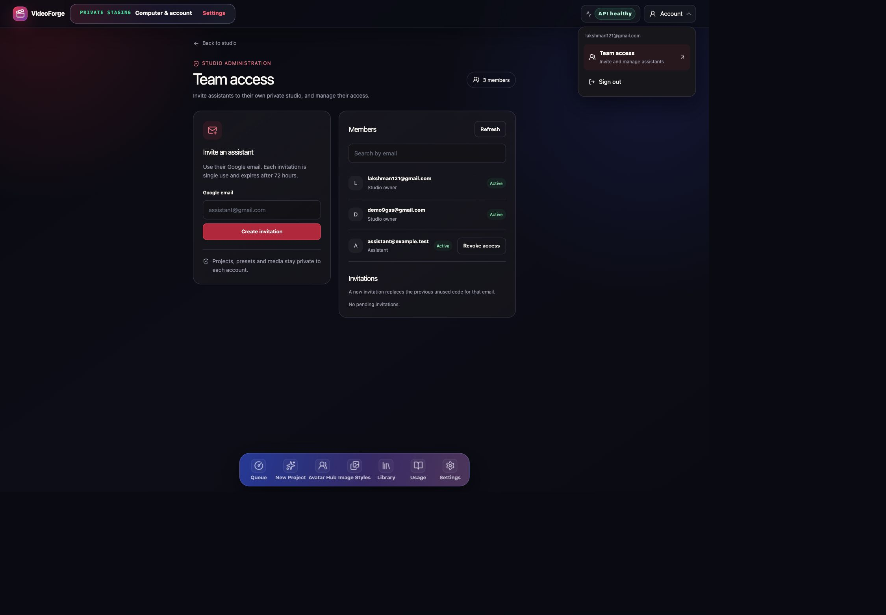
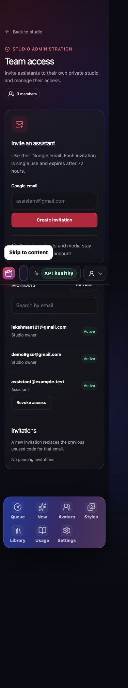

# Team access review handoff — 2026-10-01

Checkpoint: V2-09 / VF-10-09. Branch: `codex/team-access`, based on application review base `c809c697` (production source `3932c982`).
Implementation identity: `dbcd9d48fe2955f578cb0204e262ce99d6789637`. Review: [PR3](https://github.com/Pala-LakshmanSai/videoforge/pull/3). Review PR targets the application integration
`codex/cloud-pay-per-video` branch because default `main` contains bootstrap code.

## Behavior and scope

Frontier 5's `hosting/worker.mjs` and `hosting/pages.mjs` are the behavior reference: one-use
email-bound Google invitations, member list, revoke and restore, with a private studio per assistant.
Only the two user-selected manager identities can administer admission; workspace ADMIN membership
is insufficient. UI visibility, authenticated API checks, and PostgreSQL independently enforce this.

- Native account disclosure with Team access and existing sign-out behavior.
- Responsive invitation/member cards; code copy/dismiss, member search, refresh and confirmation dialog.
- 72-hour random single-use codes; raw codes stay in the issuing browser and never reach PostgreSQL.
- Replacement invitations revoke the previous code and preserve its immutable history.
- Revocation deletes all browser sessions, fences fresh sign-in/session scope, and preserves tenant data.
- Restoration returns the existing private studio after a fresh Google sign-in. Owners are protected.
- Existing jobs, worker leases, accepted artifacts and provider cleanup are preserved.

## Validation

- `pnpm --filter @videoforge/web exec vitest run src/server/hosted/team-access.test.ts src/hosted/TeamAccessScreen.test.tsx src/hosted/HostedStagingApp.test.tsx src/components/AppShell.hosted.test.tsx src/server/hosted/invite-redemption.test.ts src/server/hosted/product.test.ts`: 142 passing.
- `node --test packages/control-plane/tests/hosted-team-access.test.mjs packages/control-plane/tests/schema-inventory.test.mjs packages/control-plane/tests/hosted-invite-code-redemption.test.mjs`: 10 passing, including full schema application and existing exact-code admission regressions.
- `pnpm --filter @videoforge/web typecheck`: web and Worker pass.
- Focused ESLint and formatting checks pass. Dependency packages build successfully.
- `pnpm --filter @videoforge/web build:cloudflare`: production Worker/client build and unchanged bundle quarantine pass. Tenant/account administration routes load on demand to preserve the static Worker entry budget; the budget was not relaxed.
- Real installed Chrome against an isolated local harness using the actual API handler and PGlite PostgreSQL migration: both owner entries, assistant direct-route refusal and hidden entry, invitation creation/copy/dismiss, member revoke/restore, pending-code revoke, Escape/outside dismissal, and responsive layout. Local identities are explicit disposable fixtures; this does not prove production Google OAuth.
- `node scripts/context-validate.mjs`: selected task/profile/branch and evidence pass; inherited optional-reference/profile-size warnings remain.

Screenshots contain disposable member data and no invitation code:

## Initial review boundary (superseded by the authorized release below)

Migration `0238_hosted_team_access.sql` and runtime EXECUTE grant are prepared. Production database,
real invitations/sessions/permissions, Cloudflare deployment, providers and personal workers were
not changed. No paid generation/compute or external provider call occurred. No compute started by
this task needs shutdown; concurrent work and pre-existing reconciliation are untouched.

User review and merge approval remain required. After approval, apply 0238 with normal migration-owner
tooling, verify the configured runtime has EXECUTE, publish the reviewed application, and check both
real Google owner sessions plus a disposable assistant invite/revoke/restore flow. Do not call the
production feature qualified before those checks. Rollback the app while retaining the migration and
revocation fences; do not drop revocations or re-enable deleted sessions during rollback.

## Authorized production release — 2026-10-01

The user authorized production publication once properly verified. PR3 merged at `cf5dd2de`;
source `d7faa494` initially published on Worker `112cf626` at100%. The previously published larger
Progress layout from `212382e4` is preserved. Exact238 applied once, ledger221/max238, runtime
EXECUTE granted, Public EXECUTE and runtime revocation-table reads denied. Original invitation/link
hashes and auth counts match before/after migration.

Native PostgreSQL rehearsed invitation rotation, old-code refusal, fresh redemption, private studio
admission, non-manager denial, session revocation/login fence, restore to the same studio and
protected owner denial, then rolled back every fixture row. Production runtime independently
passes manager LIST and non-manager denial. All23public client assets match SHA256; bindings50,
secrets25 and all three Workflow identities are preserved. The first public status check observed
the previous deployment briefly; read-only verification converged without another deployment.

Real production Chrome verifies owner menu, Team access, member search, invitation create/copy/dismiss
and unused invitation revocation. The only release-test invitation uses an invalid disposable
domain and is revoked; no test account or real member revocation occurs. Private receipts retain
metadata outside this report. Current production lacks one exact requested owner identity; the
existing similarly named account remains a non-manager pending the user's explicit correction.

A live mouse test exposed the modal below the shared190 overlay: clicking Confirm dismissed it
without invoking the mutation. Keyboard activation succeeded. The focused fix reuses the existing
200 dialog layer; real local Chrome confirms the button receives pointer events, the mouse click
revokes the fixture invitation and the dialog closes. Six component checks pass. A browser
regression in `hosted-product-router.spec.ts` exercises the real pointer click and mutation outcome.
The correction is published at source `0e1a9cba1ef93e9c19aef09ac6a001dab22fe215`, Worker
`3591420e-e1db-458a-b509-9b75665e286e`,100% traffic. Backend bytes match the initial Team access
release exactly. All23public assets match SHA256. Real production Chrome confirms pointer hit
testing and mouse-click revocation, dialog closure and stable revoked state after refresh. Both
disposable release-test invitations are revoked; no test account exists and existing invitation/
studio hashes match the pre-release snapshot when the two test rows are excluded.

USD0 new provider/generation/compute. No new Workflow instances or provider resources; no compute
started by this task needs shutdown. Broad CI formatting failures remain separate; fresh assistant
Google OAuth enrollment and the absent requested owner sign-in are not claimed.
